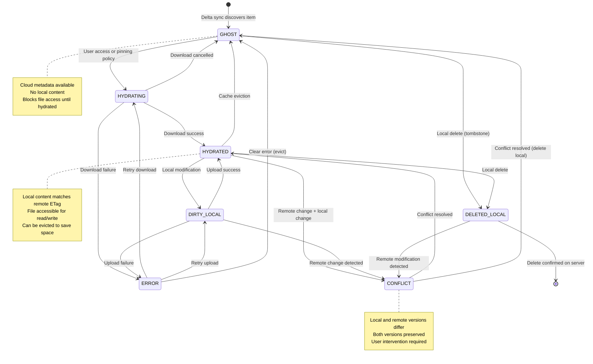

# Design: Cache Management

## Source
Moved from `.kiro/specs/archive/system-verification-and-fix/design.md`. Sections below are verbatim.

### 7. Cache Management Component

**Location**: `internal/fs/cache.go`, `internal/fs/content_cache.go`

**Verification Steps**:
1. Review cache implementation (metadata and content)
2. Test cache hit/miss scenarios
3. Test cache expiration
4. Test cache cleanup
5. Test cache statistics

**Expected Interfaces**:
- `LoopbackCache` for content
- `ThumbnailCache` for thumbnails
- bbolt database for metadata
- Cache cleanup goroutine

**Cache Cleanup Behavior**:
- **Time-based expiration**: Files older than the configured expiration threshold are removed during periodic cleanup
- **Deleted file cleanup**: When a file is deleted from the filesystem, the corresponding cache entry should be removed to free disk space
- **Orphaned cache entries**: During cleanup, cache entries for files that no longer exist in the filesystem metadata should be identified and removed
- **Cleanup frequency**: Cache cleanup runs periodically (default: every 24 hours) to maintain cache hygiene

**Verification Criteria**:
- Cached files are served without network access
- Cache respects expiration settings
- Cleanup removes old files
- Cleanup removes cache entries for deleted files
- Cleanup removes orphaned cache entries (files not in metadata)
- Statistics accurately reflect cache state
- Cache survives filesystem restarts

### 15. ETag Cache Validation Component

**Location**: `internal/fs/cache.go`, `internal/fs/content_cache.go`, `internal/fs/delta.go`

**Verification Steps**:
1. Review ETag storage and validation code
2. Test cache hit when ETag hasn't changed (via delta sync)
3. Test cache invalidation when ETag changes (via delta sync)
4. Test ETag updates from delta sync
5. Test conflict detection using ETag comparison

**Implementation Note**:
ETag-based cache validation does NOT use HTTP `if-none-match` headers for conditional GET requests. Microsoft Graph API's pre-authenticated download URLs (`@microsoft.graph.downloadUrl`) point directly to Azure Blob Storage and do not support conditional GET with ETags or 304 Not Modified responses.

Instead, ETag validation occurs via the delta sync process:
1. Delta sync fetches metadata changes including updated ETags
2. When an ETag changes, the content cache entry is invalidated
3. Next file access triggers a full re-download
4. QuickXORHash checksum verification ensures content integrity

This approach is more efficient than per-file conditional GET because:
- Delta sync proactively detects changes in batch
- Reduces API calls and network overhead
- Only changed files are re-downloaded
- Works with pre-authenticated download URLs

**Expected Interfaces**:
- Cache entries store ETag alongside content in metadata
- `content.Delete(id)` method for cache invalidation
- Delta sync updates ETags in metadata cache
- Cache invalidation triggered when ETag changes
- QuickXORHash verification in download manager

**Verification Criteria**:
- ETags are stored with file metadata
- Cache validation occurs via delta sync ETag comparison
- Unchanged files are served from cache without re-download
- Changed files (detected by ETag) trigger cache invalidation
- Delta sync invalidates cache when ETag changes
- Conflict detection compares local and remote ETags
- Upload checks remote ETag before overwriting
- QuickXORHash ensures downloaded content integrity

### ETag-Based Cache Validation

**Note**: This flow uses delta sync for ETag validation, NOT HTTP `if-none-match` headers.
Pre-authenticated download URLs from Microsoft Graph API do not support conditional GET.

```
┌─────────────────────────────────────────────────────────────┐
│              ETag Cache Validation Flow                      │
│         (via Delta Sync, not if-none-match)                 │
├─────────────────────────────────────────────────────────────┤
│                                                              │
│  Background: Delta Sync Loop (Proactive)                    │
│  ┌──────────────┐                                          │
│  │ Delta Query  │──► Fetches metadata changes              │
│  │ (Periodic)   │    including updated ETags                │
│  └──────┬───────┘                                          │
│         │                                                    │
│         ▼                                                    │
│  ┌──────────────┐                                          │
│  │ Compare ETag │──► Old ETag vs New ETag                  │
│  │  in Metadata │                                          │
│  └──────┬───────┘                                          │
│         │                                                    │
│    ETag Changed?                                            │
│    ┌────┴────┐                                             │
│    │         │                                              │
│   Yes        No                                             │
│    │         │                                              │
│    ▼         ▼                                              │
│  ┌────────┐ ┌────────┐                                    │
│  │Inval-  │ │Keep    │                                    │
│  │idate   │ │Cache   │                                    │
│  │Cache   │ │Valid   │                                    │
│  └────────┘ └────────┘                                    │
│                                                              │
│  Foreground: File Access Request                            │
│  ┌──────────────┐                                          │
│  │ User Opens   │                                          │
│  │    File      │                                          │
│  └──────┬───────┘                                          │
│         │                                                    │
│         ▼                                                    │
│  ┌──────────────┐                                          │
│  │ Check Cache  │                                          │
│  │   Valid?     │                                          │
│  └──────┬───────┘                                          │
│         │                                                    │
│    Valid Cache?                                             │
│    ┌────┴────┐                                             │
│    │         │                                              │
│   Yes        No (Invalidated by Delta Sync)                │
│    │         │                                              │
│    ▼         ▼                                              │
│  ┌────────┐ ┌────────────┐                                │
│  │ Serve  │ │ Download   │                                │
│  │  from  │ │ Full File  │                                │
│  │ Cache  │ │ (GET)      │                                │
│  └────────┘ └──────┬─────┘                                │
│                     │                                        │
│                     ▼                                        │
│              ┌──────────────┐                              │
│              │ QuickXORHash │                              │
│              │ Verification │                              │
│              └──────┬───────┘                              │
│                     │                                        │
│                     ▼                                        │
│              ┌──────────────┐                              │
│              │ Update Cache │                              │
│              │ & Metadata   │                              │
│              └──────────────┘                              │
│                                                              │
│  Key Differences from Conditional GET:                      │
│  • No if-none-match header (not supported by download URLs) │
│  • No 304 Not Modified responses                            │
│  • Proactive change detection via delta sync                │
│  • More efficient: batch metadata updates                   │
│  • Cache invalidation before file access                    │
└─────────────────────────────────────────────────────────────┘
```

### Cache Management Properties

**Property 28: ETag-Based Cache Storage**
*For any* downloaded file, the system should store content in the cache directory with the file's ETag
**Validates: Requirements 7.1**

**Property 29: Cache Invalidation on Remote ETag Change**
*For any* cached file with different remote ETag, the system should invalidate the cache entry and download the new version
**Validates: Requirements 7.3**

### State Management Properties

**Property 40: Initial Item State**
*For any* drive item discovered via delta for the first time, the system should insert it with GHOST state and not download content until required
**Validates: Requirements 21.2**

**Property 41: Successful Hydration State Transition**
*For any* successful hydration completion, the system should transition the item to HYDRATED state, record content path, update metadata, and clear error fields
**Validates: Requirements 21.4**

**Property 42: Local Modification State Transition**
*For any* locally modified hydrated file, the system should transition it to DIRTY_LOCAL state until upload succeeds
**Validates: Requirements 21.6**

### Item State Model

Every entry in the metadata database carries an explicit state that drives hydration, uploads, eviction, and conflict handling:

| State         | Meaning                                                     | Typical Transitions |
|---------------|-------------------------------------------------------------|---------------------|
| `GHOST`       | Cloud metadata known, no local content                      | Created via delta → `HYDRATING` when opened or pinned |
| `HYDRATING`   | Content download in progress                                | Success → `HYDRATED`; failure → `ERROR` |
| `HYDRATED`    | Local content matches remote ETag                           | Local edit → `DIRTY_LOCAL`; eviction → `GHOST` |
| `DIRTY_LOCAL` | Local changes pending upload                                | Upload success → `HYDRATED`; remote delta mismatch → `CONFLICT` |
| `DELETED_LOCAL` | Local delete queued for upload                            | Delete success → tombstone removal |
| `CONFLICT`    | Local + remote diverged                                     | User resolves → `HYDRATED` or duplicate keeps both |
| `ERROR`       | Last hydration/upload failed                                | Manual retry → `HYDRATING`/`DIRTY_LOCAL` |

Virtual entries (.xdg files, pinned/policy folders) store `remote_id=NULL`, `is_virtual=TRUE`, and stay in `HYDRATED` because their content is always served locally. Sync code skips uploads/deletes for entries marked virtual so FUSE never needs a special wrapper layer.

#### State Transition Diagram



#### State Transition Rules

**Valid Transitions**:
- `GHOST` → `HYDRATING`: Triggered by file access, pinning policy, or manual hydration
- `HYDRATING` → `HYDRATED`: Download completes successfully, content hash verified
- `HYDRATING` → `ERROR`: Download fails after all retry attempts exhausted
- `HYDRATING` → `GHOST`: Download cancelled by user or system shutdown
- `HYDRATED` → `DIRTY_LOCAL`: File modified locally (write, truncate, metadata change)
- `HYDRATED` → `GHOST`: Cache eviction due to space constraints or policy
- `HYDRATED` → `DELETED_LOCAL`: File deleted locally via unlink operation
- `HYDRATED` → `CONFLICT`: Delta sync detects remote changes while local changes exist
- `DIRTY_LOCAL` → `HYDRATED`: Upload completes successfully, ETags match
- `DIRTY_LOCAL` → `CONFLICT`: Delta sync detects conflicting remote changes
- `DIRTY_LOCAL` → `ERROR`: Upload fails after all retry attempts exhausted
- `ERROR` → `HYDRATING`: Manual retry of failed download
- `ERROR` → `DIRTY_LOCAL`: Manual retry of failed upload
- `ERROR` → `GHOST`: Clear error state and evict content
- `CONFLICT` → `HYDRATED`: Conflict resolved, single version remains
- `CONFLICT` → `GHOST`: Conflict resolved by deleting local version
- `DELETED_LOCAL` → `[REMOVED]`: Delete confirmed on server, entry removed
- `DELETED_LOCAL` → `CONFLICT`: Remote modification detected before delete processed

**Invalid Transitions** (System Invariants):
- Direct transitions between `GHOST` ↔ `HYDRATED` (must go through `HYDRATING`)
- Direct transitions between `GHOST` ↔ `DIRTY_LOCAL` (must hydrate first)
- Transitions from `ERROR` to `CONFLICT` (must resolve error first)
- Transitions from `DELETED_LOCAL` to `HYDRATED` (cannot resurrect deleted files)

**Trigger Conditions**:
- **File Access**: User opens file, triggers `GHOST` → `HYDRATING`
- **Delta Sync**: Remote changes detected, may trigger various transitions
- **Upload Complete**: Successful upload triggers `DIRTY_LOCAL` → `HYDRATED`
- **Download Complete**: Successful download triggers `HYDRATING` → `HYDRATED`
- **Cache Pressure**: LRU eviction triggers `HYDRATED` → `GHOST`
- **User Action**: File modification triggers `HYDRATED` → `DIRTY_LOCAL`
- **Error Recovery**: Manual retry triggers transitions from `ERROR` state

**Error Handling**:
- All failed operations transition to `ERROR` state with error details preserved
- Error state includes retry count, last error message, and timestamp
- System provides mechanisms to retry from `ERROR` state
- Persistent errors may require manual intervention or cache clearing
