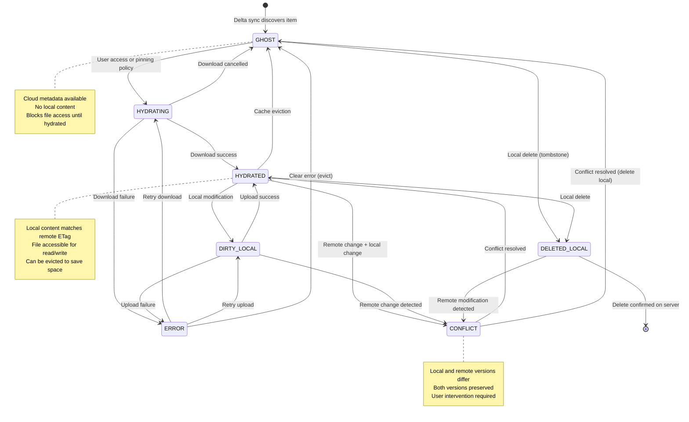

# Design Document: OneMount System Verification and Fix

## Overview

This design document outlines the systematic approach to verifying and fixing the OneMount application. The strategy involves:

1. **Component-by-component verification** - Test each major component against requirements
2. **Integration testing** - Verify components work together correctly
3. **Gap analysis** - Document discrepancies between docs and implementation
4. **Prioritized fixes** - Address critical issues first
5. **Documentation updates** - Ensure docs reflect actual behavior

## Architecture

### Verification Framework

The verification process follows a layered approach:

```
┌─────────────────────────────────────────┐
│     End-to-End User Workflows           │
├─────────────────────────────────────────┤
│     Integration Tests                   │
├─────────────────────────────────────────┤
│     Component Verification              │
├─────────────────────────────────────────┤
│     Code Analysis & Documentation       │
└─────────────────────────────────────────┘
```

### Verification Phases

#### Phase 1: Code Analysis
- Review existing code structure
- Compare implementation against architecture docs
- Identify missing or incomplete components
- Document deviations from design

#### Phase 2: Component Verification
- Test each component in isolation
- Verify against acceptance criteria
- Document failures and root causes
- Create component-specific fix plans

#### Phase 3: Integration Verification
- Test component interactions
- Verify data flow between components
- Test error propagation and handling
- Document integration issues

#### Phase 4: End-to-End Testing
- Test complete user workflows
- Verify against user stories
- Test edge cases and error scenarios
- Document user-facing issues

### Runtime Layering (Authoritative Data Flow)

To keep latency predictable, every runtime component talks to a single upstream layer:

```
┌────────────┐    ┌────────────────────┐    ┌──────────────────────┐
│   FUSE     │───►│  Metadata / Index  │───►│  Sync & Policy Engine │───► Microsoft Graph
│ Callbacks  │    │   (BBolt + cache)  │    │  (delta + uploads)    │
└────┬───────┘    └────────┬───────────┘    └──────────┬───────────┘
     │                      │                            │
     │                      ▼                            │
     │             ┌────────────────┐                    │
     └────────────►│ Content Cache  │◄───────────────────┘
                   └────────────────┘
```

- FUSE callbacks (`readdir`, `stat`, `rename`, `create`, etc.) consult only the metadata/index layer and the local content cache; they never call Microsoft Graph directly.
- The metadata/index layer is the single source of truth for real and virtual entries, item states, and overlay policies.
- The sync & policy engine is the only component allowed to call Microsoft Graph (delta queries, uploads, downloads triggered by hydration, subscription management).
- Content hydration workers operate as part of the sync engine: they stream data into the content cache and then update the metadata entry atomically.
- Because all outward-facing operations speak to the same metadata view, user-facing latency stays bounded even while background sync or notification transports churn.

## Architecture Enhancements

### Multi-Account Architecture

The system supports multiple simultaneous OneDrive mounts through isolated filesystem instances:

```
┌─────────────────────────────────────────────────────────────┐
│                    OneMount Application                      │
├─────────────────────────────────────────────────────────────┤
│  Mount Manager                                               │
│  ├─ Personal OneDrive Mount (/mnt/onedrive-personal)       │
│  │  ├─ Filesystem Instance #1                              │
│  │  ├─ Auth (personal account)                             │
│  │  ├─ Cache (personal)                                    │
│  │  ├─ Delta Sync Loop #1                                  │
│  │  └─ Webhook Subscription #1                             │
│  │                                                          │
│  ├─ Work OneDrive Mount (/mnt/onedrive-work)              │
│  │  ├─ Filesystem Instance #2                              │
│  │  ├─ Auth (work account)                                 │
│  │  ├─ Cache (work)                                        │
│  │  ├─ Delta Sync Loop #2                                  │
│  │  └─ Realtime Subscription #2                            │
│  │                                                          │
│  └─ Shared Drive Mount (/mnt/onedrive-shared)             │
│     ├─ Filesystem Instance #3                              │
│     ├─ Auth (work account, shared drive access)            │
│     ├─ Cache (shared)                                       │
│     ├─ Delta Sync Loop #3                                  │
│     └─ Realtime Subscription #3                            │
└─────────────────────────────────────────────────────────────┘
```

Each mount is completely isolated with:
- Separate FUSE mount point
- Independent authentication tokens
- Isolated metadata and content caches
- Dedicated delta sync goroutine
- Individual realtime (Socket.IO) subscription

### Tree Synchronization Behavior

The initial tree walk (and any subsequent full resync) runs entirely in the background. While the walk is running:

- Every directory fetched is immediately marked “warm” by populating the parent inode’s `children` slice so later interactive commands do not re-fetch it.
- Progress counters are exposed so the UI can show status without blocking commands.
- User-facing commands operate on whatever portion of the cache is already populated; only directories that have never been fetched block while their metadata is retrieved.
- When the refresh interval elapses, the walker revalidates directories asynchronously while continuing to serve cached data.

### Item State Model

Every entry in the metadata database carries an explicit state that drives hydration, uploads, eviction, and conflict handling:

| State         | Meaning                                                     | Typical Transitions |
|---------------|-------------------------------------------------------------|---------------------|
| `GHOST`       | Cloud metadata known, no local content                      | Created via delta → `HYDRATING` when opened or pinned |
| `HYDRATING`   | Content download in progress                                | Success → `HYDRATED`; failure → `ERROR` |
| `HYDRATED`    | Local content matches remote ETag                           | Local edit → `DIRTY_LOCAL`; eviction → `GHOST` |
| `DIRTY_LOCAL` | Local changes pending upload                                | Upload success → `HYDRATED`; remote delta mismatch → `CONFLICT` |
| `DELETED_LOCAL` | Local delete queued for upload                            | Delete success → tombstone removal |
| `CONFLICT`    | Local + remote diverged                                     | User resolves → `HYDRATED` or duplicate keeps both |
| `ERROR`       | Last hydration/upload failed                                | Manual retry → `HYDRATING`/`DIRTY_LOCAL` |

Virtual entries (.xdg files, pinned/policy folders) store `remote_id=NULL`, `is_virtual=TRUE`, and stay in `HYDRATED` because their content is always served locally. Sync code skips uploads/deletes for entries marked virtual so FUSE never needs a special wrapper layer.

#### State Transition Diagram



#### State Transition Rules

**Valid Transitions**:
- `GHOST` → `HYDRATING`: Triggered by file access, pinning policy, or manual hydration
- `HYDRATING` → `HYDRATED`: Download completes successfully, content hash verified
- `HYDRATING` → `ERROR`: Download fails after all retry attempts exhausted
- `HYDRATING` → `GHOST`: Download cancelled by user or system shutdown
- `HYDRATED` → `DIRTY_LOCAL`: File modified locally (write, truncate, metadata change)
- `HYDRATED` → `GHOST`: Cache eviction due to space constraints or policy
- `HYDRATED` → `DELETED_LOCAL`: File deleted locally via unlink operation
- `HYDRATED` → `CONFLICT`: Delta sync detects remote changes while local changes exist
- `DIRTY_LOCAL` → `HYDRATED`: Upload completes successfully, ETags match
- `DIRTY_LOCAL` → `CONFLICT`: Delta sync detects conflicting remote changes
- `DIRTY_LOCAL` → `ERROR`: Upload fails after all retry attempts exhausted
- `ERROR` → `HYDRATING`: Manual retry of failed download
- `ERROR` → `DIRTY_LOCAL`: Manual retry of failed upload
- `ERROR` → `GHOST`: Clear error state and evict content
- `CONFLICT` → `HYDRATED`: Conflict resolved, single version remains
- `CONFLICT` → `GHOST`: Conflict resolved by deleting local version
- `DELETED_LOCAL` → `[REMOVED]`: Delete confirmed on server, entry removed
- `DELETED_LOCAL` → `CONFLICT`: Remote modification detected before delete processed

**Invalid Transitions** (System Invariants):
- Direct transitions between `GHOST` ↔ `HYDRATED` (must go through `HYDRATING`)
- Direct transitions between `GHOST` ↔ `DIRTY_LOCAL` (must hydrate first)
- Transitions from `ERROR` to `CONFLICT` (must resolve error first)
- Transitions from `DELETED_LOCAL` to `HYDRATED` (cannot resurrect deleted files)

**Trigger Conditions**:
- **File Access**: User opens file, triggers `GHOST` → `HYDRATING`
- **Delta Sync**: Remote changes detected, may trigger various transitions
- **Upload Complete**: Successful upload triggers `DIRTY_LOCAL` → `HYDRATED`
- **Download Complete**: Successful download triggers `HYDRATING` → `HYDRATED`
- **Cache Pressure**: LRU eviction triggers `HYDRATED` → `GHOST`
- **User Action**: File modification triggers `HYDRATED` → `DIRTY_LOCAL`
- **Error Recovery**: Manual retry triggers transitions from `ERROR` state

**Error Handling**:
- All failed operations transition to `ERROR` state with error details preserved
- Error state includes retry count, last error message, and timestamp
- System provides mechanisms to retry from `ERROR` state
- Persistent errors may require manual intervention or cache clearing

### `.xdg-volume-info` Handling

`.xdg-volume-info` is a local-only virtual file. Creating or refreshing it:

- Assigns a `local-` ID and registers it in the metadata cache.
- Updates only that entry when the account name changes; the root’s other children remain untouched.
- Never clears the entire root cache, preventing unnecessary re-fetches after maintenance.

### Virtual Items and Overlay Policies

- Virtual items live in the same BBolt buckets as remote-backed entries and are flagged with `virtual=true`, `remote_id=NULL`, and `overlay_policy` (`LOCAL_WINS`, `REMOTE_WINS`, or `MERGED`).
- `LOCAL_WINS` (default for `.xdg-volume-info`, policy folders, or pinned views) hides any remote item that collides by name so FUSE can enumerate a single authoritative child list without merging logic.
- `REMOTE_WINS` is useful for placeholder entries that should disappear when remote content exists (e.g., onboarding tips).
- `MERGED` allows special folders to overlay remote children (e.g., “Pinned” folder containing aliases to real items). The metadata entry stores references to the underlying `item_id`s so state transitions continue to work.
- Because these flags live inside the metadata DB, FUSE handles `readdir` with a single query. The sync engine simply ignores virtual entries when generating upload/delete workqueues.

### Realtime Socket Architecture

```
┌─────────────────────────────────────────────────────────────┐
│               Socket.IO Realtime Flow (per mount)           │
├─────────────────────────────────────────────────────────────┤
│                                                             │
│  OneDrive API                                               │
│       │                                                     │
│       │ 1. POST /subscriptions/socketIo                     │
│       ▼                                                     │
│  ┌──────────────┐                                           │
│  │ Socket Sub   │                                           │
│  │   Manager    │                                           │
│  └──────┬───────┘                                           │
│         │ health + expiry                                   │
│         ▼                                                   │
│  ┌──────────────────────────────────────────────────┐       │
│  │    RealtimeNotifier (events + health)            │       │
│  └──────┬──────────────────────┬────────────────────┘       │
│         │ notifications        │ health snapshot            │
│         ▼                      ▼                            │
│   Delta Sync Trigger    Interval Controller                 │
│         │                      │                            │
│         ▼                      ▼                            │
│     Metadata DB        Polling Interval Logic               │
│                                                             │
│  Background: renewal loop + reconnect/backoff               │
└─────────────────────────────────────────────────────────────┘
```

- Each mount instantiates a Socket.IO subscription manager that owns the Engine.IO transport, renewal tokens, and reconnection/backoff logic.
- The manager publishes notifications to the delta loop and a health snapshot (status, last heartbeat, retry counts) so Requirement 5 can lengthen/shorten polling cadences deterministically.
- Polling-only mode skips the connection but still exposes “disabled” mode through the same interface so diagnostics stay consistent.
- When the transport degrades, the manager marks itself unhealthy, emits diagnostics, and leaves the delta loop in 5-minute polling mode until the Socket.IO channel recovers.

### Metadata Request Manager

Interactive metadata operations (e.g., `ls`, `cd`, file open/close) must remain responsive even while the tree sync, delta loop, or realtime handler are active. To achieve this:

- **Worker pools:** The metadata request manager runs a configurable set of workers. At least one worker is dedicated to foreground work so user-facing commands never wait behind background jobs.
- **Priority handling:** Foreground requests preempt background work. When a worker is processing a background task and a foreground request arrives, the worker finishes the current Graph call but immediately switches to the high-priority queue; background jobs resume only when no foreground work is pending.
- **In-flight deduplication:** Requests for the same directory share a single in-flight Graph call. Multiple callers attach callbacks to the same result rather than spawning duplicate requests.
- **Stale-cache policy:** If a directory already has cached children (even if the cache is due for refresh), the manager returns the cached data immediately and triggers a refresh in the background. The caller never waits for a refresh unless the directory has never been fetched before.
- **Scoped invalidation:** Failed lookups (typos, case mismatches) and virtual-file maintenance never clear entire parent caches. Only the specific entry is invalidated, ensuring other children remain available without refetching.

### ETag-Based Cache Validation

**Note**: This flow uses delta sync for ETag validation, NOT HTTP `if-none-match` headers.
Pre-authenticated download URLs from Microsoft Graph API do not support conditional GET.

```
┌─────────────────────────────────────────────────────────────┐
│              ETag Cache Validation Flow                      │
│         (via Delta Sync, not if-none-match)                 │
├─────────────────────────────────────────────────────────────┤
│                                                              │
│  Background: Delta Sync Loop (Proactive)                    │
│  ┌──────────────┐                                          │
│  │ Delta Query  │──► Fetches metadata changes              │
│  │ (Periodic)   │    including updated ETags                │
│  └──────┬───────┘                                          │
│         │                                                    │
│         ▼                                                    │
│  ┌──────────────┐                                          │
│  │ Compare ETag │──► Old ETag vs New ETag                  │
│  │  in Metadata │                                          │
│  └──────┬───────┘                                          │
│         │                                                    │
│    ETag Changed?                                            │
│    ┌────┴────┐                                             │
│    │         │                                              │
│   Yes        No                                             │
│    │         │                                              │
│    ▼         ▼                                              │
│  ┌────────┐ ┌────────┐                                    │
│  │Inval-  │ │Keep    │                                    │
│  │idate   │ │Cache   │                                    │
│  │Cache   │ │Valid   │                                    │
│  └────────┘ └────────┘                                    │
│                                                              │
│  Foreground: File Access Request                            │
│  ┌──────────────┐                                          │
│  │ User Opens   │                                          │
│  │    File      │                                          │
│  └──────┬───────┘                                          │
│         │                                                    │
│         ▼                                                    │
│  ┌──────────────┐                                          │
│  │ Check Cache  │                                          │
│  │   Valid?     │                                          │
│  └──────┬───────┘                                          │
│         │                                                    │
│    Valid Cache?                                             │
│    ┌────┴────┐                                             │
│    │         │                                              │
│   Yes        No (Invalidated by Delta Sync)                │
│    │         │                                              │
│    ▼         ▼                                              │
│  ┌────────┐ ┌────────────┐                                │
│  │ Serve  │ │ Download   │                                │
│  │  from  │ │ Full File  │                                │
│  │ Cache  │ │ (GET)      │                                │
│  └────────┘ └──────┬─────┘                                │
│                     │                                        │
│                     ▼                                        │
│              ┌──────────────┐                              │
│              │ QuickXORHash │                              │
│              │ Verification │                              │
│              └──────┬───────┘                              │
│                     │                                        │
│                     ▼                                        │
│              ┌──────────────┐                              │
│              │ Update Cache │                              │
│              │ & Metadata   │                              │
│              └──────────────┘                              │
│                                                              │
│  Key Differences from Conditional GET:                      │
│  • No if-none-match header (not supported by download URLs) │
│  • No 304 Not Modified responses                            │
│  • Proactive change detection via delta sync                │
│  • More efficient: batch metadata updates                   │
│  • Cache invalidation before file access                    │
└─────────────────────────────────────────────────────────────┘
```

## Correctness Properties

*A property is a characteristic or behavior that should hold true across all valid executions of a system-essentially, a formal statement about what the system should do. Properties serve as the bridge between human-readable specifications and machine-verifiable correctness guarantees.*

Based on the prework analysis of acceptance criteria, the following 67 correctness properties have been identified for property-based testing:

### Authentication Properties

**Property 1: OAuth2 Token Storage Security**
*For any* successful OAuth2 authentication completion, the system should store authentication tokens with proper security attributes (correct file permissions, secure location)
**Validates: Requirements 1.2**

**Property 2: Automatic Token Refresh**
*For any* expired authentication token with valid refresh token, the system should automatically refresh the token without user intervention
**Validates: Requirements 1.3**

**Property 3: Re-authentication on Refresh Failure**
*For any* token refresh failure scenario, the system should prompt the user to re-authenticate
**Validates: Requirements 1.4**

**Property 4: Headless Authentication Method**
*For any* system running in headless mode, the authentication process should use device code flow
**Validates: Requirements 1.5**

**Property 4.1: Account-Based Token Storage**
*For any* authentication token storage operation, the system should store tokens using account-based paths (account email hash) rather than mount-point-based paths, ensuring tokens are accessible regardless of mount point location and preventing duplication
**Validates: Requirements 1.6**

### Filesystem Mounting Properties

**Property 5: FUSE Mount Success**
*For any* valid mount point specification, the system should successfully mount OneDrive using FUSE
**Validates: Requirements 2.1**

**Property 6: Non-blocking Initial Sync**
*For any* first-time filesystem mount, the initial directory structure fetch should complete while keeping interactive operations responsive
**Validates: Requirements 2A.1**

**Property 7: Root Directory Visibility**
*For any* successfully mounted filesystem, the root directory contents should be visible and accessible
**Validates: Requirements 2.2**

**Property 8: Standard File Operations Support**
*For any* mounted filesystem, standard file operations (ls, cat, cp, etc.) should work correctly
**Validates: Requirements 2.3**

**Property 9: Mount Conflict Error Handling**
*For any* mount point that is already in use, the system should display a clear error message identifying the conflicting process
**Validates: Requirements 2.4**

**Property 10: Clean Resource Release**
*For any* mounted filesystem, unmounting should cleanly release all associated resources
**Validates: Requirements 2.5**

### File Access Properties

**Property 11: Metadata-Only Directory Listing**
*For any* directory listing operation, the system should display all files using cached metadata without downloading file content
**Validates: Requirements 3.1**

**Property 12: On-Demand Content Download**
*For any* uncached file access, the system should request file content using the correct API endpoint (GET /items/{id}/content)
**Validates: Requirements 3.2**

**Property 13: ETag Cache Validation**
*For any* cached file access, the system should validate the cache using ETag comparison from delta sync metadata
**Validates: Requirements 3.4**

**Property 14: Cache Hit Serving**
*For any* cached file with matching ETag, the system should serve content from local cache without network requests
**Validates: Requirements 3.5**

**Property 15: Cache Invalidation on ETag Mismatch**
*For any* cached file with different ETag, the system should invalidate the cache entry and download new content
**Validates: Requirements 3.6**

### File Modification Properties

**Property 16: Local Change Tracking**
*For any* file modification, the system should mark the file as having local changes
**Validates: Requirements 4.1**

**Property 17: Upload Queuing**
*For any* saved modified file, the system should queue the file for upload to the server
**Validates: Requirements 4.2**

**Property 18: ETag Update After Upload**
*For any* successful upload completion, the system should update the file's ETag from the server response
**Validates: Requirements 4.7**

**Property 19: Modified Flag Cleanup**
*For any* successful upload completion, the system should clear the modified flag
**Validates: Requirements 4.8**

### Delta Synchronization Properties

**Property 20: Initial Delta Sync**
*For any* first filesystem mount, the system should fetch the complete directory structure using the delta API
**Validates: Requirements 5.1**

**Property 21: Metadata Cache Updates**
*For any* remote changes detected via delta query, the system should update the local metadata cache
**Validates: Requirements 5.8**

**Property 22: Conflict Copy Creation**
*For any* file with both local and remote changes, the system should create a conflict copy
**Validates: Requirements 5.11**

**Property 23: Delta Token Persistence**
*For any* completed delta sync, the system should store the @odata.deltaLink token for the next sync cycle
**Validates: Requirements 5.12**

### Offline Mode Properties

**Property 24: Offline Detection**
*For any* network connectivity loss, the system should detect the offline state through passive monitoring of API call failures
**Validates: Requirements 6.1**

**Property 25: Offline Read Access**
*For any* cached file, the system should serve the file for read operations while offline
**Validates: Requirements 6.4**

**Property 26: Offline Write Queuing**
*For any* write operation while offline, the system should allow the operation and queue changes for synchronization when connectivity is restored
**Validates: Requirements 6.5**

**Property 27: Batch Upload Processing**
*For any* network connectivity restoration, the system should process queued uploads in batches
**Validates: Requirements 6.10**

### Cache Management Properties

**Property 28: ETag-Based Cache Storage**
*For any* downloaded file, the system should store content in the cache directory with the file's ETag
**Validates: Requirements 7.1**

**Property 29: Cache Invalidation on Remote ETag Change**
*For any* cached file with different remote ETag, the system should invalidate the cache entry and download the new version
**Validates: Requirements 7.3**

### Conflict Resolution Properties

**Property 30: ETag-Based Conflict Detection**
*For any* file modified both locally and remotely, the system should detect the conflict by comparing ETags
**Validates: Requirements 8.1**

**Property 31: Local Version Preservation**
*For any* detected conflict, the system should preserve the local version with its original name
**Validates: Requirements 8.4**

**Property 32: Conflict Copy Creation with Timestamp**
*For any* detected conflict, the system should create a conflict copy with a timestamp suffix
**Validates: Requirements 8.5**

### Concurrency Properties

**Property 33: Safe Concurrent File Access**
*For any* simultaneous file access operations, the system should handle concurrent operations safely without race conditions
**Validates: Requirements 10.1**

**Property 34: Non-blocking Downloads**
*For any* ongoing download operations, other file operations should be allowed to proceed without blocking
**Validates: Requirements 10.2**

### Error Handling Properties

**Property 35: Network Error Logging**
*For any* network error occurrence, the system should log the error with appropriate context information
**Validates: Requirements 11.1**

**Property 36: Rate Limit Backoff**
*For any* API rate limit encounter, the system should implement exponential backoff
**Validates: Requirements 11.2**

### Configuration Properties

**Property 37: XDG Configuration Directory Usage**
*For any* system configuration, the system should use os.UserConfigDir() to determine the configuration directory
**Validates: Requirements 15.1**

**Property 38: Token Storage Location**
*For any* authentication token storage, the system should store tokens in the configuration directory
**Validates: Requirements 15.7**

**Property 39: Cache Storage Location**
*For any* file content caching, the system should store cache in the cache directory
**Validates: Requirements 15.8**

### State Management Properties

**Property 40: Initial Item State**
*For any* drive item discovered via delta for the first time, the system should insert it with GHOST state and not download content until required
**Validates: Requirements 21.2**

**Property 41: Successful Hydration State Transition**
*For any* successful hydration completion, the system should transition the item to HYDRATED state, record content path, update metadata, and clear error fields
**Validates: Requirements 21.4**

**Property 42: Local Modification State Transition**
*For any* locally modified hydrated file, the system should transition it to DIRTY_LOCAL state until upload succeeds
**Validates: Requirements 21.6**

### Security Properties

**Property 43: Token Encryption at Rest**
*For any* authentication token storage operation, the system should encrypt tokens using AES-256 encryption
**Validates: Requirements 22.1**

**Property 44: Token File Permissions**
*For any* token storage file creation, the system should set file permissions to 0600 (owner read/write only)
**Validates: Requirements 22.2**

**Property 45: Secure Token Storage Location**
*For any* authentication token storage, the system should store tokens in the XDG configuration directory with restricted access
**Validates: Requirements 22.3**

**Property 46: HTTPS/TLS Communication**
*For any* Microsoft Graph API communication, the system should use HTTPS/TLS 1.2 or higher for all connections
**Validates: Requirements 22.4**

**Property 47: Sensitive Data Logging Prevention**
*For any* logging operation, the system should never log authentication tokens, passwords, or sensitive user data
**Validates: Requirements 22.6**

**Property 48: Cache File Security**
*For any* cached file content storage, the system should set appropriate file permissions to prevent unauthorized access
**Validates: Requirements 22.8**

### Performance Properties

**Property 49: Directory Listing Performance**
*For any* directory listing operation with up to 1000 files, the system should respond within 2 seconds
**Validates: Requirements 23.1**

**Property 50: Cached File Access Performance**
*For any* cached file opening operation, the system should serve content within 100 milliseconds
**Validates: Requirements 23.2**

**Property 51: Idle Memory Usage**
*For any* idle system state, the system should consume no more than 50 MB of RAM
**Validates: Requirements 23.3**

**Property 52: Active Sync Memory Usage**
*For any* active file synchronization operation, the system should consume no more than 200 MB of RAM
**Validates: Requirements 23.4**

**Property 53: Concurrent Operations Performance**
*For any* concurrent file operations scenario with at least 10 simultaneous operations, the system should handle them without performance degradation
**Validates: Requirements 23.7**

**Property 54: Startup Performance**
*For any* system startup scenario, the system should complete initialization and be ready for file operations within 5 seconds
**Validates: Requirements 23.9**

**Property 55: Shutdown Performance**
*For any* system shutdown scenario, the system should complete graceful shutdown within 10 seconds
**Validates: Requirements 23.10**

### Resource Management Properties

**Property 56: Cache Size Enforcement**
*For any* cache size configuration, the system should enforce the specified maximum cache size limit
**Validates: Requirements 24.1**

**Property 57: File Descriptor Limits**
*For any* file descriptor management scenario, the system should not exceed 1000 open file descriptors simultaneously
**Validates: Requirements 24.4**

**Property 58: Worker Thread Limits**
*For any* worker thread spawning scenario, the system should limit concurrent workers to the configured maximum (default: 10)
**Validates: Requirements 24.5**

**Property 59: Adaptive Network Throttling**
*For any* limited network bandwidth scenario, the system should implement adaptive throttling to prevent network saturation
**Validates: Requirements 24.7**

**Property 60: Memory Pressure Handling**
*For any* system memory pressure scenario, the system should reduce in-memory caching and increase disk-based caching
**Validates: Requirements 24.8**

**Property 61: CPU Usage Management**
*For any* high CPU usage scenario, the system should reduce background processing priority to maintain system responsiveness
**Validates: Requirements 24.9**

**Property 62: Graceful Resource Degradation**
*For any* system resource pressure scenario, the system should gracefully degrade non-essential features while maintaining core functionality
**Validates: Requirements 24.10**

### Concurrency and Lock Management Properties

**Property 63: Lock Ordering Compliance**
*For any* sequence of lock acquisitions, the system should acquire locks in the defined order (filesystem → mount manager → cache manager → inode → worker pool → network state)
**Validates: Concurrency Design Requirements**

**Property 64: Deadlock Prevention**
*For any* concurrent operation scenario, the system should complete all operations without deadlocks when following the lock ordering policy
**Validates: Concurrency Design Requirements**

**Property 65: Lock Release Consistency**
*For any* lock acquisition, the system should release locks in reverse order (LIFO) and handle all error conditions properly
**Validates: Concurrency Design Requirements**

**Property 66: Concurrent File Access Safety**
*For any* set of concurrent file operations on different inodes, the system should handle all operations safely without race conditions
**Validates: Concurrency Design Requirements**

**Property 67: State Transition Atomicity**
*For any* item state transition, the system should complete the transition atomically without intermediate inconsistent states
**Validates: State Machine Design Requirements**

## Concurrency and Lock Management

### Lock Ordering Policy

To prevent deadlocks, all components MUST acquire locks in the following order:

1. **Global Filesystem Lock** (`filesystem.mutex`)
2. **Mount Manager Lock** (`mountManager.mutex`) 
3. **Cache Manager Lock** (`cacheManager.mutex`)
4. **Individual Inode Locks** (`inode.mutex`)
5. **Worker Pool Locks** (`downloadManager.mutex`, `uploadManager.mutex`)
6. **Network State Lock** (`networkState.mutex`)

**Lock Ordering Rules**:
- Always acquire locks in the order listed above
- Never acquire a higher-numbered lock while holding a lower-numbered lock
- Release locks in reverse order (LIFO)
- Use `defer` statements to ensure proper lock release
- Minimize lock hold time by preparing data before acquiring locks

### Concurrent Operation Guidelines

**Safe Concurrent Operations**:
- Multiple file reads from different inodes (each inode has its own lock)
- Directory listings while files are being downloaded (read-only metadata access)
- Delta sync while serving file operations (background sync uses separate locks)
- Upload and download operations on different files (separate worker pools)

**Operations Requiring Coordination**:
- File modification + delta sync (coordinate via inode state)
- Cache eviction + file access (coordinate via cache manager)
- Filesystem shutdown + active operations (coordinate via context cancellation)

### Deadlock Prevention Strategies

**Lock Timeout Policy**:
```go
// Example lock acquisition with timeout
ctx, cancel := context.WithTimeout(context.Background(), 30*time.Second)
defer cancel()

if !filesystem.mutex.TryLockContext(ctx) {
    return fmt.Errorf("failed to acquire filesystem lock within timeout")
}
defer filesystem.mutex.Unlock()
```

**Lock-Free Operations Where Possible**:
- File status queries use atomic operations
- Statistics collection uses read-only snapshots
- Network state checks use atomic boolean flags

**Goroutine Management**:
- All long-running goroutines MUST be tracked with `sync.WaitGroup`
- Use context cancellation for graceful shutdown
- Set reasonable timeouts for all blocking operations
- Implement circuit breakers for external API calls

### Lock Granularity Guidelines

**Filesystem Level** (Coarse-grained):
- Mount/unmount operations
- Global configuration changes
- Shutdown coordination

**Cache Level** (Medium-grained):
- Cache cleanup operations
- Cache size enforcement
- Statistics collection

**Inode Level** (Fine-grained):
- Individual file operations
- Metadata updates
- State transitions

**Operation Level** (Finest-grained):
- Network request queuing
- Worker thread coordination
- Status updates

### Race Condition Prevention

**Common Race Conditions and Solutions**:

1. **File State Changes During Access**:
   - Solution: Use atomic state transitions with compare-and-swap
   - Lock inode before checking and updating state

2. **Cache Invalidation During Read**:
   - Solution: Use reference counting for cache entries
   - Delay invalidation until all readers complete

3. **Concurrent Uploads of Same File**:
   - Solution: Use file-level upload locks
   - Queue subsequent uploads until first completes

4. **Delta Sync vs Local Modifications**:
   - Solution: Use ETag comparison with atomic updates
   - Detect conflicts before applying changes

### Performance Considerations

**Lock Contention Reduction**:
- Use read-write locks where appropriate (`sync.RWMutex`)
- Implement lock-free fast paths for common operations
- Batch operations to reduce lock acquisition frequency
- Use channels for producer-consumer patterns instead of shared state

**Monitoring and Debugging**:
- Log lock acquisition times in debug mode
- Implement lock contention metrics
- Use Go's race detector during testing
- Profile lock usage under load

## Components and Interfaces

### 1. Authentication Component

**Location**: `internal/graph/oauth2*.go`, `internal/graph/authenticator.go`

**Verification Steps**:
1. Review OAuth2 implementation (both GTK and headless flows)
2. Test token storage and retrieval in Docker container
3. Test token refresh mechanism
4. Test authentication failure scenarios
5. Verify secure token storage

**Expected Interfaces**:
- `Auth` struct with `AccessToken`, `RefreshToken`, `ExpiresAt`
- `Authenticator` interface with `Authenticate()`, `Refresh()`, `GetAuth()` methods
- `RealAuthenticator` and `MockAuthenticator` implementations
- Token storage in `~/.config/onemount/auth_tokens.json` or test-artifacts directory

**Verification Criteria**:
- Authentication succeeds with valid credentials (Requirements 1.1, 1.2)
- Tokens are stored securely with appropriate permissions (Requirements 1.2, 22.1, 22.2)
- Token refresh works automatically before expiration (Requirements 1.3)
- Failed authentication provides clear error messages (Requirements 1.4)
- Headless mode uses device code flow correctly (Requirements 1.5)
- Tokens are stored using account-based paths for reliability and multi-account support (Requirements 1.6)
- Tests run in isolated Docker containers without affecting host system (Requirements 16.1-16.7)

#### Account-Based Token Storage Architecture

**Problem**: The original implementation stored tokens at `{cacheDir}/{instance}/auth_tokens.json` where `instance` is derived from the mount point location. This caused:
- Docker test reliability issues (different mount points = different token paths)
- Token duplication (same account at different mount points = duplicate tokens)
- Token loss on remount (changing mount point = can't find existing tokens)
- Test environment confusion (tests can't find production tokens)

**Solution**: Store tokens at `{cacheDir}/accounts/{account-hash}/auth_tokens.json` where:
- `cacheDir`: XDG cache directory (typically `~/.cache/onemount`)
- `account-hash`: SHA256 hash of account email (first 16 characters)
- Example: `user@example.com` → `~/.cache/onemount/accounts/a1b2c3d4e5f6g7h8/auth_tokens.json`

**Benefits**:
- **Mount Point Independence**: Same tokens regardless of where you mount
- **No Token Duplication**: One account = one token file
- **Reliable Docker Testing**: Tests find tokens regardless of mount point
- **Account Isolation**: Different accounts have separate token files
- **Multi-Account Support**: Multiple accounts can be mounted simultaneously

**Implementation**:

```go
// GetAuthTokensPathByAccount returns token path based on account identity
func GetAuthTokensPathByAccount(cacheDir, accountEmail string) string {
    accountHash := hashAccount(accountEmail)
    return filepath.Join(cacheDir, "accounts", accountHash, AuthTokensFileName)
}

// hashAccount creates a stable hash of account email
func hashAccount(email string) string {
    normalized := strings.ToLower(strings.TrimSpace(email))
    hash := sha256.Sum256([]byte(normalized))
    return hex.EncodeToString(hash[:])[:16]
}

// FindAuthTokens searches for tokens with fallback and migration
func FindAuthTokens(cacheDir, instance, accountEmail string) (string, error) {
    // 1. Try account-based location (new)
    if accountEmail != "" {
        accountPath := GetAuthTokensPathByAccount(cacheDir, accountEmail)
        if fileExists(accountPath) {
            return accountPath, nil
        }
    }
    
    // 2. Try instance-based location (old, for migration)
    instancePath := GetAuthTokensPath(cacheDir, instance)
    if fileExists(instancePath) {
        // Auto-migrate if we have account email
        if accountEmail != "" {
            migrateTokens(instancePath, GetAuthTokensPathByAccount(cacheDir, accountEmail))
        }
        return instancePath, nil
    }
    
    // 3. Try legacy location (oldest)
    legacyPath := GetAuthTokensPathFromCacheDir(cacheDir)
    if fileExists(legacyPath) {
        if accountEmail != "" {
            migrateTokens(legacyPath, GetAuthTokensPathByAccount(cacheDir, accountEmail))
        }
        return legacyPath, nil
    }
    
    // 4. Return new account-based path for creation
    if accountEmail != "" {
        return GetAuthTokensPathByAccount(cacheDir, accountEmail), nil
    }
    
    return legacyPath, nil
}
```

**Migration Strategy**:
- Automatic migration on first use (copy tokens from old to new location)
- Keep old tokens as backup (don't delete immediately)
- Backward compatibility maintained (old locations still work)
- Gradual deprecation timeline (log warnings → eventual removal)

**Security Considerations**:
- Token file permissions remain `0600` (owner read/write only)
- SHA256 hash is cryptographically secure and collision-resistant
- Account email not visible in filesystem (privacy-preserving)
- Hash length (16 chars = 64 bits) provides sufficient uniqueness

**Testing Requirements**:
- Unit tests for hash generation and path generation
- Integration tests for token migration from old locations
- System tests for Docker environment token access
- Multi-account tests for token isolation

### 2. Basic Filesystem Mounting Component

**Location**: `internal/fs/raw_filesystem.go`, `cmd/onemount/main.go`

**Verification Steps**:
1. Review FUSE initialization code
2. Test mounting at various mount points
3. Test mount point validation
4. Test unmounting and cleanup
5. Verify signal handling for graceful shutdown

**Expected Interfaces**:
- `NewFilesystem()` constructor
- `Mount()` method to mount filesystem
- `Unmount()` method for cleanup
- Signal handlers for SIGINT, SIGTERM

**Verification Criteria**:
- Filesystem mounts successfully at specified path
- Mount fails gracefully if path is in use
- Unmount releases all resources
- Signal handlers trigger clean shutdown
- No orphaned processes or mount points after exit
- Root directory contents are visible after mount
- Standard file operations work correctly

### 2A. Initial Synchronization and Caching Component

**Location**: `internal/fs/sync.go`, `internal/fs/cache.go`, `internal/fs/metadata_manager.go`

**Verification Steps**:
1. Review background tree synchronization implementation
2. Test non-blocking initial sync behavior
3. Test cached metadata serving
4. Test asynchronous refresh triggers
5. Test scoped cache invalidation

**Expected Interfaces**:
- `StartBackgroundSync()` method for non-blocking sync
- `ServeFromCache()` method for immediate responses
- `TriggerAsyncRefresh()` for background updates
- `InvalidateEntry()` for scoped invalidation

**Verification Criteria**:
- Initial sync runs in background without blocking operations
- Interactive commands use cached metadata immediately
- Stale cache triggers async refresh while serving cached data
- Failed lookups only invalidate specific entries, not entire directories
- Background sync progress is trackable

### 2B. Virtual File Management Component

**Location**: `cmd/common/xdg.go`, `internal/fs/virtual_files.go`

**Verification Steps**:
1. Review virtual file creation and serving
2. Test `.xdg-volume-info` immediate availability
3. Test virtual file persistence with `local-*` identifiers
4. Test overlay policy resolution
5. Test virtual file exclusion from sync operations

**Expected Interfaces**:
- `CreateVirtualFile()` method for virtual file creation
- `ServeVirtualFile()` method for immediate serving
- `SetOverlayPolicy()` for precedence management
- Virtual file metadata with `is_virtual=TRUE` flag

**Verification Criteria**:
- `.xdg-volume-info` available immediately on mount
- Virtual files bypass Graph API lookups
- Virtual files persist with `local-*` identifiers
- Overlay policies resolve conflicts correctly
- Virtual files excluded from upload/delete operations

### 2C. Advanced Mounting Options Component

**Location**: `cmd/onemount/main.go`, `internal/fs/daemon.go`, `internal/fs/database.go`

**Verification Steps**:
1. Review daemon mode implementation
2. Test mount timeout configuration
3. Test stale lock file detection and cleanup
4. Test database retry logic with exponential backoff
5. Test command-line option parsing

**Expected Interfaces**:
- `ForkDaemon()` method for background operation
- `SetMountTimeout()` for timeout configuration
- `DetectStaleLocks()` for lock file cleanup
- `RetryWithBackoff()` for database operations

**Verification Criteria**:
- Daemon mode forks process and detaches from terminal
- Mount timeout is configurable and enforced
- Stale lock files (>5 minutes) are detected and removed
- Database retries use exponential backoff (max 10 attempts)
- Configuration validation provides clear error messages

### 2D. FUSE Operation Performance Component

**Location**: `internal/fs/fuse_operations.go`, `internal/fs/metadata_cache.go`

**Verification Steps**:
1. Review FUSE operation handlers
2. Test metadata-only operation serving
3. Test background worker delegation
4. Test operation response times
5. Test concurrent operation handling

**Expected Interfaces**:
- FUSE operation handlers (`readdir`, `getattr`, etc.)
- `ServeFromMetadata()` for local-only operations
- `DelegateToWorker()` for Graph API interactions
- Performance monitoring and metrics

**Verification Criteria**:
- All FUSE operations served from local metadata/cache
- No Graph API calls block FUSE threads
- Graph interactions delegated to background workers
- Operation response times meet performance requirements
- Concurrent operations handled safely

#### Daemon Mode

**Purpose**: Allow OneMount to run as a background service without blocking the terminal.

**Implementation** (`cmd/onemount/main.go`):
- Accepts `--daemon` flag to enable daemon mode
- Forks the process using `syscall.ForkExec`
- Creates new process group and session
- Redirects logs to file in cache directory
- Removes `--daemon` flag from child process arguments to prevent infinite forking
- Parent process exits after successful fork

**Behavior**:
- When `--daemon` is specified, the process forks and the parent exits immediately
- The child process continues running in the background
- All output is redirected to log files
- The daemon process can be stopped using standard signals (SIGTERM, SIGINT)

#### Mount Timeout Configuration

**Purpose**: Prevent indefinite hanging during mount operations, especially in containerized environments.

**Implementation** (`cmd/onemount/main.go`):
- Accepts `--mount-timeout` flag to specify timeout duration (e.g., "120s", "2m")
- Default timeout: 60 seconds
- Recommended for Docker: 120 seconds (due to network initialization delays)
- Uses context with timeout to enforce the limit
- Provides clear error message if mount times out

**Behavior**:
- Mount operation is wrapped in a context with the specified timeout
- If mount doesn't complete within the timeout, the operation is cancelled
- Error message indicates timeout occurred and suggests increasing the value
- Pre-mount connectivity check helps identify network issues early

#### Stale Lock File Detection and Cleanup

**Purpose**: Recover from crashes or improper shutdowns that leave database lock files behind.

**Implementation** (`internal/fs/cache.go`):
- Database initialization includes retry logic with exponential backoff
- Max retries: 10 attempts
- Initial backoff: 200ms, max backoff: 5 seconds
- Database timeout: 10 seconds per attempt
- **Stale lock detection**: Checks if lock file is older than 5 minutes
- If stale, attempts to remove the lock file and retry
- Provides clear error message if database remains locked after all retries

**Behavior**:
- When opening the BBolt database, if a lock file exists:
  1. Check the modification time of the lock file
  2. If older than 5 minutes, consider it stale
  3. Attempt to remove the stale lock file
  4. Retry database open operation
  5. If lock is not stale or removal fails, retry with exponential backoff
- Logs each retry attempt with backoff duration
- After 10 failed attempts, returns error with diagnostic information

### 3. Basic On-Demand File Access Component

**Location**: `internal/fs/file_operations.go`, `internal/fs/dir_operations.go`

**Verification Steps**:
1. Review FUSE operation implementations
2. Test read operations (Open, Read, Release)
3. Test directory operations (OpenDir, ReadDir, ReleaseDir)
4. Test metadata operations (GetAttr, SetAttr)
5. Test ETag-based cache validation
6. Test redirect handling for downloads

**Expected Interfaces**:
- FUSE operation handlers (Open, Read, etc.)
- `RequestFileContent()` for uncached files
- `ValidateCache()` for ETag comparison
- `FollowRedirect()` for download URLs

**Verification Criteria**:
- Directory listings use metadata without downloading content
- Uncached files trigger download via GET `/items/{id}/content`
- 302 redirects are followed to pre-authenticated URLs
- Cached files validated using ETag comparison from delta sync
- Cache hits serve from local storage without network requests
- Cache misses invalidate and re-download content

### 3A. Download Status and Progress Tracking Component

**Location**: `internal/fs/file_status.go`, `internal/fs/download_manager.go`

**Verification Steps**:
1. Review file status tracking implementation
2. Test status updates during download
3. Test error status marking
4. Test status persistence and retrieval
5. Test status notification mechanisms

**Expected Interfaces**:
- `UpdateFileStatus()` for status changes
- `SetDownloadingStatus()` for active downloads
- `SetErrorStatus()` for failed downloads
- `GetFileStatus()` for status queries

**Verification Criteria**:
- File status updates to "downloading" during active downloads
- Failed downloads marked with error status and logged
- Status changes are persistent and queryable
- Status updates trigger appropriate notifications
- Status information available via extended attributes and D-Bus

### 3B. Download Manager Configuration Component

**Location**: `internal/fs/download_manager.go`, `internal/config/download_config.go`

**Verification Steps**:
1. Review download configuration implementation
2. Test worker pool size configuration
3. Test retry attempts configuration
4. Test queue size configuration
5. Test chunk size configuration
6. Test configuration validation

**Expected Interfaces**:
- `ConfigureWorkerPool()` for worker management
- `SetRetryAttempts()` for retry configuration
- `SetQueueSize()` for queue management
- `SetChunkSize()` for large file handling
- `ValidateConfig()` for parameter validation

**Verification Criteria**:
- Worker pool size configurable (1-10, default: 3)
- Retry attempts configurable (1-10, default: 3)
- Queue size configurable (100-5000, default: 500)
- Chunk size configurable (1MB-100MB, default: 10MB)
- Invalid configurations display clear error messages with valid ranges
- Configuration parameters validated on startup

### 3C. File Hydration State Management Component

**Location**: `internal/fs/state_manager.go`, `internal/fs/hydration.go`

**Verification Steps**:
1. Review item state management implementation
2. Test GHOST state handling
3. Test hydration state transitions
4. Test eviction state transitions
5. Test state persistence and recovery

**Expected Interfaces**:
- `GetItemState()` for state queries
- `TransitionToHydrating()` for download initiation
- `TransitionToHydrated()` for successful completion
- `TransitionToGhost()` for eviction
- `BlockUntilHydrated()` for access control

**Verification Criteria**:
- GHOST state items block access until hydration
- Hydration transitions to HYDRATED on success or ERROR on failure
- Evicted files transition back to GHOST without metadata loss
- State transitions are atomic and persistent
- Future FUSE requests can immediately rehydrate on demand

### 4. Download Manager Component

**Location**: `internal/fs/download_manager.go`

**Verification Steps**:
1. Review download queue implementation
2. Test concurrent downloads
3. Test download retry logic
4. Test download cancellation
5. Test cache integration

**Expected Interfaces**:
- `DownloadManager` struct with worker pool
- `QueueDownload()` method
- `CancelDownload()` method
- Integration with `LoopbackCache`

**Configuration Parameters**:
- **Worker Pool Size**: Number of concurrent download workers
  - Default: 3 workers
  - Valid Range: 1-10 workers
  - Configurable via: Command-line flag or configuration file
  - Purpose: Controls download concurrency and resource usage
  
- **Recovery Attempts Limit**: Maximum retry attempts for failed downloads
  - Default: 3 attempts
  - Valid Range: 1-10 attempts
  - Configurable via: Command-line flag or configuration file
  - Purpose: Balances reliability with avoiding infinite retries
  
- **Queue Size**: Buffer capacity for pending download requests
  - Default: 500 requests
  - Valid Range: 100-5000 requests
  - Configurable via: Command-line flag or configuration file
  - Purpose: Prevents memory exhaustion while allowing burst traffic
  
- **Chunk Size**: Size of chunks for large file downloads
  - Default: 10 MB (10485760 bytes)
  - Valid Range: 1 MB - 100 MB
  - Configurable via: Command-line flag or configuration file
  - Purpose: Balances memory usage with download efficiency and resume granularity

**Verification Criteria**:
- Files download on first access
- Multiple files download concurrently
- Failed downloads retry with backoff
- Downloaded content is cached correctly
- Download status is tracked and reported
- Configuration parameters are validated on startup
- Invalid configuration values display clear error messages with valid ranges

### 5. Upload Manager Component

**Location**: `internal/fs/upload_manager.go`, `internal/fs/upload_session.go`

**Verification Steps**:
1. Review upload queue implementation
2. Test upload session creation
3. Test chunked uploads for large files
4. Test upload retry logic
5. Test conflict detection

**Expected Interfaces**:
- `UploadManager` struct with queue
- `UploadSession` for managing uploads
- `QueueUpload()` method
- `Upload()` method with retry logic

**Verification Criteria**:
- Modified files are queued for upload
- Uploads complete successfully
- Large files use chunked upload
- Failed uploads retry appropriately
- Upload conflicts are detected and handled

### 6. Delta Synchronization Component

**Location**: `internal/fs/delta.go`, `internal/fs/sync.go`

**Verification Steps**:
1. Review delta sync loop implementation
2. Test initial sync
3. Test incremental sync
4. Test conflict detection
5. Test delta link persistence

**Expected Interfaces**:
- `DeltaLoop()` goroutine
- `FetchDeltas()` method
- `ApplyChanges()` method
- Delta link storage in bbolt database

**Verification Criteria**:
- Initial sync fetches all metadata
- Incremental syncs fetch only changes
- Remote changes update local cache
- Conflicts create conflict copies
- Delta link persists across restarts

### 7. Cache Management Component

**Location**: `internal/fs/cache.go`, `internal/fs/content_cache.go`

**Verification Steps**:
1. Review cache implementation (metadata and content)
2. Test cache hit/miss scenarios
3. Test cache expiration
4. Test cache cleanup
5. Test cache statistics

**Expected Interfaces**:
- `LoopbackCache` for content
- `ThumbnailCache` for thumbnails
- bbolt database for metadata
- Cache cleanup goroutine

**Cache Cleanup Behavior**:
- **Time-based expiration**: Files older than the configured expiration threshold are removed during periodic cleanup
- **Deleted file cleanup**: When a file is deleted from the filesystem, the corresponding cache entry should be removed to free disk space
- **Orphaned cache entries**: During cleanup, cache entries for files that no longer exist in the filesystem metadata should be identified and removed
- **Cleanup frequency**: Cache cleanup runs periodically (default: every 24 hours) to maintain cache hygiene

**Verification Criteria**:
- Cached files are served without network access
- Cache respects expiration settings
- Cleanup removes old files
- Cleanup removes cache entries for deleted files
- Cleanup removes orphaned cache entries (files not in metadata)
- Statistics accurately reflect cache state
- Cache survives filesystem restarts

### 8. Offline Mode Component

**Location**: `internal/fs/offline.go`, `internal/graph/network_feedback.go`

**Verification Steps**:
1. Review offline detection logic (passive and active)
2. Test transition to offline mode
3. Test read-write operations with change queuing
4. Test change tracking in persistent storage
5. Test transition back to online mode
6. Test user notification mechanisms
7. Test configuration options

**Expected Interfaces**:
- `IsOffline()` method
- `SetOffline()` method
- `NetworkStateMonitor` for connectivity monitoring
- `ConnectivityChecker` for active checks
- `FeedbackManager` for user notifications
- Offline change tracking in database
- `OfflineChange` struct for tracking modifications
- `ProcessOfflineChanges()` method for upload queue processing

**Network Detection Mechanisms**:
1. **Passive Detection**: Monitors API call failures for network error patterns
2. **Active Detection**: Periodic connectivity checks to Microsoft Graph endpoints
3. **Error Pattern Analysis**: Recognizes specific network error strings

**User Feedback Levels**:
- **None**: No user notifications (logging only)
- **Basic**: Simple connectivity status messages
- **Detailed**: Comprehensive network and sync information

**Notification Types**:
- Network Connected/Disconnected
- Sync Started/Completed
- Conflicts Detected
- Sync Failed

**Configuration Options**:
- `checkInterval`: Network connectivity check frequency (default: 15s)
- `connectivityTimeout`: Timeout for connectivity checks (default: 10s)
- `feedbackLevel`: Level of user feedback (default: Basic)
- `cacheRetention`: Cache retention duration
- `maxPendingChanges`: Maximum pending changes to track (default: 1000)
- `conflictResolution`: Default conflict resolution strategy

**Offline Change Queuing**:

The system implements a read-write offline mode where all file operations are allowed while offline:

1. **File Modifications**: When a file is modified offline:
   - The change is written to the local cache
   - An `OfflineChange` record is created in the persistent database
   - The record includes: file path, operation type (create/modify/delete), timestamp, and local ETag
   - Multiple changes to the same file update the existing record with the most recent version

2. **File Creation**: When a file is created offline:
   - The file content is stored in the local cache
   - An `OfflineChange` record is created with operation type "create"
   - The file is assigned a temporary local ID until synchronized

3. **File Deletion**: When a file is deleted offline:
   - The file is removed from the local cache
   - An `OfflineChange` record is created with operation type "delete"
   - The deletion is queued for synchronization

4. **Change Processing**: When connectivity is restored:
   - All pending `OfflineChange` records are retrieved from the database
   - Changes are processed in batches to avoid overwhelming the server
   - For each change:
     - Check for conflicts by comparing local ETag with remote ETag
     - If no conflict, upload the change
     - If conflict detected, apply configured conflict resolution strategy
     - On successful upload, remove the `OfflineChange` record
     - On failure, retry with exponential backoff

5. **Conflict Resolution**: During offline-to-online synchronization:
   - Compare local ETag (from when file was downloaded) with current remote ETag
   - If ETags differ, a conflict exists
   - Apply configured strategy: last-writer-wins, keep-both, user-choice, merge, or rename
   - Default strategy is keep-both (creates conflict copy)

**Verification Criteria**:
- Network loss is detected automatically via passive monitoring
- Active connectivity checks run at configured intervals
- Filesystem allows read and write operations when offline
- Cached files remain accessible
- File modifications are tracked in persistent storage
- Multiple changes to the same file preserve the most recent version
- File creation and deletion operations are queued correctly
- Changes are queued for upload when online
- Online transition processes queued changes in batches
- Conflicts are detected using ETag comparison
- Configured conflict resolution strategy is applied
- User notifications are emitted according to feedback level
- Configuration options are respected

### 9. Offline-to-Online Synchronization Process

**Location**: `internal/fs/sync_manager.go`, `internal/fs/offline.go`

**Synchronization Steps**:
1. **Change Detection**: Identify all pending offline changes from database
2. **Conflict Analysis**: Check for server-side changes that conflict with local changes
3. **Upload Queue**: Queue local changes for upload to the server
4. **Batch Processing**: Process changes in batches to avoid overwhelming the server
5. **Verification**: Verify that all changes were successfully synchronized
6. **Cleanup**: Remove successfully synchronized changes from the pending queue

**Conflict Resolution Strategies**:
1. **Last Writer Wins**: Most recent modification takes precedence (compare timestamps)
2. **User Choice**: Present options to user for manual resolution
3. **Merge**: Attempt automatic merging for compatible changes
4. **Rename**: Create separate versions with conflict indicators
5. **Keep Both**: Create separate versions for both local and remote (default)

**Conflict Types**:
- **Content Conflicts**: Local and server versions have different content
- **Metadata Conflicts**: File properties differ between local and server
- **Existence Conflicts**: File exists locally but was deleted on server, or vice versa
- **Parent Conflicts**: Parent directory was moved or deleted on server

**Offline Change Data Model**:

```go
type OfflineChangeType string
const (
    OfflineChangeCreate OfflineChangeType = "create"
    OfflineChangeModify OfflineChangeType = "modify"
    OfflineChangeDelete OfflineChangeType = "delete"
)

type OfflineChange struct {
    ID            string            // Unique change ID
    ItemID        string            // OneDrive item ID (or temporary local ID)
    Path          string            // File path
    OperationType OfflineChangeType // Type of operation
    Timestamp     time.Time         // When change was made
    LocalETag     string            // ETag when file was downloaded
    ContentHash   string            // Hash of local content
    Size          int64             // File size
    RetryCount    int               // Number of upload attempts
    LastError     string            // Last error message (if any)
}

type OfflineChangeQueue struct {
    changes map[string]*OfflineChange // itemID -> change
    db      *bbolt.DB                  // Persistent storage
    mutex   sync.RWMutex               // Thread safety
}
```

**Change Queue Operations**:
- `AddChange(change *OfflineChange)`: Add or update a change in the queue
- `GetPendingChanges() []*OfflineChange`: Retrieve all pending changes
- `RemoveChange(changeID string)`: Remove a successfully synchronized change
- `UpdateRetryCount(changeID string)`: Increment retry counter after failed attempt
- `GetChangeByItemID(itemID string) *OfflineChange`: Get change for specific item

**Verification Criteria**:
- All pending changes are identified correctly
- Conflicts are detected before upload attempts using ETag comparison
- Appropriate resolution strategy is applied based on configuration
- Both versions are preserved when using keep-both strategy
- Synchronization completes successfully for all queued changes
- Failed changes are retried with exponential backoff
- Successfully synchronized changes are removed from the queue
- Change queue persists across filesystem restarts

### 10. User Notification and Feedback System

**Location**: `internal/graph/network_feedback.go`, `internal/fs/dbus.go`

**Notification Mechanisms**:
1. **D-Bus Signals**: Primary notification mechanism when D-Bus is available
2. **Logging**: All notifications are logged regardless of feedback level
3. **Callbacks**: Application-level callbacks for programmatic handling
4. **Extended Attributes**: File status information via xattr

**Feedback Levels**:
- **None**: Suppress user notifications, logging only
- **Basic**: Simple connectivity status messages (default)
- **Detailed**: Comprehensive network and sync information

**Notification Types**:
1. **Network State Changes**:
   - Network Connected: Emitted when connectivity is restored
   - Network Disconnected: Emitted when connectivity is lost
   
2. **Synchronization Events**:
   - Sync Started: Emitted when offline-to-online sync begins
   - Sync Completed: Emitted when all changes are synchronized
   - Conflicts Detected: Emitted when conflicts require attention
   - Sync Failed: Emitted when synchronization errors occur

3. **File Status Updates**:
   - Download Progress: File download status changes
   - Upload Progress: File upload status changes
   - Error Status: File operation errors

**D-Bus Signal Format**:
```
Interface: com.github.jstaf.onedriver.FileStatus
Signals:
  - NetworkStateChanged(connected: bool)
  - SyncStatusChanged(status: string, details: string)
  - FileStatusChanged(path: string, status: string)
```

**Configuration Options**:
- `--feedback-level`: Set notification verbosity (none, basic, detailed)
- `--offline-mode`: Enable manual offline mode
- `--query-offline-status`: Query current network state
- `--query-cache-status`: Query cached files for offline planning

**User Experience**:
- Users receive timely notifications about network state changes
- Synchronization progress is visible and understandable
- Conflicts are clearly communicated with resolution options
- Offline mode can be manually controlled for planned disconnections
- Cache status helps users plan for offline work

**Verification Criteria**:
- D-Bus notifications are emitted correctly when available
- Feedback level configuration is respected
- Network state changes trigger appropriate notifications
- Synchronization events are communicated to users
- Manual offline mode can be activated and deactivated
- Cache status queries provide accurate information
- Notifications work correctly even when D-Bus is unavailable

### 11. File Status and D-Bus Component

**Location**: `internal/fs/file_status.go`, `internal/fs/dbus.go`

**Verification Steps**:
1. Review file status tracking
2. Test D-Bus server initialization
3. Test status signal emission
4. Test extended attribute fallback
5. Test Nemo extension integration

**Expected Interfaces**:
- `FileStatusInfo` struct
- `FileStatusDBusServer` for D-Bus communication
- Extended attributes (user.onemount.status)
- Nemo extension Python script

**Verification Criteria**:
- File status updates correctly
- D-Bus signals are sent when available
- Extended attributes work as fallback
- Nemo extension displays status icons
- Status persists across filesystem restarts

### 12. Error Handling Component

**Location**: `internal/errors/`, `internal/logging/` throughout codebase

**Verification Steps**:
1. Review error types and handling
2. Test network error scenarios in Docker
3. Test API rate limiting
4. Test crash recovery
5. Test error logging

**Expected Interfaces**:
- Custom error types in `internal/errors`
- Structured logging with zerolog in `internal/logging`
- Error context propagation and monitoring
- Error wrapping with context

**Verification Criteria**:
- Errors are logged with context
- Network errors trigger retries
- Rate limits trigger backoff
- Crashes don't corrupt state
- Error messages are user-friendly
- All tests run in Docker containers

### 13. Realtime Subscription Component

**Location**: `internal/fs/socket_subscription.go`, `internal/graph/socketio/`

**Verification Steps**:
1. Review the Socket.IO subscription manager to ensure it requests delegated endpoints, maintains health snapshots, and surfaces events to the delta loop.
2. Test initialization per mount (including polling-only mode) to confirm configuration is honored.
3. Simulate notifications to ensure they immediately trigger delta queries and preempt lower-priority metadata work.
4. Inject transport failures to verify degraded health is reported and polling cadence falls back to the Requirement 5 baseline.
5. Test renewal before expiration and reconnection logic, ensuring tokens persist in BBolt.
6. Test shutdown/unmount flows to confirm the transport disconnects cleanly within the timeout.

**Expected Interfaces**:
- `type ChangeNotifier interface { Start(ctx); Notifications() <-chan struct{}; Health() socketio.HealthState; Stop(ctx); IsActive() bool }` implemented by `SocketSubscriptionManager`.
- Health/expiration metrics exposed via `internal/metrics`/stats so polling cadence decisions remain deterministic.

**Verification Criteria**:
- Socket.IO subscriptions start successfully on mount (or skip when polling-only) and surface diagnostics on failure.
- Notifications trigger immediate delta queries; health snapshots reflect heartbeat timings and failures.
- Subscription IDs and expirations persist and renew before the 24 h Graph deadline.
- When the transport degrades, the notifier marks itself unhealthy so the delta loop remains in fallback mode until the channel recovers.
- Unmounting a drive cleanly tears down the socket connection and deletes stored subscription metadata.
- Personal drives can scope subscriptions to root or subfolders; business drives restrict to the root per Graph limits.

### 14. Multi-Account Mount Manager Component

**Location**: `cmd/onemount/main.go`, `internal/ui/onemount.go`

**Verification Steps**:
1. Review mount management code
2. Test mounting multiple accounts simultaneously
3. Test isolation between mounts (auth, cache, sync)
4. Test personal OneDrive mount
5. Test OneDrive for Business mount
6. Test shared drive mount
7. Test "Shared with me" access

**Expected Interfaces**:
- `MountManager` struct tracking active mounts
- `Mount(accountType, mountPoint, auth)` method
- `Unmount(mountPoint)` method
- `ListMounts()` method
- Separate `Filesystem` instance per mount
- Separate cache directory per mount
- Separate delta sync loop per mount

**Verification Criteria**:
- Multiple accounts can be mounted simultaneously
- Each mount has isolated authentication
- Each mount has isolated cache
- Each mount has independent delta sync
- Personal OneDrive accessible via `/me/drive`
- Business OneDrive accessible via `/me/drive`
- Shared drives accessible via `/drives/{drive-id}`
- "Shared with me" accessible via `/me/drive/sharedWithMe`
- No cross-contamination between mounts

### 15. ETag Cache Validation Component

**Location**: `internal/fs/cache.go`, `internal/fs/content_cache.go`, `internal/fs/delta.go`

**Verification Steps**:
1. Review ETag storage and validation code
2. Test cache hit when ETag hasn't changed (via delta sync)
3. Test cache invalidation when ETag changes (via delta sync)
4. Test ETag updates from delta sync
5. Test conflict detection using ETag comparison

**Implementation Note**:
ETag-based cache validation does NOT use HTTP `if-none-match` headers for conditional GET requests. Microsoft Graph API's pre-authenticated download URLs (`@microsoft.graph.downloadUrl`) point directly to Azure Blob Storage and do not support conditional GET with ETags or 304 Not Modified responses.

Instead, ETag validation occurs via the delta sync process:
1. Delta sync fetches metadata changes including updated ETags
2. When an ETag changes, the content cache entry is invalidated
3. Next file access triggers a full re-download
4. QuickXORHash checksum verification ensures content integrity

This approach is more efficient than per-file conditional GET because:
- Delta sync proactively detects changes in batch
- Reduces API calls and network overhead
- Only changed files are re-downloaded
- Works with pre-authenticated download URLs

**Expected Interfaces**:
- Cache entries store ETag alongside content in metadata
- `content.Delete(id)` method for cache invalidation
- Delta sync updates ETags in metadata cache
- Cache invalidation triggered when ETag changes
- QuickXORHash verification in download manager

**Verification Criteria**:
- ETags are stored with file metadata
- Cache validation occurs via delta sync ETag comparison
- Unchanged files are served from cache without re-download
- Changed files (detected by ETag) trigger cache invalidation
- Delta sync invalidates cache when ETag changes
- Conflict detection compares local and remote ETags
- Upload checks remote ETag before overwriting
- QuickXORHash ensures downloaded content integrity

### 16. Network Error Pattern Recognition Component

**Location**: `internal/graph/network_feedback.go`, `internal/fs/offline.go`

**Verification Steps**:
1. Review error pattern matching code
2. Test each recognized error pattern
3. Test offline state transition on pattern match
4. Test logging of detected patterns

**Recognized Error Patterns**:
- "no such host"
- "network is unreachable"
- "connection refused"
- "connection timed out"
- "dial tcp"
- "context deadline exceeded"
- "no route to host"
- "network is down"
- "temporary failure in name resolution"
- "operation timed out"

**Verification Criteria**:
- All error patterns are recognized correctly
- Offline state is triggered on pattern match
- Error patterns are logged with context
- False positives are minimized
- Pattern matching is case-insensitive where appropriate


## Data Models

### User Notification and Feedback Data Model

```go
type FeedbackLevel int
const (
    FeedbackLevelNone FeedbackLevel = iota     // No user notifications
    FeedbackLevelBasic                          // Simple status messages (default)
    FeedbackLevelDetailed                       // Comprehensive information
)

type NotificationType int
const (
    NotificationNetworkConnected NotificationType = iota
    NotificationNetworkDisconnected
    NotificationSyncStarted
    NotificationSyncCompleted
    NotificationConflictsDetected
    NotificationSyncFailed
)

type Notification struct {
    Type      NotificationType
    Timestamp time.Time
    Message   string
    Details   map[string]interface{}
}

type FeedbackHandler interface {
    HandleNotification(notification Notification)
    GetFeedbackLevel() FeedbackLevel
}

type FeedbackManager struct {
    handlers      []FeedbackHandler
    feedbackLevel FeedbackLevel
    mutex         sync.RWMutex
}

type DBusNotificationServer struct {
    conn       *dbus.Conn
    objectPath dbus.ObjectPath
    manager    *FeedbackManager
}

type OfflineStatusQuery struct {
    IsOffline         bool
    LastOnlineTime    time.Time
    PendingChanges    int
    NetworkState      string
}

type CacheStatusQuery struct {
    TotalCachedFiles  int
    TotalCacheSize    int64
    CachedFileList    []CachedFileInfo
    AvailableOffline  bool
}

type CachedFileInfo struct {
    Path          string
    Size          int64
    CachedAt      time.Time
    LastAccessed  time.Time
}
```

### Realtime Subscription Data Model

```go
type SocketSubscription struct {
	ID              string    // Delegated subscription ID
	Resource        string    // Resource path (e.g., "/me/drive/root")
	NotificationURL string    // WSS endpoint for Socket.IO
	Expiration      time.Time // Graph-imposed lease
	ClientState     string    // Validation token echoed in events
}

type SocketSubscriptionManager struct {
	current       *SocketSubscription
	filesystem    *Filesystem
	auth          *graph.Auth
	transport     socketio.RealtimeTransport
	renewalTicker *time.Ticker
	health        socketio.HealthState
	mutex         sync.RWMutex
}
```

### Multi-Account Mount Data Model

```go
type MountConfig struct {
    AccountType    AccountType // Personal, Business, Shared
    MountPoint     string      // Filesystem mount path
    DriveID        string      // For shared drives
    AuthTokenPath  string      // Path to auth tokens
    CacheDir       string      // Cache directory for this mount
}

type AccountType int
const (
    PersonalOneDrive AccountType = iota
    BusinessOneDrive
    SharedDrive
    SharedWithMe
)

type MountManager struct {
    mounts map[string]*MountInstance // mountPoint -> MountInstance
    mutex  sync.RWMutex
}

type MountInstance struct {
    Config       MountConfig
    Filesystem   *Filesystem
    Auth         *graph.Auth
    DeltaLoop    *DeltaLoop
    Subscription *SubscriptionManager
    MountedAt    time.Time
}
```

### Download Manager Configuration Data Model

```go
type DownloadConfig struct {
    WorkerPoolSize   int           // Number of concurrent download workers (1-10, default: 3)
    RetryAttempts    int           // Maximum retry attempts for failed downloads (1-10, default: 3)
    QueueSize        int           // Buffer capacity for pending downloads (100-5000, default: 500)
    ChunkSize        int64         // Chunk size for large file downloads (1MB-100MB, default: 10MB)
    Timeout          time.Duration // Timeout per download attempt (default: 30s)
}

type DownloadStatus struct {
    State        DownloadState // Current download state
    Progress     int64         // Bytes downloaded
    TotalSize    int64         // Total file size
    StartTime    time.Time     // Download start time
    LastError    string        // Last error message (if any)
    RetryCount   int           // Number of retry attempts
}

type DownloadState int
const (
    DownloadStateIdle DownloadState = iota
    DownloadStateQueued
    DownloadStateActive
    DownloadStateCompleted
    DownloadStateFailed
    DownloadStateCancelled
)
```

### Virtual File Management Data Model

```go
type VirtualFile struct {
    LocalID       string        // Local identifier (prefixed with "local-")
    Path          string        // Virtual file path
    Content       []byte        // File content
    OverlayPolicy OverlayPolicy // Conflict resolution policy
    IsVirtual     bool          // Always true for virtual files
    CreatedAt     time.Time     // Creation timestamp
    LastAccessed  time.Time     // Last access timestamp
}

type OverlayPolicy int
const (
    LocalWins  OverlayPolicy = iota // Local virtual file takes precedence
    RemoteWins                      // Remote file takes precedence
    Merged                          // Merge local and remote content
)

type VirtualFileManager struct {
    files map[string]*VirtualFile // path -> VirtualFile
    mutex sync.RWMutex
}
```

### Advanced Mounting Configuration Data Model

```go
type MountConfig struct {
    MountPoint      string        // Path where filesystem will be mounted
    DaemonMode      bool          // Run as background daemon
    MountTimeout    time.Duration // Maximum time to wait for mount (default: 60s)
    NoSyncTree      bool          // Skip initial tree sync
    Debug           bool          // Enable debug logging
    AllowOther      bool          // Allow other users to access mount
}

type DaemonConfig struct {
    LogFile         string        // Path to log file for daemon output
    PIDFile         string        // Path to PID file (optional)
    WorkingDir      string        // Working directory for daemon
}

type DatabaseConfig struct {
    Path            string        // Path to BBolt database file
    Timeout         time.Duration // Timeout per open attempt (default: 10s)
    MaxRetries      int           // Maximum retry attempts (default: 10)
    InitialBackoff  time.Duration // Initial backoff duration (default: 200ms)
    MaxBackoff      time.Duration // Maximum backoff duration (default: 5s)
    StaleLockAge    time.Duration // Age threshold for stale locks (default: 5m)
}
```

### File Hydration State Data Model

```go
type ItemState int
const (
    StateGhost ItemState = iota      // Cloud metadata known, no local content
    StateHydrating                   // Content download in progress
    StateHydrated                    // Local content matches remote ETag
    StateDirtyLocal                  // Local changes pending upload
    StateDeletedLocal                // Local delete queued for upload
    StateConflict                    // Local + remote diverged
    StateError                       // Last hydration/upload failed
)

type HydrationManager struct {
    activeHydrations map[string]*HydrationJob // itemID -> job
    stateTransitions chan StateTransition
    mutex           sync.RWMutex
}

type HydrationJob struct {
    ItemID      string        // OneDrive item ID
    State       ItemState     // Current state
    WorkerID    string        // Responsible worker ID
    StartTime   time.Time     // Hydration start time
    Progress    int64         // Bytes downloaded
    TotalSize   int64         // Total file size
    LastError   string        // Last error message
    RetryCount  int           // Number of retry attempts
}

type StateTransition struct {
    ItemID    string    // Item being transitioned
    FromState ItemState // Previous state
    ToState   ItemState // New state
    Reason    string    // Reason for transition
    Timestamp time.Time // When transition occurred
}
```

### XDG Base Directory Structure

OneMount follows XDG Base Directory Specification:

```
Configuration Directory (XDG_CONFIG_HOME or ~/.config):
└── onemount/
    ├── config.yml                    # Main configuration file
    ├── auth_tokens.json              # Authentication tokens (personal)
    ├── auth_tokens_work.json         # Authentication tokens (work)
    └── auth_tokens_shared.json       # Authentication tokens (shared drives)

Cache Directory (XDG_CACHE_HOME or ~/.cache):
└── onemount/
    ├── personal/                     # Personal OneDrive cache
    │   ├── metadata.db               # BBolt metadata database
    │   ├── content/                  # File content cache
    │   │   ├── {item-id-1}
    │   │   └── {item-id-2}
    │   └── thumbnails/               # Thumbnail cache
    │       ├── {item-id-1}.jpg
    │       └── {item-id-2}.jpg
    │
    ├── work/                         # Work OneDrive cache
    │   ├── metadata.db
    │   ├── content/
    │   └── thumbnails/
    │
    └── shared-{drive-id}/            # Shared drive cache
        ├── metadata.db
        ├── content/
        └── thumbnails/

Runtime Data (XDG_RUNTIME_DIR or /tmp):
└── onemount/
    ├── mount-{pid}.sock              # Unix socket for IPC
    └── dbus-{pid}.sock               # D-Bus socket
```

**Implementation**:
- Use `os.UserConfigDir()` which respects `XDG_CONFIG_HOME`
- Use `os.UserCacheDir()` which respects `XDG_CACHE_HOME`
- Allow override via command-line flags (`--config-file`, `--cache-dir`)
- Create directories with appropriate permissions (0700 for config, 0755 for cache)
- Separate cache directories per mount to avoid conflicts

### ETag Cache Entry Data Model

```go
type CacheEntry struct {
    ItemID           string    // OneDrive item ID
    Content          []byte    // File content
    ETag             string    // ETag from OneDrive
    CTag             string    // CTag from OneDrive (optional)
    Size             int64     // File size
    LastModified     time.Time // Last modified time
    CachedAt         time.Time // When cached
    LastAccessed     time.Time // Last access time
    DownloadURL      string    // Pre-authenticated download URL (temporary)
    DownloadURLExpiry time.Time // When download URL expires
}

type MetadataCache struct {
    items map[string]*CachedMetadata // itemID -> metadata
    mutex sync.RWMutex
}

type CachedMetadata struct {
    DriveItem        *graph.DriveItem // Full metadata
    ETag             string           // Current ETag
    CachedAt         time.Time        // When metadata was cached
    LastValidated    time.Time        // Last ETag validation
    HasLocalChanges  bool             // Pending upload
    LocalETag        string           // ETag when file was downloaded
}
```

### Cache Cleanup Implementation

**Deleted File Handling**:

When a file is deleted from the filesystem (via `Unlink` operation), the cache cleanup process should:

1. **Immediate cleanup on deletion**: When `Unlink` is called, the filesystem should:
   - Remove the inode from the filesystem's internal tracking
   - Mark the cache entry for deletion
   - Optionally remove the cache entry immediately to free disk space

2. **Periodic cleanup of orphaned entries**: During scheduled cache cleanup, the system should:
   - Iterate through all cache entries
   - Check if each cached item ID exists in the metadata database
   - Remove cache entries for items that no longer exist in metadata
   - Log the number of orphaned entries removed

3. **Cache cleanup algorithm**:
   ```
   For each cache entry:
     - Check if item ID exists in metadata database
     - If not found in metadata:
       - Delete cache file from disk
       - Remove entry from cache index
       - Update cache statistics
     - If found but expired (last access > expiration threshold):
       - Delete cache file from disk
       - Remove entry from cache index
       - Update cache statistics
   ```

**Implementation Notes**:
- The `LoopbackCache.Open()` method uses `os.O_CREATE` flag, which can create files even for deleted items
- This behavior is acceptable for performance optimization but requires proper cleanup
- Cache cleanup should run periodically (default: every 24 hours) to remove orphaned entries
- Manual cache cleanup can be triggered via command-line or API
- Cache statistics should reflect the actual state after cleanup

**Rationale for Deferred Cleanup**:
- Immediate deletion on every `Unlink` could impact performance
- Periodic cleanup is more efficient for batch operations
- Allows for potential "undo" functionality if file is restored quickly
- Balances disk space usage with performance

### Daemon Mode and Mount Configuration Data Model

```go
type MountConfig struct {
    MountPoint      string        // Path where filesystem will be mounted
    DaemonMode      bool          // Run as background daemon
    MountTimeout    time.Duration // Maximum time to wait for mount (default: 60s)
    NoSyncTree      bool          // Skip initial tree sync
    Debug           bool          // Enable debug logging
    AllowOther      bool          // Allow other users to access mount
}

type DaemonConfig struct {
    LogFile         string        // Path to log file for daemon output
    PIDFile         string        // Path to PID file (optional)
    WorkingDir      string        // Working directory for daemon
}

type DatabaseConfig struct {
    Path            string        // Path to BBolt database file
    Timeout         time.Duration // Timeout per open attempt (default: 10s)
    MaxRetries      int           // Maximum retry attempts (default: 10)
    InitialBackoff  time.Duration // Initial backoff duration (default: 200ms)
    MaxBackoff      time.Duration // Maximum backoff duration (default: 5s)
    StaleLockAge    time.Duration // Age threshold for stale locks (default: 5m)
}
```

### Verification Data Model

For each component, we track:

```go
type ComponentVerification struct {
    ComponentName    string
    RequirementIDs   []string
    Status           VerificationStatus
    TestResults      []TestResult
    Issues           []Issue
    FixPriority      Priority
}

type VerificationStatus string
const (
    NotStarted VerificationStatus = "not_started"
    InProgress VerificationStatus = "in_progress"
    Passed     VerificationStatus = "passed"
    Failed     VerificationStatus = "failed"
)

type TestResult struct {
    TestName        string
    Passed          bool
    ErrorMessage    string
    ExpectedBehavior string
    ActualBehavior   string
}

type Issue struct {
    IssueID         string
    Description     string
    RootCause       string
    AffectedFiles   []string
    Severity        Severity
    FixEstimate     string
}

type Priority string
const (
    Critical Priority = "critical"  // Blocks core functionality
    High     Priority = "high"      // Major feature broken
    Medium   Priority = "medium"    // Minor feature broken
    Low      Priority = "low"       // Enhancement or optimization
)
```

### Gap Analysis Data Model

```go
type DocumentationGap struct {
    DocumentPath     string
    Section          string
    DocumentedBehavior string
    ActualBehavior     string
    GapType            GapType
    UpdateRequired     bool
}

type GapType string
const (
    Missing      GapType = "missing"       // Feature documented but not implemented
    Extra        GapType = "extra"         // Feature implemented but not documented
    Inconsistent GapType = "inconsistent"  // Implementation differs from docs
    Outdated     GapType = "outdated"      // Docs describe old implementation
)
```


## Error Handling

### Verification Error Handling

During verification, we handle errors as follows:

1. **Test Failures**: Log failure details, continue with other tests
2. **Component Crashes**: Capture stack trace, mark component as failed
3. **Integration Failures**: Identify which components are involved
4. **Timeout Errors**: Mark as inconclusive, retry with longer timeout

### Fix Error Handling

During fixes, we handle errors as follows:

1. **Compilation Errors**: Fix immediately before proceeding
2. **Test Failures**: Analyze root cause, update fix approach
3. **Regression**: Revert change, analyze why it broke other components
4. **Documentation Errors**: Update docs to match working implementation

## OneDrive API Endpoint Mapping

This section maps design components to specific OneDrive API endpoints based on Microsoft Graph API documentation.

### Authentication Endpoints
- **OAuth2 Authorization**: `https://login.microsoftonline.com/{tenant}/oauth2/v2.0/authorize`
- **Token Exchange**: `https://login.microsoftonline.com/{tenant}/oauth2/v2.0/token`
- **Token Refresh**: `https://login.microsoftonline.com/{tenant}/oauth2/v2.0/token` (with refresh_token)

### Drive Access Endpoints
- **Personal OneDrive**: `GET /me/drive`
- **Business OneDrive**: `GET /me/drive` (same endpoint, different tenant)
- **Specific Drive**: `GET /drives/{drive-id}`
- **Shared With Me**: `GET /me/drive/sharedWithMe`
- **Drive Root**: `GET /me/drive/root`

### File Operations Endpoints
- **Get Metadata**: `GET /drives/{drive-id}/items/{item-id}`
- **Get Content**: `GET /drives/{drive-id}/items/{item-id}/content`
  - Returns: `302 Found` with `Location` header to download URL
  - Supports: `if-none-match` header for ETag validation
  - Response: `304 Not Modified` if ETag matches, `200 OK` with content if changed
- **Upload Small File (<250MB)**: `PUT /drives/{drive-id}/items/{item-id}/content`
  - Request Body: Binary file content
  - Response: DriveItem with new ETag
- **Create Upload Session (≥250MB)**: `POST /drives/{drive-id}/items/{parent-id}:/{filename}:/createUploadSession`
  - Response: `uploadUrl` and `expirationDateTime`
- **Upload Chunk**: `PUT {uploadUrl}` (from upload session)
  - Headers: `Content-Range: bytes {start}-{end}/{total}`

### Delta Sync Endpoints
- **Initial Delta**: `GET /drives/{drive-id}/root/delta`
  - Returns: Collection of DriveItems + `@odata.nextLink` or `@odata.deltaLink`
- **Subsequent Delta**: `GET /drives/{drive-id}/root/delta?token={deltaToken}`
  - Uses token from previous `@odata.deltaLink`
  - Returns: Only changed items since last query
- **Delta with Sharing Changes**: `GET /drives/{drive-id}/root/delta`
  - Header: `Prefer: deltashowsharingchanges`
  - Response includes: `@microsoft.graph.sharedChanged: "True"` annotation

### Socket.IO Subscription Endpoints
- **Fetch Subscription Endpoint**: `GET {resource}/subscriptions/socketIo`
  - Example: `GET /me/drive/root/subscriptions/socketIo`
  - Response: `{ "id": "{guid}", "notificationUrl": "wss://*.graph.microsoft.com/notifications/socketIo?..." }`
  - The client connects directly to `notificationUrl` via Engine.IO v4 (`EIO=4&transport=websocket`).
- **Renew Subscription**: `POST {resource}/subscriptions/socketIo/renew`
  - Payload: `{ "id": "{subscriptionId}" }`
  - Response: updated expiration metadata used to refresh local timers.
- **Disconnect**: closing the WebSocket automatically releases the subscription lease; no additional HTTP DELETE call is necessary.
  ```json
  {
    "value": [{
      "subscriptionId": "subscription-guid",
      "subscriptionExpirationDateTime": "2024-12-31T10:00:00Z",
      "changeType": "updated",
      "resource": "/me/drive/root",
      "clientState": "validation-token"
    }]
  }
  ```

### Directory Listing Endpoints
- **List Children**: `GET /drives/{drive-id}/items/{item-id}/children`
  - Returns: Collection of DriveItems (files and folders)
- **Get Item by Path**: `GET /drives/{drive-id}/root:/{path}`

### Metadata Properties
All DriveItem responses include:
- `id`: Unique identifier
- `name`: File/folder name
- `size`: Size in bytes
- `eTag`: Entity tag for cache validation
- `cTag`: Change tag (optional)
- `lastModifiedDateTime`: Last modification timestamp
- `createdDateTime`: Creation timestamp
- `file`: Present if item is a file (with `mimeType`)
- `folder`: Present if item is a folder (with `childCount`)
- `deleted`: Present if item is deleted
- `parentReference`: Parent folder information
- `@microsoft.graph.downloadUrl`: Pre-authenticated download URL (temporary, ~1 hour)

### API Limitations and Constraints
- **File Size Limits**:
  - Simple upload (PUT): Max 250 MB
  - Upload session: Max 250 GB (personal), 15 GB (business)
  
- **Subscription Limits**:
  - Max expiration: 4230 minutes (3 days)
  - Personal OneDrive: Subscribe to any folder
  - Business OneDrive: Subscribe to root only
  - Requires publicly accessible notification URL
  
- **Rate Limiting**:
  - Implement exponential backoff on 429 responses
  - Respect `Retry-After` header
  
- **Delta Query**:
  - Delta tokens expire after 30 days of inactivity
  - Use `token=latest` to get current state without enumeration

## Testing Strategy

### Docker Test Environment

All tests run in isolated Docker containers to avoid affecting the host system:

**Test Runner Container** (`onemount-test-runner`):
- Based on `onemount-base` image with Go 1.23+
- Includes all dependencies: FUSE3, GTK3, Python, build tools
- Pre-built OneMount binaries for faster test execution
- Mounts workspace as volume for source code access
- Writes test artifacts to `test-artifacts/` directory
- Configured with FUSE device and SYS_ADMIN capability

**Test Types**:
1. **Unit Tests**: Lightweight, no FUSE required, run with `docker compose run unit-tests`
2. **Integration Tests**: Require FUSE, run with `docker compose run integration-tests`
3. **System Tests**: Full end-to-end, require auth tokens, run with `docker compose run system-tests`
4. **Coverage Analysis**: Generate coverage reports, run with `docker compose run coverage`

**Docker Compose Services**:
- `test-runner`: Base service with common configuration
- `unit-tests`: Extends test-runner for unit tests
- `integration-tests`: Extends test-runner with FUSE support
- `system-tests`: Extends test-runner with auth token mounting
- `coverage`: Extends test-runner for coverage analysis
- `shell`: Interactive shell for debugging

**Environment Variables**:
- `ONEMOUNT_TEST_TIMEOUT`: Test timeout duration (default: 5m)
- `ONEMOUNT_TEST_VERBOSE`: Enable verbose test output
- `GORACE`: Race detector configuration
- `DOCKER_CONTAINER`: Flag indicating tests run in Docker

### Property-Based Testing Requirements

**Library Selection**: Use Go's `testing/quick` package for property-based testing, with `github.com/leanovate/gopter` as an alternative for more complex property generation.

**Test Configuration**:
- Each property-based test MUST run a minimum of 100 iterations
- Each test MUST be tagged with a comment explicitly referencing the correctness property from the design document
- Use this exact format: `**Feature: system-verification-and-fix, Property {number}: {property_text}**`

**Property Implementation Requirements**:
- Each correctness property MUST be implemented by a SINGLE property-based test
- Property tests MUST generate random inputs within the valid domain
- Property tests MUST verify the property holds for all generated inputs
- Property tests MUST provide clear failure messages with counterexamples

**Example Property Test Structure**:
```go
// **Feature: system-verification-and-fix, Property 1: OAuth2 Token Storage Security**
func TestProperty_OAuth2TokenStorageSecurity(t *testing.T) {
    property := func(authData AuthData) bool {
        // Generate random valid OAuth2 completion
        tokens, err := completeOAuth2(authData)
        if err != nil {
            return true // Skip invalid inputs
        }
        
        // Verify tokens are stored securely
        return verifySecureTokenStorage(tokens)
    }
    
    config := &quick.Config{MaxCount: 100}
    if err := quick.Check(property, config); err != nil {
        t.Errorf("Property failed: %v", err)
    }
}
```

**Property Test Organization**:
- Group property tests by component (authentication, filesystem, etc.)
- Place property tests in `*_property_test.go` files
- Run property tests as part of integration test suite
- Include property tests in coverage analysis

### Unit Test Verification

Review existing unit tests in Docker:
- Identify gaps in coverage
- Verify tests check actual behavior, not implementation details
- Add missing tests for edge cases
- Ensure tests are deterministic
- Run with: `docker compose -f docker/compose/docker-compose.test.yml run unit-tests`

### Integration Test Creation

Create new integration tests for:
- Authentication → Mounting → File Access flow
- File Modification → Upload → Delta Sync flow
- Online → Offline → Online transition flow
- Concurrent file operations
- Error recovery scenarios
- Run with: `docker compose -f docker/compose/docker-compose.test.yml run integration-tests`

### End-to-End Test Creation

Create end-to-end tests for:
- Complete user workflow from install to file access
- Multi-file operations (copy directory, etc.)
- Long-running operations (large file upload)
- Stress testing (many concurrent operations)
- Run with: `docker compose -f docker/compose/docker-compose.test.yml run system-tests`

### Test Execution Strategy

1. **Build test images**: `docker compose -f docker/compose/docker-compose.build.yml build`
2. **Run unit tests**: Fast feedback, no external dependencies
3. **Run integration tests**: Verify component interactions
4. **Run system tests**: Full end-to-end with real OneDrive (requires auth)
5. **Generate coverage**: Analyze test coverage
6. **Review artifacts**: Check `test-artifacts/` for logs and results
7. **Debug in container**: Use `docker compose run shell` for interactive debugging

## Implementation Plan Overview

The implementation will follow this sequence:

1. **Setup verification environment**
   - Create test OneDrive account
   - Set up test mount point
   - Configure logging for detailed output

2. **Component verification (in dependency order)**
   - Authentication (foundational)
   - Filesystem mounting (depends on auth)
   - File operations (depends on mounting)
   - Download/Upload managers (depends on file ops)
   - Delta sync (depends on download/upload)
   - Cache management (depends on all above)
   - Offline mode (depends on cache)
   - File status/D-Bus (depends on file ops)
   - Error handling (cross-cutting)

3. **Integration verification**
   - Test component interactions
   - Verify data flow
   - Test error propagation

4. **End-to-end verification**
   - Test complete workflows
   - Test edge cases
   - Performance testing

5. **Documentation updates**
   - Update architecture docs
   - Update design docs
   - Update API docs
   - Create troubleshooting guide

## Timeout Configuration

### Overview

All timeout values across OneMount components are centralized in the `TimeoutConfig` struct to ensure consistency and ease of configuration. This addresses Issue #PERF-003 (Inconsistent Timeout Values) by providing a single source of truth for all timeout-related settings.

### Timeout Categories

**Short Operations (< 5 seconds)**:
- Download Worker Shutdown: 5 seconds
- Network Callback Shutdown: 5 seconds
- Content Stats Timeout: 5 seconds

**Medium Operations (5-30 seconds)**:
- Metadata Request Timeout: 30 seconds

**Long Operations (30 seconds - 2 minutes)**:
- Upload Graceful Shutdown: 30 seconds

**Graceful Shutdown (10-60 seconds)**:
- Filesystem Shutdown: 10 seconds

### Configuration Structure

```go
type TimeoutConfig struct {
    DownloadWorkerShutdown  time.Duration // Time to wait for download workers to finish
    UploadGracefulShutdown  time.Duration // Time to wait for active uploads to complete
    FilesystemShutdown      time.Duration // Time to wait for all filesystem goroutines to stop
    NetworkCallbackShutdown time.Duration // Time to wait for network feedback callbacks
    MetadataRequestTimeout  time.Duration // Time to wait for metadata requests
    ContentStatsTimeout     time.Duration // Time to wait for content cache statistics
}
```

### Default Values

```go
DefaultTimeoutConfig() returns:
- DownloadWorkerShutdown:  5 * time.Second
- UploadGracefulShutdown:  30 * time.Second
- FilesystemShutdown:      10 * time.Second
- NetworkCallbackShutdown: 5 * time.Second
- MetadataRequestTimeout:  30 * time.Second
- ContentStatsTimeout:     5 * time.Second
```

### Validation

All timeout values are validated on initialization:
- Must be positive (> 0)
- Should be at least 1 second (for most timeouts)
- Should not exceed 5 minutes (to prevent indefinite hangs)

Invalid configurations result in clear error messages indicating the problem field and valid ranges.

### Usage in Components

**Download Manager**:
- Uses `DownloadWorkerShutdown` when stopping workers
- Logs timeout duration if workers don't finish in time

**Upload Manager**:
- Uses `UploadGracefulShutdown` for active upload completion
- Type asserts to `*Filesystem` to access configuration

**Filesystem**:
- Uses `FilesystemShutdown` when stopping all goroutines
- Initializes with `DefaultTimeoutConfig()` on creation

**Metadata Requests**:
- Uses `MetadataRequestTimeout` for fetch operations
- Logs timeout duration if requests don't complete

**Content Statistics**:
- Uses `ContentStatsTimeout` for statistics collection
- Falls back to partial results on timeout

### Future Enhancements

1. **Command-Line Configuration**: Add flags for timeout customization
2. **Configuration File**: Support timeout settings in config file
3. **Dynamic Adjustment**: Automatically adjust based on network conditions
4. **Timeout Metrics**: Collect metrics on timeout occurrences
5. **Timeout Profiles**: Predefined profiles for different environments

### Documentation

Detailed timeout policy documentation is available in:
- `docs/guides/developer/timeout-policy.md`

This document includes:
- Rationale for each timeout value
- Guidelines for when to adjust timeouts
- Troubleshooting timeout-related issues
- Best practices for timeout configuration

## Success Criteria

The verification and fix process is complete when:

1. All acceptance criteria from requirements are met
2. All integration tests pass
3. End-to-end workflows work correctly
4. Documentation accurately reflects implementation
5. No critical or high-priority issues remain
6. Performance meets documented requirements
7. Error handling is robust and user-friendly

## Risks and Mitigation

### Risk: Breaking working components while fixing others
**Mitigation**: 
- Create comprehensive test suite before making changes
- Use feature branches for each fix
- Run full test suite after each change

### Risk: Documentation updates lag behind code changes
**Mitigation**:
- Update docs as part of each fix task
- Review docs before marking task complete
- Use traceability matrix to track doc updates

### Risk: Fixes introduce new bugs
**Mitigation**:
- Thorough code review for each change
- Integration testing after each fix
- Regression testing before moving to next component

### Risk: Time estimates are inaccurate
**Mitigation**:
- Start with smallest, most isolated components
- Adjust estimates based on actual progress
- Prioritize critical issues if time is limited
