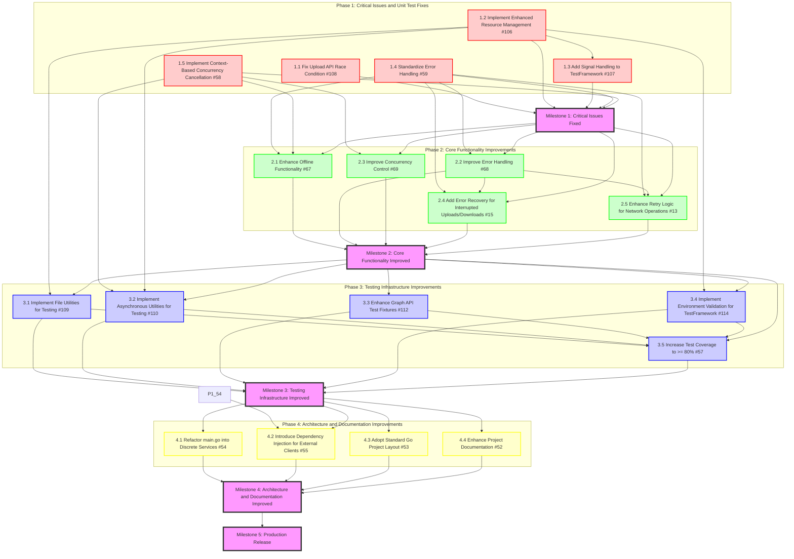
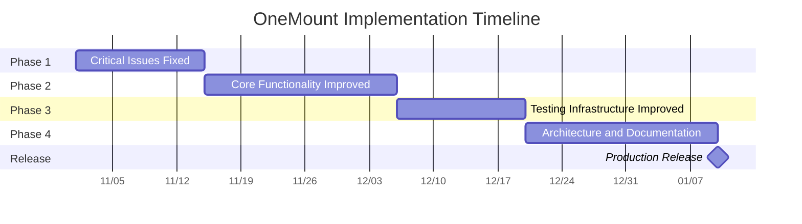

# OneMount Implementation Plan Diagram

## Dependency Graph

## Timeline

## Notes

- The dependency graph shows the relationships between tasks and how they flow into milestones.
- The timeline provides an estimated schedule for completing each phase.
- Actual dates should be adjusted based on team capacity and priorities.
- The critical path runs through all phases sequentially, with dependencies between phases.