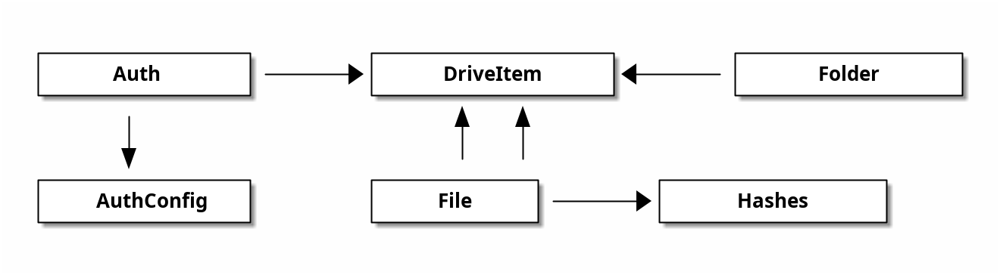

# 5. Data Model

This section describes the data structures and relationships used in the OneMount system.

## 5.1 Entity Relationship Diagram

The OneMount system uses the following key entities and their relationships:

- **Auth**: Represents authentication tokens and configuration
- **AuthConfig**: Contains authentication configuration parameters
- **DriveItem**: The core entity representing files and folders in OneDrive
- **File**: Contains file-specific attributes
- **Folder**: Contains folder-specific attributes
- **Hashes**: Contains hash values for file integrity checking

## 5.2 Data Dictionary

### Authentication Entities

#### Auth
| Attribute    | Type   | Description                                      |
|--------------|--------|--------------------------------------------------|
| AuthConfig   | struct | Authentication configuration                     |
| Account      | string | User account name                                |
| ExpiresIn    | int64  | Token expiration time in seconds                 |
| ExpiresAt    | int64  | Timestamp when the token expires                 |
| AccessToken  | string | OAuth2 access token                              |
| RefreshToken | string | OAuth2 refresh token                             |
| path         | string | Path to the auth token file                      |

#### AuthConfig
| Attribute   | Type   | Description                                      |
|-------------|--------|--------------------------------------------------|
| ClientID    | string | OAuth2 client ID                                 |
| CodeURL     | string | URL for obtaining authorization code             |
| TokenURL    | string | URL for obtaining tokens                         |
| RedirectURL | string | Redirect URL for OAuth2 flow                     |

### OneDrive Entities

#### DriveItem
| Attribute        | Type           | Description                                      |
|------------------|----------------|--------------------------------------------------|
| ID               | string         | Unique identifier for the item                   |
| Name             | string         | Name of the item                                 |
| Size             | uint64         | Size of the item in bytes                        |
| ModTime          | time.Time      | Last modified time                               |
| Parent           | DriveItemParent| Reference to the parent item                     |
| Folder           | Folder         | Present if the item is a folder                  |
| File             | File           | Present if the item is a file                    |
| Deleted          | Deleted        | Present if the item is deleted                   |
| ConflictBehavior | string         | How conflicts should be handled                  |
| ETag             | string         | Entity tag for caching                           |

#### DriveItemParent
| Attribute  | Type   | Description                                      |
|------------|--------|--------------------------------------------------|
| Path       | string | Path to the parent item                          |
| ID         | string | Unique identifier for the parent item            |
| DriveID    | string | Identifier for the drive                         |
| DriveType  | string | Type of drive (personal, business, documentLibrary) |

#### Folder
| Attribute  | Type   | Description                                      |
|------------|--------|--------------------------------------------------|
| ChildCount | uint32 | Number of child items in the folder              |

#### File
| Attribute | Type   | Description                                      |
|-----------|--------|--------------------------------------------------|
| Hashes    | Hashes | Hash values for the file                         |

#### Hashes
| Attribute    | Type   | Description                                      |
|--------------|--------|--------------------------------------------------|
| SHA1Hash     | string | SHA1 hash of the file content                    |
| QuickXorHash | string | QuickXorHash of the file content                 |

#### Deleted
| Attribute | Type   | Description                                      |
|-----------|--------|--------------------------------------------------|
| State     | string | State of the deleted item                        |
