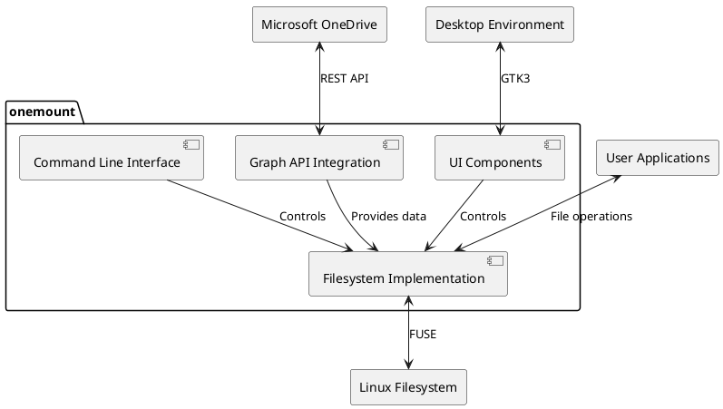
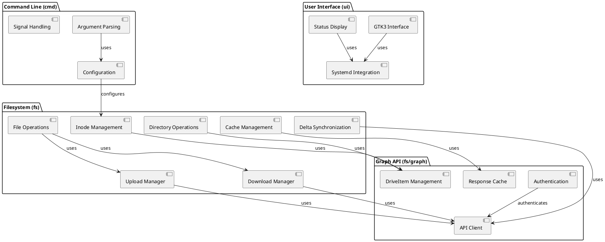
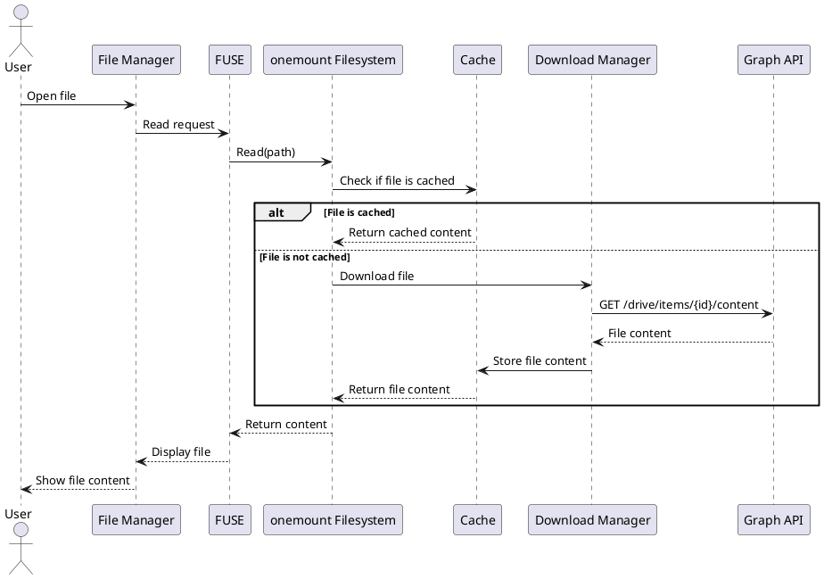
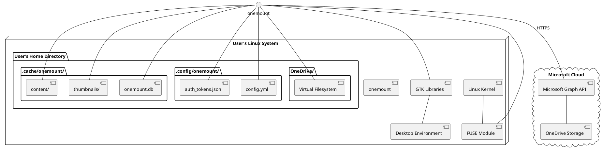

# Software Architecture Specification for OneMount

## 1. Introduction & Context

### 1.1 Purpose
This Software Architecture Specification provides a comprehensive architectural overview of the OneMount system. It presents multiple architectural views to address different stakeholder concerns and serves as a communication medium between the software architect and other project stakeholders.

### 1.2 Scope
This document covers the architecture of onemount, a native Linux filesystem for Microsoft OneDrive that performs on-demand file downloads rather than syncing the entire OneDrive content. It includes the filesystem implementation, Microsoft Graph API integration, user interfaces, and deployment considerations.

### 1.3 System Overview
onemount is a native Linux filesystem for Microsoft OneDrive that performs on-demand file downloads rather than syncing. It's written in Go and uses FUSE to implement the filesystem. The system allows Linux users to access their OneDrive files as if they were local files, but only downloads them when they are accessed, saving bandwidth and storage space.

### 1.4 Document Overview
This document is structured according to the "Views and Beyond" approach, presenting the architecture through multiple views:
- Context View: Shows how onemount fits into its environment
- Logical View: Describes the functional components of the system
- Development View: Describes the architecture that supports the software development process
- Process View: Describes the system's dynamic aspects
- Deployment View: Illustrates how the software is deployed

Each view addresses different stakeholder concerns and provides a different perspective on the system.

### 1.5 References
1. Microsoft Graph API Documentation: https://docs.microsoft.com/en-us/graph/
2. FUSE Documentation: https://github.com/libfuse/libfuse
3. BBolt Documentation: https://github.com/etcd-io/bbolt
4. GTK3 Documentation: https://docs.gtk.org/gtk3/

### 1.6 Definitions, Acronyms, and Abbreviations
- **FUSE**: Filesystem in Userspace - allows implementing a filesystem in user space
- **API**: Application Programming Interface
- **OAuth2**: Open Authorization 2.0 - an authorization protocol
- **UI**: User Interface
- **CLI**: Command Line Interface
- **GTK**: GIMP Toolkit - a multi-platform toolkit for creating graphical user interfaces
- **BBolt**: An embedded key/value database for Go
- **OneDrive**: Microsoft's cloud storage service

## 2. Stakeholder Viewpoints & Concerns

### 2.1 Stakeholder Summary

| Stakeholder                          | Description                                                | Primary Concerns                                                       |
|--------------------------------------|------------------------------------------------------------|--------------------------------------------------------------------|
| Linux Users                          | End users who want to access OneDrive on Linux             | Access OneDrive files on Linux without syncing entire account         |
| Windows/Mac Users Migrating to Linux | Users transitioning from other operating systems           | Easily transition files from Windows/Mac to Linux via OneDrive        |
| Mobile Device Users                  | Users who upload content from mobile devices               | Access photos and files uploaded from mobile devices on Linux         |
| Users with Limited Storage           | Users with large OneDrive accounts but limited local space | Access large OneDrive accounts without using equivalent local storage |
| Users with Poor Internet             | Users with unreliable internet connections                 | Work with OneDrive files even with unreliable internet connection     |
| Developers                           | Contributors to the onemount codebase                     | Extend and improve the onemount codebase                             |
| File Manager Developers              | Developers of Linux file managers                          | Integrate file managers with onemount for better user experience     |
| Package Maintainers                  | Maintainers of Linux distribution packages                 | Package onemount for different Linux distributions                   |
| Microsoft                            | Provider of the OneDrive service                           | Enable cross-platform access to OneDrive service                      |
| System Administrators                | IT staff who deploy and maintain software                  | Deploy onemount in organizational environments                       |

### 2.2 Architectural Viewpoints

| Viewpoint | Stakeholders | Concerns Addressed |
|-----------|--------------|-------------------|
| Context View | All stakeholders | System boundaries, external entities, interfaces |
| Logical View | Developers, System Administrators | Component structure, responsibilities, interactions |
| Development View | Developers, Package Maintainers | Code organization, build process, development environment |
| Process View | Developers, System Administrators | Runtime behavior, concurrency, performance |
| Deployment View | System Administrators, Package Maintainers | Installation, configuration, resource requirements |

## 3. Architectural Views

### 3.1 Context View

#### 3.1.1 System Context Diagram



#### 3.1.2 External Entities

1. **Microsoft OneDrive / Graph API**
   - Cloud storage service that hosts user files and folders
   - Provides RESTful HTTP API with OAuth2 authentication
   - onemount authenticates with Microsoft, then performs CRUD operations on files and folders

2. **Linux Filesystem**
   - The host operating system's filesystem
   - onemount mounts a virtual filesystem using FUSE that appears as a normal directory
   - Applications interact with this virtual filesystem using standard file operations

3. **User Applications**
   - Any application that needs to access OneDrive files
   - Interact with onemount through normal filesystem operations
   - Unaware that they are accessing cloud storage rather than local files

4. **Desktop Environment**
   - The Linux desktop environment (GNOME, KDE, etc.)
   - Interacts with onemount through GTK3 for UI integration and D-Bus for system integration
   - Provides status information and basic controls through system tray icon

#### 3.1.3 System Interfaces

1. **Microsoft Graph API Interface**
   - RESTful HTTP API with JSON payloads
   - OAuth2 authentication
   - Supports file/folder operations, delta queries, and upload sessions

2. **FUSE Interface**
   - Implements filesystem operations (open, read, write, etc.)
   - Maps OneDrive items to local filesystem entities
   - Handles permissions and metadata

3. **GTK3 Interface**
   - Provides graphical user interface components
   - Displays status information and configuration options
   - Allows user to control the onemount service

4. **D-Bus Interface**
   - Enables communication with the desktop environment
   - Provides status updates and notifications
   - Allows control of the onemount service

### 3.2 Logical View

#### 3.2.1 Logical Components

1. **Filesystem Implementation (fs package)**
   - Core FUSE implementation that handles filesystem operations
   - Manages inodes, file operations, and directory structure
   - Coordinates with other components to fulfill filesystem requests

2. **Graph API Integration (fs/graph package)**
   - Handles communication with Microsoft's Graph API
   - Manages authentication and token refresh
   - Translates between OneDrive items and local filesystem entities

3. **Cache Management**
   - Stores file metadata and content locally
   - Implements efficient delta synchronization
   - Manages cache cleanup and consistency

4. **Command Line Interface (cmd package)**
   - Provides user interface for mounting, unmounting, and configuring OneMount
   - Handles command-line arguments and configuration
   - Manages signals and graceful shutdown

5. **User Interface (ui package)**
   - Provides graphical interface using GTK3
   - Displays status information and configuration options
   - Integrates with desktop environment through systemd and D-Bus

#### 3.2.2 Component Diagram



#### 3.2.3 Key Abstractions

1. **Filesystem**
   - Main FUSE implementation that handles filesystem operations
   - Maps OneDrive items to local filesystem entities
   - Coordinates with other components to fulfill filesystem requests

2. **Inode**
   - Represents files and directories in the filesystem
   - Stores metadata and handles operations
   - Maps to DriveItems from OneDrive

3. **DriveItem**
   - Represents items in OneDrive (files, folders)
   - Contains metadata from the Graph API
   - Provides methods for CRUD operations

4. **Auth**
   - Manages OAuth2 authentication with Microsoft
   - Handles token refresh and storage
   - Provides authenticated HTTP client for API requests

5. **UploadManager/DownloadManager**
   - Manage file transfers to and from OneDrive
   - Handle chunking for large files
   - Implement retry logic and error handling

6. **Cache**
   - Stores file metadata and content locally
   - Implements efficient delta synchronization
   - Manages cache cleanup and consistency

### 3.3 Development View

#### 3.3.1 Module Organization

onemount follows a modular code organization that separates concerns and promotes maintainability:

| Module                 | Description                                | Key Dependencies                  |
|------------------------|--------------------------------------------|-----------------------------------|
| fs                     | Core filesystem implementation             | go-fuse, bbolt, zerolog           |
| fs/graph               | Microsoft Graph API integration            | net/http, json, zerolog           |
| fs/graph/quickxorhash  | Hash implementation for OneDrive           | hash, encoding/base64             |
| fs/offline             | Offline mode functionality                 | fs, fs/graph                      |
| cmd/onemount          | Main filesystem application                | fs, fs/graph, pflag               |
| cmd/onemount-launcher | GUI launcher application                   | ui, ui/systemd, gtk               |
| cmd/common             | Shared code between applications           | fs, yaml, zerolog                 |
| ui                     | GUI implementation                         | gtk, fs/graph                     |
| ui/systemd             | Systemd integration for the UI             | dbus, go-systemd                  |
| testutil               | Testing utilities                          | testing, fs, fs/graph             |

#### 3.3.2 Code Structure

The source code is organized according to Go's standard project layout:

```
onemount/
├── cmd/                  # Command-line applications
│   ├── common/           # Shared code between applications
│   ├── onemount/        # Main filesystem application
│   └── onemount-launcher/ # GUI launcher application
├── fs/                   # Filesystem implementation
│   ├── graph/            # Microsoft Graph API integration
│   │   └── quickxorhash/ # Hash implementation for OneDrive
│   └── offline/          # Offline mode functionality
├── ui/                   # GUI implementation
│   └── systemd/          # Systemd integration for the UI
├── testutil/             # Testing utilities
│   └── common/           # Common test utilities
└── pkg/                  # Resources and packaging files
    ├── debian/           # Debian packaging
    └── resources/        # Application resources
```

#### 3.3.3 Development Environment

onemount uses a Makefile-based build system that supports various targets:

- **build**: Compiles the main binaries
- **install**: Installs the application system-wide
- **rpm**: Creates RPM packages for Fedora, CentOS, RHEL
- **deb**: Creates DEB packages for Debian, Ubuntu
- **test**: Runs all tests
- **test-init**: Sets up the test environment

The development process is supported by several tools:

- **GoLand**: JetBrains IDE with predefined run configurations
- **cgo-helper.sh**: Script to help with CGO compilation
- **curl-graph.sh**: Utility for interacting with Microsoft Graph API
- **run_tests_with_mock_auth.sh**: Script to run tests with mock authentication

The codebase follows Go's standard coding conventions and best practices:

1. **Code Organization**
   - Group related functionality into separate files
   - Use interfaces to decouple components
   - Follow Go's standard project layout

2. **Error Handling**
   - Return errors to callers instead of handling them internally
   - Use structured logging with zerolog
   - Avoid using `log.Fatal()` in library code

3. **Testing**
   - Write both unit and integration tests
   - Use testify for assertions
   - Test edge cases, especially around network connectivity

4. **Performance**
   - Cache filesystem metadata and file contents
   - Minimize network requests
   - Use concurrent operations where appropriate

5. **Documentation**
   - Document public APIs with godoc-compatible comments
   - Add comments explaining complex logic
   - Keep the README up-to-date

### 3.4 Process View

#### 3.4.1 Runtime Processes

onemount runs as a single process with multiple goroutines for concurrent operations:

1. **Main Process**: Handles filesystem mounting and signal handling
2. **Delta Synchronization**: Background goroutine that periodically fetches changes from OneDrive
3. **Subscription-based Change Notification**: Background goroutine that listens for real-time change notifications from OneDrive using WebSockets
4. **Upload Workers**: Multiple goroutines that handle file uploads to OneDrive
5. **Download Workers**: Multiple goroutines that handle file downloads from OneDrive
6. **Cache Cleanup**: Background goroutine that periodically cleans up the cache

#### 3.4.2 Process Communication

Components communicate through various mechanisms:

1. **Function Calls**: Direct method invocation for synchronous operations
2. **Channels**: Go channels for asynchronous communication between goroutines
3. **Callbacks**: Function callbacks for event notification
4. **D-Bus**: For communication with the desktop environment
   - Provides file status updates and notifications to desktop applications
   - Implemented with a fallback mechanism to extended attributes
   - **D-Bus Unavailability Detection**: The system attempts to start the D-Bus server during filesystem initialization. If the connection to the D-Bus session bus fails or if the server cannot be started (e.g., in environments without D-Bus support), the system logs an error but continues operation.
   - **Extended Attributes Fallback**: File status information is always stored as extended attributes (`user.onemount.status` and `user.onemount.error`) on files and directories, regardless of D-Bus availability. When updating file status, the system first sets these extended attributes and then attempts to send D-Bus signals only if the D-Bus server is available.
   - **Transparent Transition**: The transition between D-Bus and extended attributes is transparent to users and applications. File managers and other applications that support either mechanism will automatically use whichever is available.
5. **HTTP**: For communication with the Microsoft Graph API

#### 3.4.3 Sequence Diagrams

The following sequence diagram illustrates the file access workflow:



### 3.5 Deployment View

#### 3.5.1 Deployment Diagram



#### 3.5.2 Physical Nodes

onemount is designed to run on Linux systems with the following components:

- **Operating System**: Linux (various distributions)
- **Required Libraries**: FUSE, GTK3
- **Runtime Dependencies**:
  - go-fuse/v2: For filesystem implementation
  - gotk3: For GUI components
  - bbolt: For embedded database
  - zerolog: For logging

#### 3.5.3 Network Requirements

onemount requires outbound HTTPS access to the following endpoints:

- `https://login.microsoftonline.com` - Authentication
- `https://graph.microsoft.com` - Microsoft Graph API

No inbound network access is required.

When deployed, onemount creates the following directory structure:

```
$HOME/
├── .config/onemount/
│   ├── config.yml       # User configuration
│   ├── auth_tokens.json # Authentication tokens
│   └── onemount.log    # Log file
├── .cache/onemount/
│   ├── content/         # Cached file content
│   ├── thumbnails/      # Cached thumbnails
│   └── onemount.db     # Metadata cache database
└── OneMount/            # Mount point (configurable)
```

## 4. Crosscutting Concerns

### 4.1 Security

#### 4.1.1 Security Requirements

onemount must securely handle user authentication and protect user data:

- Secure storage of authentication tokens
- Secure communication with Microsoft Graph API
- Protection of cached file content
- Proper handling of file permissions

#### 4.1.2 Authentication and Authorization

onemount uses OAuth2 for authentication with Microsoft:

- OAuth2 authorization code flow for interactive authentication
- Device code flow for headless authentication
- Secure storage of refresh tokens
- Automatic token refresh when needed

#### 4.1.3 Data Protection

User data is protected through several mechanisms:

- HTTPS for all communication with Microsoft Graph API
- Local file permissions for cached content
- Encryption of authentication tokens
- Secure handling of sensitive information in memory

#### 4.1.4 Security Patterns

onemount implements several security patterns:

- Principle of least privilege
- Defense in depth
- Secure by default
- Fail securely

### 4.2 Performance

#### 4.2.1 Performance Requirements

onemount must provide responsive file access while minimizing resource usage:

- Fast access to frequently used files
- Efficient use of network bandwidth
- Minimal memory and CPU usage
- Responsive user interface

#### 4.2.2 Scalability

onemount scales to handle large OneDrive accounts through:

- On-demand file downloading
- Efficient caching of metadata
- Delta synchronization for efficient updates
- Subscription-based change notifications for real-time updates
- Concurrent file transfers

#### 4.2.2.1 Subscription-based Change Notification

The current realtime design replaces legacy “webhook” terminology with a Socket.IO subscription that is completely owned by the client:

- The filesystem requests a delegated Socket.IO endpoint for the mounted drive using Microsoft Graph’s `/subscriptions/socketIo` flow and never exposes an inbound webhook URL.
- A dedicated `SocketSubscriptionManager` coordinates the lifecycle (startup, renewal, shutdown) and publishes notifications to the delta loop through a buffered channel.
- The manager relies on the in-house `internal/socketio` module, which implements Engine.IO v4/WebSocket transport with deterministic heartbeats, reconnection backoff, and structured tracing.
- Health signals from the transport determine the polling cadence: when the socket is healthy the delta loop polls no more than every 30 minutes; when unhealthy it falls back to 5 minutes (temporarily down to 10 seconds during prolonged failures).
- Incoming `notification` events immediately trigger an on-demand delta query so user-visible state stays in sync without waiting for the next watchdog pass.

This mechanism complements the delta synchronization by providing immediate notifications while allowing a graceful fallback to timed polling whenever the realtime channel is unavailable.

#### 4.2.3 Caching Strategy

onemount uses a sophisticated caching system:

- Metadata cache using BBolt database
- Content cache on local filesystem
- Thumbnail cache for quick previews
- Cache cleanup to manage disk usage

#### 4.2.4 Performance Monitoring

Performance is monitored through:

- Structured logging of operation times
- Metrics for file transfers
- Cache hit/miss statistics
- Resource usage monitoring

### 4.3 Other Crosscutting Concerns

1. **Availability**
   - Offline mode for continued operation without internet
   - Automatic reconnection when connectivity is restored
   - Network connectivity detection
     - Detection mechanism: The system uses a passive approach to detect network connectivity changes by monitoring the success or failure of API calls to Microsoft Graph.
     - Components responsible:
       - Delta synchronization loop: A background goroutine that periodically fetches changes from OneDrive using the delta API.
       - IsOffline function: Determines if an error from a network request indicates network connectivity issues by examining error patterns.
     - Detection process:
       - When a delta fetch fails with an error that indicates network connectivity issues, the system marks the filesystem as offline.
       - When a delta fetch succeeds after previously being offline, the system marks the filesystem as online again.
       - The offline state affects file operations, causing the system to use cached content and queue changes for later synchronization.
       - When transitioning from offline to online mode, the system processes all changes made while offline.
   - Crash recovery architecture
     - State preservation: The system uses a bbolt embedded database to persistently store filesystem metadata, upload sessions, and delta synchronization state. This ensures that critical state is preserved across crashes.
     - Crash detection: The system detects crashes by checking for stale database lock files during startup. If a lock file exists but is older than 5 minutes, it's considered stale and removed to allow recovery.
     - Recovery process: During initialization, the system:
       - Opens the database with retries and exponential backoff to handle potential corruption
       - Restores filesystem metadata from the persistent store
       - Recovers and restarts incomplete upload sessions
       - Processes any changes made while offline
       - Resumes delta synchronization from the last known state

2. **Reliability**
   - Retry logic for network operations
   - Graceful handling of API rate limits
     - Detection mechanisms: The system identifies rate limiting through HTTP 429 responses and Retry-After headers from the Microsoft Graph API
     - Backoff strategies: Implements exponential backoff with jitter for retries, starting with a base delay and increasing up to a maximum delay
     - Request prioritization: Critical operations (e.g., saving files) are prioritized over background operations during rate limiting
     - Rate tracking: Maintains a sliding window counter of requests to proactively avoid hitting limits
     - User notification: Displays system notifications when rate limits are encountered, with different severity levels based on impact
   - Conflict resolution for concurrent changes
     - **Conflict Detection Mechanism**: The system detects conflicts when a file has both remote changes (newer modification time and different ETag) and local changes. Local changes are detected by checking for offline changes in the database and pending uploads.
     - **Resolution Strategy**: When a conflict is detected, the system creates a conflict copy of the remote file with a timestamp in the name (e.g., "filename (Conflict Copy 2023-05-15 14:30:25)"). The local version is kept as is, preserving the user's changes, while the remote version is added as a separate file with the conflict copy name.
     - **User Notification Approach**: Files with conflicts are marked with a special status flag. This status is exposed to users through:
       1. Extended attributes on the files (`user.onemount.status` and `user.onemount.error`) that can be displayed by file managers
       2. D-Bus signals that notify desktop applications about the conflict
       3. Visual indicators in the UI showing the conflict status

3. **Maintainability**
   - Modular design for easier maintenance
   - Comprehensive test suite
   - Clear documentation

4. **Usability**
   - Intuitive user interface
   - Seamless integration with desktop environment
   - Helpful error messages

## 5. Architectural Decisions

### 5.1 Key Architectural Decisions

| Decision | Alternatives Considered | Rationale |
|----------|-------------------------|-----------|
| Use of FUSE | Kernel module, custom protocol | FUSE allows implementing a filesystem in user space, which simplifies development and deployment while providing good performance and compatibility. |
| On-demand file download | Full synchronization, hybrid approach | On-demand downloading saves bandwidth and local storage, especially for users with large OneDrive accounts. |
| Local caching | No caching, remote-only | Caching improves performance and enables offline access while balancing storage usage. |
| Go programming language | C/C++, Rust, Python | Go provides good performance, built-in concurrency, cross-platform support, and a rich ecosystem of libraries. |
| BBolt for metadata cache | SQLite, LevelDB, Redis | BBolt is a simple, embedded key-value store that is well-suited for metadata caching and has no external dependencies. |

### 5.2 Architectural Constraints

1. **FUSE Limitations**
   - FUSE has performance overhead compared to kernel filesystems
   - Some applications may not work correctly with FUSE filesystems
   - FUSE requires kernel support and user permissions

2. **Microsoft Graph API Constraints**
   - API rate limits restrict the number of requests
   - API changes may require updates to the codebase
   - Authentication requirements may change

3. **Linux Distribution Compatibility**
   - Different distributions have different package management systems
   - GTK version differences between distributions
   - Systemd may not be available on all distributions

### 5.3 Quality Attribute Scenarios

1. **Performance Scenario**: A user opens a large file that is not in the cache
   - The system should start displaying the file within 2 seconds
   - The file should continue loading in the background
   - The user should be able to interact with the beginning of the file while the rest loads

2. **Availability Scenario**: A user loses internet connectivity
   - The system should detect the connectivity loss
   - Recently accessed files should remain available
   - Changes made offline should be queued for upload when connectivity is restored

3. **Security Scenario**: A user's authentication token expires
   - The system should detect the expired token
   - The system should automatically refresh the token if a refresh token is available
   - If automatic refresh fails, the user should be prompted to re-authenticate

## 6. Appendices

### 6.1 Glossary

| Term | Abbreviation | Definition | Source |
| --- | --- | --- | --- |
| Filesystem in Userspace | FUSE | A software interface that allows implementing a filesystem in user space | |
| OneDrive | | Microsoft's cloud storage service | |
| Graph API | | Microsoft's API for accessing OneDrive and other Microsoft services | |
| OAuth2 | | An authorization framework that enables third-party applications to obtain limited access to a user's account | |
| Delta Synchronization | | A method of synchronizing changes by only transferring the differences between versions | |
| Inode | | A data structure that stores information about a file or directory in a filesystem | |
| Goroutine | | A lightweight thread managed by the Go runtime | |
| BBolt | | An embedded key-value database for Go | |

### 6.2 Revision History

| Version | Date       | Description | Author |
|---------|------------|-------------|--------|
| 0.1.0   | 2025-04-28 | Initial version | onemount Team |
