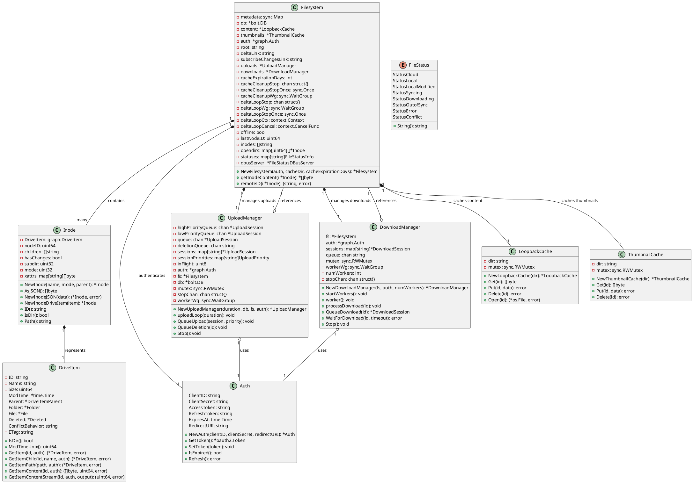
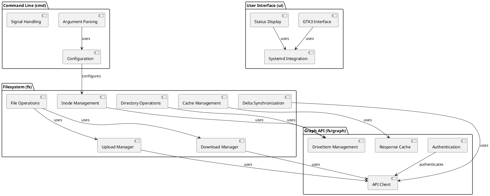
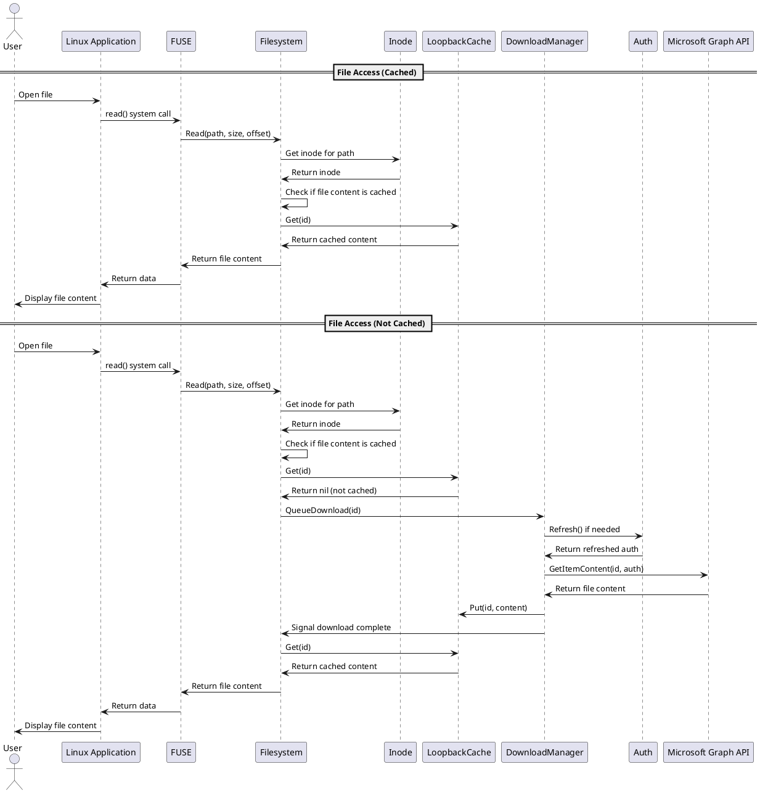
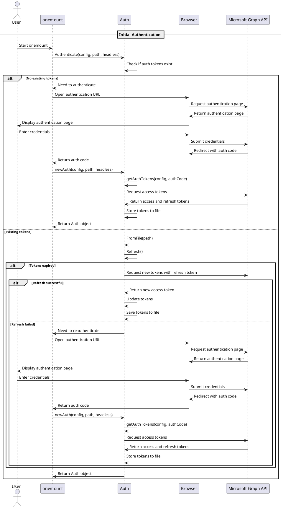
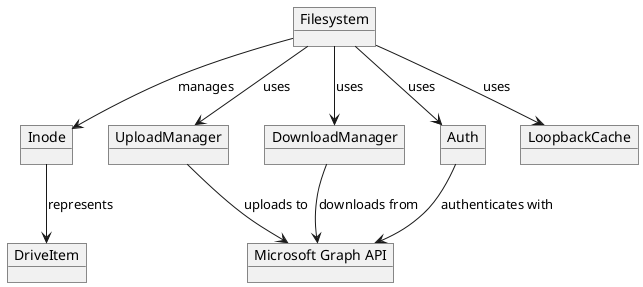
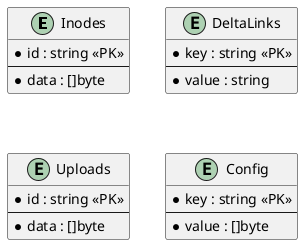

# Software Design Specification for OneMount

## 1. Introduction

### 1.1 Purpose
This software design specification document provides a detailed technical description of the OneMount system architecture, components, and interfaces. It serves as a reference for developers working on the project and helps ensure consistent implementation across the codebase.

### 1.2 Scope
This document covers the design of onemount, a native Linux filesystem for Microsoft OneDrive that performs on-demand file downloads rather than syncing the entire OneDrive content. It includes the filesystem implementation, Microsoft Graph API integration, user interfaces, authentication mechanisms, caching strategies, and offline functionality.

### 1.3 Definitions, Acronyms, and Abbreviations
- **FUSE**: Filesystem in Userspace - allows implementing a filesystem in user space
- **API**: Application Programming Interface
- **OAuth2**: Open Authorization 2.0 - an authorization protocol
- **UI**: User Interface
- **CLI**: Command Line Interface
- **GTK**: GIMP Toolkit - a multi-platform toolkit for creating graphical user interfaces
- **BBolt**: An embedded key/value database for Go
- **OneDrive**: Microsoft's cloud storage service
- **Graph API**: Microsoft's API for accessing OneDrive and other Microsoft services
- **Delta Synchronization**: A method of synchronizing changes by only transferring the differences between versions
- **Inode**: A data structure that stores information about a file or directory in a filesystem
- **Goroutine**: A lightweight thread managed by the Go runtime

## 2. Class & Component Diagrams

### 2.1 Class Diagram
The following class diagram shows the core classes of the onemount system and their relationships:



### 2.2 Component Diagram
The following component diagram shows the major components of the onemount system and their interactions:



## 3. Sequence & Collaboration Diagrams

### 3.1 Sequence Diagram
The following sequence diagram illustrates the file access workflow in OneMount:



The following sequence diagram illustrates the authentication workflow in OneMount:



### 3.2 Collaboration Diagram
The following collaboration diagram shows the interactions between key objects in the onemount system:



## 4. API Specifications

### 4.1 API Overview
onemount interacts with Microsoft's Graph API to access and manipulate OneDrive files and folders. The API integration is implemented in the `fs/graph` package and provides a Go interface to the REST API.

### 4.2 API Endpoints/Methods

#### 4.2.1 GetItem
- **Description**: Retrieves a DriveItem by its ID
- **Method Signature**: `GetItem(id string, auth *Auth) (*DriveItem, error)`
- **Parameters**:
  - `id` (string): The ID of the DriveItem to retrieve
  - `auth` (*Auth): Authentication information
- **Returns**:
  - `*DriveItem`: The retrieved DriveItem
  - `error`: Error if the operation fails
- **Example**:
  ```
  item, err := GetItem("1234567890", auth)
  ```

#### 4.2.2 GetItemContent
- **Description**: Retrieves the content of a file
- **Method Signature**: `GetItemContent(id string, auth *Auth) ([]byte, uint64, error)`
- **Parameters**:
  - `id` (string): The ID of the file to retrieve
  - `auth` (*Auth): Authentication information
- **Returns**:
  - `[]byte`: The file content
  - `uint64`: The size of the file
  - `error`: Error if the operation fails
- **Example**:
  ```
  content, size, err := GetItemContent("1234567890", auth)
  ```

#### 4.2.3 GetItemChildren
- **Description**: Retrieves the children of a folder
- **Method Signature**: `GetItemChildren(id string, auth *Auth) ([]*DriveItem, error)`
- **Parameters**:
  - `id` (string): The ID of the folder
  - `auth` (*Auth): Authentication information
- **Returns**:
  - `[]*DriveItem`: The children of the folder
  - `error`: Error if the operation fails
- **Example**:
  ```
  children, err := GetItemChildren("1234567890", auth)
  ```

#### 4.2.4 Mkdir
- **Description**: Creates a new folder
- **Method Signature**: `Mkdir(name string, parentID string, auth *Auth) (*DriveItem, error)`
- **Parameters**:
  - `name` (string): The name of the new folder
  - `parentID` (string): The ID of the parent folder
  - `auth` (*Auth): Authentication information
- **Returns**:
  - `*DriveItem`: The created folder
  - `error`: Error if the operation fails
- **Example**:
  ```
  folder, err := Mkdir("New Folder", "1234567890", auth)
  ```

#### 4.2.5 Remove
- **Description**: Removes a file or folder
- **Method Signature**: `Remove(id string, auth *Auth) error`
- **Parameters**:
  - `id` (string): The ID of the item to remove
  - `auth` (*Auth): Authentication information
- **Returns**:
  - `error`: Error if the operation fails
- **Example**:
  ```
  err := Remove("1234567890", auth)
  ```

### 4.3 Authentication and Authorization
onemount uses OAuth2 for authentication with Microsoft's Graph API. The authentication process is implemented in the `fs/graph` package and provides the following features:

- OAuth2 authorization code flow for interactive authentication
- Device code flow for headless authentication
- Secure storage of refresh tokens
- Automatic token refresh when needed

### 4.4 Rate Limiting and Quotas
Microsoft’s Graph API has rate limits that onemount must respect. The API integration includes mechanisms to handle rate limiting:

- Exponential backoff for retrying requests
- Caching to reduce the number of API calls
- Queuing of uploads and downloads to avoid overwhelming the API

### 4.5 Realtime Notification Module

The realtime notification pipeline is now defined by an explicit Engine.IO/Socket.IO transport interface instead of depending on a third-party client. This section captures the best-practice shape of the module so any future implementation can be validated against Requirement 20.

#### 4.5.1 Layered Components

1. **`SocketSubscriptionManager` (package `internal/fs`)**
   - Owns the Graph subscription lifecycle (endpoint discovery, renewal, shutdown).
   - Consumes the transport interface to receive notification events and translate them into filesystem wake-ups.
   - Publishes health signals to the delta loop so polling cadence can adjust automatically.

2. **`RealtimeTransport` interface (package `internal/socketio`)**
   - Defines the contract between subscription management and the Engine.IO implementation.
   - Facilitates dependency injection in tests; alternative transports must obey the same semantics.

3. **`EngineTransport` implementation (package `internal/socketio`)**
   - Concrete Engine.IO v4/WebSocket client that satisfies `RealtimeTransport`.
   - Implements heartbeat, reconnection, logging, and packet parsing rules mandated by Requirement 20.

#### 4.5.2 Interface Definition

```go
// RealtimeTransport exposes the minimum surface needed by the filesystem.
type RealtimeTransport interface {
    Connect(ctx context.Context, endpoint string, headers http.Header) error
    Close(ctx context.Context) error
    On(event EventType, handler Listener)
    Health() HealthState
}

type EventType string

type HealthState struct {
    Status          StatusCode // Healthy, Degraded, Failed
    LastError       error
    MissedHeartbeats int
    LastHeartbeat    time.Time
}
```

- `Connect` negotiates the Engine.IO handshake (`EIO=4&transport=websocket`) and must be idempotent; repeated calls after a healthy connection return immediately.
- `On` registers strongly typed listeners for events such as `EventConnected`, `EventNotification`, `EventError`, and `EventEngineMetrics`.
- `Health` executes in O(1) time and is safe for concurrent calls from the delta loop watchdog.
- `Close` stops heartbeats, drains goroutines, and ensures that the connection is torn down before unmounting.

#### 4.5.3 EngineTransport Responsibilities

- **Handshake & Auth**: Attach the current OAuth bearer token and preserve Graph query parameters (resource, delta tokens). Rotate the connection when tokens are refreshed.
 - **Handshake & Auth**: Attach the current OAuth bearer token and preserve Graph query parameters (resource, delta tokens). Rotate the connection when tokens are refreshed. Use the host and query string from the `notificationUrl` Microsoft Graph returns, but always target the standard Socket.IO path (`/socket.io/`) and connect via WebSocket with `EIO=4&transport=websocket` so the push service treats the session the same way as the official client.
- **Heartbeat Management**: Parse the server-provided ping interval/timeout, schedule local timers, and declare the transport degraded after two consecutive missed pings.
- **Reconnection Policy**: Apply exponential backoff (1 s → 2 s → 4 s … capped at 60 s with ±10 % jitter). Reset the backoff after a successful reconnect.
- **Structured Diagnostics**: Emit trace-level logs for packet direction, handshake payloads, ping/pong timing, and close/error codes. Payloads must be truncated to a configurable limit to avoid log bloat.
- **Testing Hooks**: Provide fake transports that implement `RealtimeTransport` so unit and integration tests can cover error paths without a live Graph endpoint.
- **Standalone Operation**: The implementation MUST reside inside the OneMount repository; it may not delegate to Azure Web PubSub or other managed relays.

#### 4.5.4 Interaction with Delta Loop

1. Transport connects and reports `Healthy`.
2. `SocketSubscriptionManager` marks realtime mode active and lengthens the delta polling interval (≥30 minutes by default).
3. When a `notification` event arrives, the manager triggers `DeltaLoop.ScheduleImmediateSync()`.
4. If the transport reports `Degraded` or `Failed`, the manager shortens polling to 5 minutes (or a temporarily aggressive 10 seconds) until health is restored.

This design ensures the Engine.IO module can evolve independently while guaranteeing that every implementation conforms to the same observable behavior.

## 5. Data Model Definitions

### 5.1 Data Model Overview
onemount's data model consists of several key entities that represent the filesystem and its interaction with OneDrive:

1. **Filesystem**: The main entity that manages the filesystem operations
2. **Inode**: Represents files and directories in the filesystem
3. **DriveItem**: Represents items in OneDrive (files, folders)
4. **Auth**: Manages authentication with Microsoft
5. **Cache**: Stores file metadata and content locally

### 5.2 Entity Definitions

#### 5.2.1 Filesystem
- **Description**: The main entity that manages the filesystem operations
- **Attributes**:
  - `metadata` (sync.Map): Stores metadata for inodes
  - `db` (*bolt.DB): Database for persistent storage
  - `content` (*LoopbackCache): Cache for file content
  - `thumbnails` (*ThumbnailCache): Cache for thumbnails
  - `auth` (*graph.Auth): Authentication information
  - `root` (string): Root directory ID
  - `deltaLink` (string): Link for delta synchronization
  - `uploads` (*UploadManager): Manages file uploads
  - `downloads` (*DownloadManager): Manages file downloads
  - `offline` (bool): Whether the system is in offline mode
- **Relationships**:
  - Contains many Inodes
  - Has one UploadManager
  - Has one DownloadManager
  - Has one LoopbackCache
  - Has one ThumbnailCache
  - Has one Auth

#### 5.2.2 Inode
- **Description**: Represents files and directories in the filesystem
- **Attributes**:
  - `DriveItem` (graph.DriveItem): The corresponding OneDrive item
  - `nodeID` (uint64): Unique identifier for the inode
  - `children` ([]string): IDs of child inodes (for directories)
  - `hasChanges` (bool): Whether the inode has local changes
  - `mode` (uint32): File mode (permissions)
  - `xattrs` (map[string][]byte): Extended attributes
- **Relationships**:
  - Belongs to one Filesystem
  - Represents one DriveItem

#### 5.2.3 DriveItem
- **Description**: Represents items in OneDrive (files, folders)
- **Attributes**:
  - `ID` (string): Unique identifier for the item
  - `Name` (string): Name of the item
  - `Size` (uint64): Size of the item in bytes
  - `ModTime` (*time.Time): Last modification time
  - `Parent` (*DriveItemParent): Parent folder information
  - `Folder` (*Folder): Folder information (if it's a folder)
  - `File` (*File): File information (if it's a file)
  - `Deleted` (*Deleted): Deletion information (if it's deleted)
  - `ETag` (string): Entity tag for concurrency control
- **Relationships**:
  - Is represented by one Inode
  - Has one Parent (if not root)
  - Is either a File or a Folder

### 5.3 Database Schema
onemount uses BBolt, an embedded key/value database, to store metadata. The database schema is organized as follows:



### 5.4 Data Validation Rules
onemount implements several data validation rules to ensure data integrity:

1. **File Names**: Must be valid in both OneDrive and Linux filesystems
2. **File Sizes**: Must be within OneDrive's limits
3. **Path Lengths**: Must be within OneDrive's and Linux's limits
4. **Permissions**: Must be compatible with both OneDrive and Linux

## 6. Implementation Considerations

### 6.1 Dependencies
onemount has the following external dependencies:

1. **go-fuse/v2**: For filesystem implementation
2. **gotk3**: For GUI components
3. **bbolt**: For embedded database
4. **zerolog**: For structured logging
5. **testify**: For testing
6. **pflag**: For command-line argument parsing
7. **yaml**: For configuration file parsing
8. **dbus**: For D-Bus integration
9. **go-systemd**: For systemd integration

### 6.2 Performance Considerations
onemount implements several performance optimizations:

1. **Caching**: Metadata and content are cached locally to reduce API calls
2. **Delta Synchronization**: Only changes are synchronized to reduce bandwidth usage
3. **Concurrent Operations**: Multiple goroutines are used for uploads and downloads
4. **Chunked Transfers**: Large files are transferred in chunks to improve reliability
5. **Response Caching**: API responses are cached to reduce duplicate requests

### 6.3 Security Considerations
onemount implements several security measures:

1. **Token Storage**: Authentication tokens are stored with appropriate file permissions
2. **HTTPS**: All API communications use HTTPS
3. **Minimal Permissions**: The application requests only the permissions it needs
4. **Secure Defaults**: Security-sensitive options have secure defaults
5. **Error Handling**: Security-related errors are handled gracefully

### 6.4 Error Handling
onemount implements a comprehensive error handling strategy:

1. **Structured Logging**: Errors are logged with context information
2. **Retry Logic**: Transient errors are retried with exponential backoff
3. **User Feedback**: User-facing errors are presented clearly
4. **Graceful Degradation**: The system continues to function when possible, even with errors
5. **Error Types**: Different types of errors are handled appropriately

## 7. Appendices

### 7.1 References
1. Microsoft Graph API Documentation: https://docs.microsoft.com/en-us/graph/
2. FUSE Documentation: https://github.com/libfuse/libfuse
3. BBolt Documentation: https://github.com/etcd-io/bbolt
4. GTK3 Documentation: https://docs.gtk.org/gtk3/
5. onemount Software Architecture Specification

### 7.2 Revision History

| Version | Date       | Description | Author |
|---------|------------|-------------|--------|
| 0.1.0   | 2025-04-28 | Initial draft | onemount Team |
