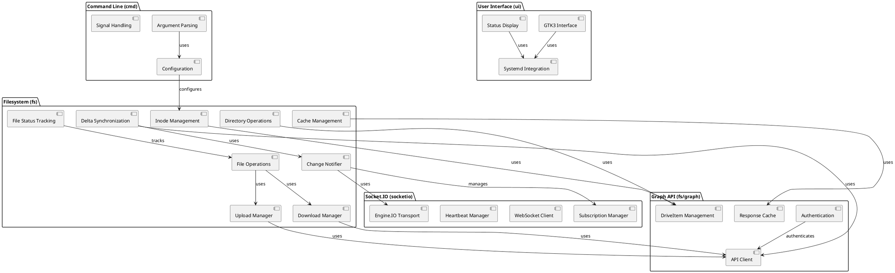
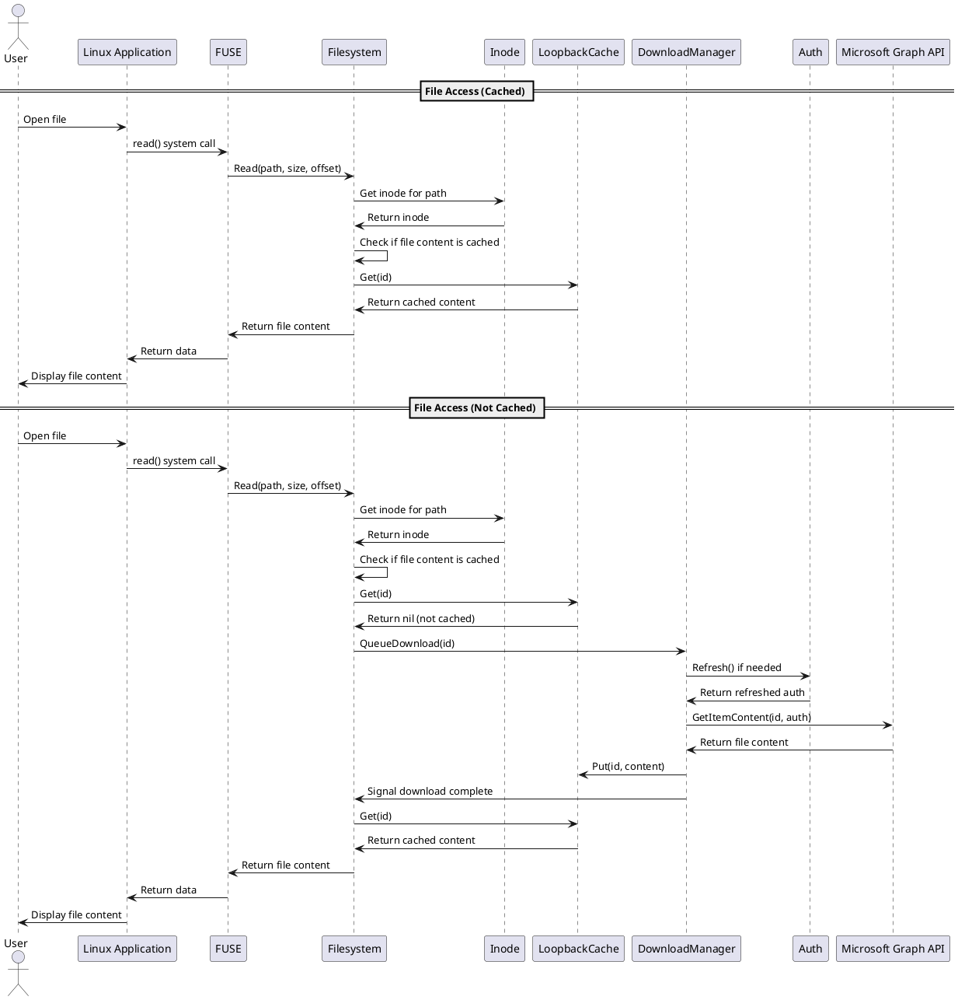
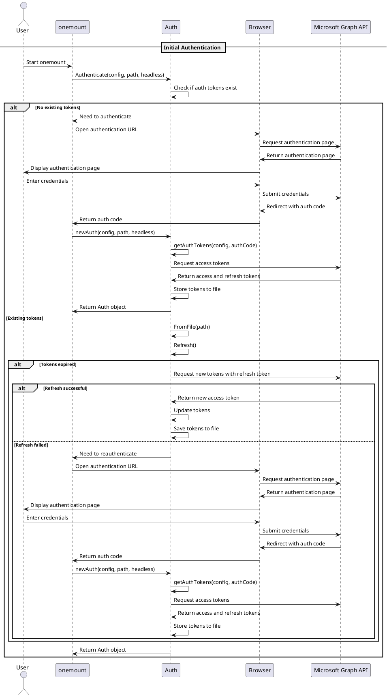
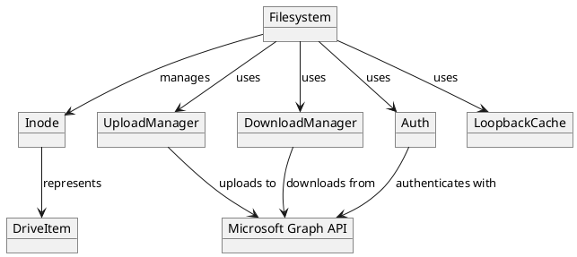
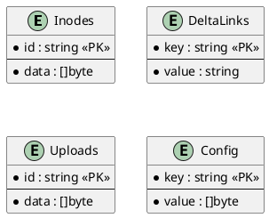

# Software Design Specification for OneMount

## 1. Introduction

### 1.1 Purpose
This software design specification document provides a detailed technical description of the OneMount system architecture, components, and interfaces. It serves as a reference for developers working on the project and helps ensure consistent implementation across the codebase.

### 1.2 Scope
This document covers the design of onemount, a native Linux filesystem for Microsoft OneDrive that performs on-demand file downloads rather than syncing the entire OneDrive content. It includes the filesystem implementation, Microsoft Graph API integration, user interfaces, authentication mechanisms, caching strategies, and offline functionality.

### 1.3 Definitions, Acronyms, and Abbreviations
- **FUSE**: Filesystem in Userspace - allows implementing a filesystem in user space
- **API**: Application Programming Interface
- **OAuth2**: Open Authorization 2.0 - an authorization protocol
- **UI**: User Interface
- **CLI**: Command Line Interface
- **GTK**: GIMP Toolkit - a multi-platform toolkit for creating graphical user interfaces
- **BBolt**: An embedded key/value database for Go
- **OneDrive**: Microsoft's cloud storage service
- **Graph API**: Microsoft's API for accessing OneDrive and other Microsoft services
- **Delta Synchronization**: A method of synchronizing changes by only transferring the differences between versions
- **Inode**: A data structure that stores information about a file or directory in a filesystem
- **Goroutine**: A lightweight thread managed by the Go runtime

## 2. Class & Component Diagrams

### 2.1 Class Diagram
The following class diagram shows the core classes of the onemount system and their relationships:

```plantuml
@startuml
class Filesystem {
  -metadata: sync.Map
  -db: *bbolt.DB
  -content: *LoopbackCache
  -thumbnails: *ThumbnailCache
  -auth: *graph.Auth
  -root: string
  -deltaLink: string
  -uploads: *UploadManager
  -downloads: *DownloadManager
  -changeNotifier: ChangeNotifier
  -offline: bool
  -timeouts: TimeoutConfig
  -statuses: map[string]FileStatusInfo
  -dbusServer: *FileStatusDBusServer
  -lastNodeID: uint64
  -inodes: []string
  -opendirs: map[uint64][]*Inode
  +NewFilesystem(auth, cacheDir, cacheExpirationDays): *Filesystem
  +getInodeContent(i *Inode): *[]byte
  +remoteID(i *Inode): (string, error)
}

class Inode {
  -DriveItem: graph.DriveItem
  -nodeID: uint64
  -children: []string
  -hasChanges: bool
  -subdir: uint32
  -mode: uint32
  -xattrs: map[string][]byte
  +NewInode(name, mode, parent): *Inode
  +AsJSON(): []byte
  +NewInodeJSON(data): (*Inode, error)
  +NewInodeDriveItem(item): *Inode
  +ID(): string
  +IsDir(): bool
  +Path(): string
}

class DriveItem {
  -ID: string
  -Name: string
  -Size: uint64
  -ModTime: *time.Time
  -Parent: *DriveItemParent
  -Folder: *Folder
  -File: *File
  -Deleted: *Deleted
  -ConflictBehavior: string
  -ETag: string
  +IsDir(): bool
  +ModTimeUnix(): uint64
  +GetItem(id, auth): (*DriveItem, error)
  +GetItemChild(id, name, auth): (*DriveItem, error)
  +GetItemPath(path, auth): (*DriveItem, error)
  +GetItemContent(id, auth): ([]byte, uint64, error)
  +GetItemContentStream(id, auth, output): (uint64, error)
}

class Auth {
  -ClientID: string
  -ClientSecret: string
  -AccessToken: string
  -RefreshToken: string
  -ExpiresAt: time.Time
  -RedirectURI: string
  +NewAuth(clientID, clientSecret, redirectURI): *Auth
  +GetToken(): *oauth2.Token
  +SetToken(token): void
  +IsExpired(): bool
  +Refresh(): error
}

class UploadManager {
  -highPriorityQueue: chan *UploadSession
  -lowPriorityQueue: chan *UploadSession
  -queue: chan *UploadSession
  -deletionQueue: chan string
  -sessions: map[string]*UploadSession
  -sessionPriorities: map[string]UploadPriority
  -inFlight: uint8
  -auth: *graph.Auth
  -fs: *Filesystem
  -db: *bolt.DB
  -mutex: sync.RWMutex
  -stopChan: chan struct{}
  -workerWg: sync.WaitGroup
  +NewUploadManager(duration, db, fs, auth): *UploadManager
  +uploadLoop(duration): void
  +QueueUpload(session, priority): void
  +QueueDeletion(id): void
  +Stop(): void
}

class DownloadManager {
  -fs: *Filesystem
  -auth: *graph.Auth
  -sessions: map[string]*DownloadSession
  -queue: chan string
  -mutex: sync.RWMutex
  -workerWg: sync.WaitGroup
  -numWorkers: int
  -stopChan: chan struct{}
  +NewDownloadManager(fs, auth, numWorkers): *DownloadManager
  +startWorkers(): void
  +worker(): void
  +processDownload(id): void
  +QueueDownload(id): *DownloadSession
  +WaitForDownload(id, timeout): error
  +Stop(): void
}

class LoopbackCache {
  -dir: string
  -mutex: sync.RWMutex
  +NewLoopbackCache(dir): *LoopbackCache
  +Get(id): []byte
  +Put(id, data): error
  +Delete(id): error
  +Open(id): (*os.File, error)
}

class ThumbnailCache {
  -dir: string
  -mutex: sync.RWMutex
  +NewThumbnailCache(dir): *ThumbnailCache
  +Get(id): []byte
  +Put(id, data): error
  +Delete(id): error
}

enum FileStatus {
  StatusCloud
  StatusLocal
  StatusLocalModified
  StatusSyncing
  StatusDownloading
  StatusOutofSync
  StatusError
  StatusConflict
  +String(): string
}

interface ChangeNotifier {
  +Start(ctx): error
  +Stop(ctx): error
  +Notifications(): <-chan struct{}
  +Health(): HealthState
  +IsActive(): bool
  +Stats(): NotifierStats
}

class SocketSubscriptionManager {
  -subscriptionID: string
  -notificationURL: string
  -expiration: time.Time
  -clientState: string
  -renewalTicker: *time.Ticker
  -transport: RealtimeTransport
  +NewSocketSubscriptionManager(): *SocketSubscriptionManager
  +Start(): error
  +Stop(): error
  +Renew(): error
}

class TimeoutConfig {
  -DownloadWorkerShutdown: time.Duration
  -UploadGracefulShutdown: time.Duration
  -FilesystemShutdown: time.Duration
  -NetworkCallbackShutdown: time.Duration
  -MetadataRequestTimeout: time.Duration
  -ContentStatsTimeout: time.Duration
  +DefaultTimeoutConfig(): TimeoutConfig
  +Validate(): error
}

class FileStatusInfo {
  -Status: FileStatus
  -Progress: float64
  -Error: string
  -LastUpdated: time.Time
  +NewFileStatusInfo(): FileStatusInfo
  +UpdateStatus(status): void
  +UpdateProgress(progress): void
}

Filesystem "1" *-- "many" Inode : contains
Filesystem "1" *-- "1" UploadManager : manages uploads
Filesystem "1" *-- "1" DownloadManager : manages downloads
Filesystem "1" *-- "1" LoopbackCache : caches content
Filesystem "1" *-- "1" ThumbnailCache : caches thumbnails
Filesystem "1" *-- "1" Auth : authenticates
Filesystem "1" *-- "1" ChangeNotifier : notifies changes
Filesystem "1" *-- "1" TimeoutConfig : configures timeouts
Filesystem "1" *-- "many" FileStatusInfo : tracks status

Inode "1" *-- "1" DriveItem : represents

UploadManager "1" o-- "1" Filesystem : references
UploadManager "1" o-- "1" Auth : uses

DownloadManager "1" o-- "1" Filesystem : references
DownloadManager "1" o-- "1" Auth : uses

ChangeNotifier "1" *-- "1" SocketSubscriptionManager : manages subscriptions
SocketSubscriptionManager "1" o-- "1" Filesystem : references
@enduml
```



### 2.2 Component Diagram
The following component diagram shows the major components of the onemount system and their interactions:



## 3. Sequence & Collaboration Diagrams

### 3.1 Sequence Diagram
The following sequence diagram illustrates the file access workflow in OneMount:



The following sequence diagram illustrates the authentication workflow in OneMount:



### 3.2 Collaboration Diagram
The following collaboration diagram shows the interactions between key objects in the onemount system:



## 4. API Specifications

### 4.1 API Overview
onemount interacts with Microsoft's Graph API to access and manipulate OneDrive files and folders. The API integration is implemented in the `fs/graph` package and provides a Go interface to the REST API.

### 4.2 API Endpoints/Methods

#### 4.2.1 GetItem
- **Description**: Retrieves a DriveItem by its ID
- **Method Signature**: `GetItem(id string, auth *Auth) (*DriveItem, error)`
- **Parameters**:
  - `id` (string): The ID of the DriveItem to retrieve
  - `auth` (*Auth): Authentication information
- **Returns**:
  - `*DriveItem`: The retrieved DriveItem
  - `error`: Error if the operation fails
- **Example**:
  ```
  item, err := GetItem("1234567890", auth)
  ```

#### 4.2.2 GetItemContent
- **Description**: Retrieves the content of a file
- **Method Signature**: `GetItemContent(id string, auth *Auth) ([]byte, uint64, error)`
- **Parameters**:
  - `id` (string): The ID of the file to retrieve
  - `auth` (*Auth): Authentication information
- **Returns**:
  - `[]byte`: The file content
  - `uint64`: The size of the file
  - `error`: Error if the operation fails
- **Example**:
  ```
  content, size, err := GetItemContent("1234567890", auth)
  ```

#### 4.2.3 GetItemChildren
- **Description**: Retrieves the children of a folder
- **Method Signature**: `GetItemChildren(id string, auth *Auth) ([]*DriveItem, error)`
- **Parameters**:
  - `id` (string): The ID of the folder
  - `auth` (*Auth): Authentication information
- **Returns**:
  - `[]*DriveItem`: The children of the folder
  - `error`: Error if the operation fails
- **Example**:
  ```
  children, err := GetItemChildren("1234567890", auth)
  ```

#### 4.2.4 Mkdir
- **Description**: Creates a new folder
- **Method Signature**: `Mkdir(name string, parentID string, auth *Auth) (*DriveItem, error)`
- **Parameters**:
  - `name` (string): The name of the new folder
  - `parentID` (string): The ID of the parent folder
  - `auth` (*Auth): Authentication information
- **Returns**:
  - `*DriveItem`: The created folder
  - `error`: Error if the operation fails
- **Example**:
  ```
  folder, err := Mkdir("New Folder", "1234567890", auth)
  ```

#### 4.2.5 Remove
- **Description**: Removes a file or folder
- **Method Signature**: `Remove(id string, auth *Auth) error`
- **Parameters**:
  - `id` (string): The ID of the item to remove
  - `auth` (*Auth): Authentication information
- **Returns**:
  - `error`: Error if the operation fails
- **Example**:
  ```
  err := Remove("1234567890", auth)
  ```

### 4.3 Authentication and Authorization
onemount uses OAuth2 for authentication with Microsoft's Graph API. The authentication process is implemented in the `fs/graph` package and provides the following features:

- OAuth2 authorization code flow for interactive authentication
- Device code flow for headless authentication
- Secure storage of refresh tokens
- Automatic token refresh when needed

### 4.4 Rate Limiting and Quotas
Microsoft’s Graph API has rate limits that onemount must respect. The API integration includes mechanisms to handle rate limiting:

- Exponential backoff for retrying requests
- Caching to reduce the number of API calls
- Queuing of uploads and downloads to avoid overwhelming the API

### 4.5 Realtime Notification Module

The realtime notification system provides efficient change detection through Microsoft Graph's Socket.IO subscription service. This module implements a complete Engine.IO v4/WebSocket client that integrates with the delta synchronization loop to minimize polling frequency while maintaining responsiveness to remote changes.

#### 4.5.1 Architecture Overview

The realtime notification system consists of three main layers:

1. **Change Notifier Facade** (`internal/fs/change_notifier.go`)
   - Provides a unified interface for both Socket.IO and polling-only modes
   - Manages subscription lifecycle and health monitoring
   - Integrates with the delta loop to adjust polling cadence based on transport health

2. **Socket.IO Transport** (`internal/socketio/`)
   - Implements Engine.IO v4 protocol over WebSocket
   - Handles connection management, heartbeats, and reconnection logic
   - Provides structured logging and health reporting

3. **Subscription Manager** (`internal/fs/socket_subscription.go`)
   - Manages Microsoft Graph subscription endpoints
   - Handles subscription renewal and cleanup
   - Persists subscription state in BBolt database

#### 4.5.2 Change Notifier Interface

The change notifier facade provides a consistent interface regardless of the underlying transport:

```go
// ChangeNotifier provides a unified interface for realtime notifications
type ChangeNotifier interface {
    // Start initializes the notifier and begins listening for changes
    Start(ctx context.Context) error
    
    // Stop gracefully shuts down the notifier
    Stop(ctx context.Context) error
    
    // Notifications returns a channel that receives change events
    Notifications() <-chan struct{}
    
    // Health returns the current health state of the transport
    Health() HealthState
    
    // IsActive returns true if realtime notifications are active
    IsActive() bool
    
    // Stats returns statistics about the notifier
    Stats() NotifierStats
}

type HealthState struct {
    Status           StatusCode    // Healthy, Degraded, Failed, Disabled
    LastError        error         // Last error encountered
    LastHeartbeat    time.Time     // Last successful heartbeat
    MissedHeartbeats int          // Consecutive missed heartbeats
    ConnectedAt      time.Time     // When connection was established
    ReconnectCount   int          // Number of reconnections
}

type NotifierStats struct {
    Mode                string        // "socket.io" or "polling-only"
    NotificationsReceived int64       // Total notifications received
    ConnectionUptime     time.Duration // Total connection uptime
    SubscriptionExpiry   time.Time     // When subscription expires
    PollingInterval      time.Duration // Current polling interval
}
```

#### 4.5.3 Socket.IO Transport Implementation

The Socket.IO transport implements the Engine.IO v4 protocol with the following features:

**Connection Management:**
- Establishes WebSocket connection with `EIO=4&transport=websocket` parameters
- Attaches OAuth bearer token in Authorization header
- Handles Graph API subscription endpoint discovery
- Implements automatic reconnection with exponential backoff

**Heartbeat Protocol:**
- Parses server-provided ping interval and timeout values
- Sends ping frames at the negotiated interval
- Declares connection degraded after 2 consecutive missed pongs
- Logs heartbeat timing for diagnostics

**Error Handling:**
- Implements exponential backoff for reconnection (1s → 60s with jitter)
- Gracefully handles network failures and token expiration
- Provides detailed error context for troubleshooting

**Structured Logging:**
- Emits trace-level logs for all packet exchanges
- Logs connection state changes and health transitions
- Truncates large payloads to prevent log bloat
- Includes timing information for performance analysis

#### 4.5.4 Integration with Delta Synchronization

The change notifier integrates closely with the delta synchronization loop:

**Polling Cadence Adjustment:**
- When Socket.IO is healthy: polling interval ≥ 30 minutes (configurable)
- When Socket.IO is degraded: polling interval = 5 minutes (fallback)
- During recovery: polling interval = 10 seconds (temporary aggressive mode)

**Change Event Processing:**
1. Socket.IO receives notification from Microsoft Graph
2. Change notifier signals the delta loop via the notifications channel
3. Delta loop immediately schedules a delta query
4. High-priority metadata requests preempt background work
5. Changes are applied to the local metadata cache

**Health Monitoring:**
- Delta loop queries notifier health before adjusting polling intervals
- Health state changes are logged with context
- Statistics are exposed via the `--stats` command for diagnostics

#### 4.5.5 Subscription Management

The subscription manager handles the Microsoft Graph subscription lifecycle:

**Subscription Creation:**
- Discovers Socket.IO endpoint via `GET {resource}/subscriptions/socketIo`
- Extracts `notificationUrl` and subscription metadata
- Stores subscription details in BBolt database for persistence

**Subscription Renewal:**
- Monitors subscription expiration (Graph limit: 4230 minutes)
- Automatically renews subscriptions before expiration
- Handles renewal failures with fallback to polling mode

**Subscription Cleanup:**
- Gracefully disconnects WebSocket on unmount
- Removes subscription metadata from database
- Ensures no resource leaks during shutdown

#### 4.5.6 Configuration Options

The realtime notification system supports the following configuration:

```yaml
realtime:
  enabled: true                    # Enable Socket.IO notifications
  polling_only: false             # Force polling-only mode
  subscription_renewal: true       # Enable automatic renewal
  heartbeat_timeout: 60s          # Heartbeat timeout
  reconnect_backoff_max: 60s      # Maximum reconnection backoff
  log_packets: false              # Enable packet-level logging
  
delta:
  realtime_interval: 30m          # Polling interval when Socket.IO is healthy
  fallback_interval: 5m           # Polling interval when Socket.IO is degraded
  recovery_interval: 10s          # Polling interval during recovery
```

This architecture ensures reliable realtime notifications while maintaining backward compatibility with polling-only mode and providing comprehensive observability for troubleshooting.


- **Handshake & Auth**: Attach the current OAuth bearer token and preserve Graph query parameters (resource, delta tokens). Rotate the connection when tokens are refreshed.
 - **Handshake & Auth**: Attach the current OAuth bearer token and preserve Graph query parameters (resource, delta tokens). Rotate the connection when tokens are refreshed. Use the host and query string from the `notificationUrl` Microsoft Graph returns, but always target the standard Socket.IO path (`/socket.io/`) and connect via WebSocket with `EIO=4&transport=websocket` so the push service treats the session the same way as the official client.
- **Heartbeat Management**: Parse the server-provided ping interval/timeout, schedule local timers, and declare the transport degraded after two consecutive missed pings.
- **Reconnection Policy**: Apply exponential backoff (1 s → 2 s → 4 s … capped at 60 s with ±10 % jitter). Reset the backoff after a successful reconnect.
- **Structured Diagnostics**: Emit trace-level logs for packet direction, handshake payloads, ping/pong timing, and close/error codes. Payloads must be truncated to a configurable limit to avoid log bloat.
- **Testing Hooks**: Provide fake transports that implement `RealtimeTransport` so unit and integration tests can cover error paths without a live Graph endpoint.
- **Standalone Operation**: The implementation MUST reside inside the OneMount repository; it may not delegate to Azure Web PubSub or other managed relays.

#### 4.5.4 Interaction with Delta Loop

1. Transport connects and reports `Healthy`.
2. `SocketSubscriptionManager` marks realtime mode active and lengthens the delta polling interval (≥30 minutes by default).
3. When a `notification` event arrives, the manager triggers `DeltaLoop.ScheduleImmediateSync()`.
4. If the transport reports `Degraded` or `Failed`, the manager shortens polling to 5 minutes (or a temporarily aggressive 10 seconds) until health is restored.

This design ensures the Engine.IO module can evolve independently while guaranteeing that every implementation conforms to the same observable behavior.

### 4.6 ETag-Based Cache Validation

OneMount uses ETags for cache validation through delta synchronization rather than HTTP conditional GET requests. This approach provides efficient cache management while working within the constraints of Microsoft Graph API's pre-authenticated download URLs.

#### 4.6.1 Implementation Approach

**Delta Sync Method**:
OneMount implements ETag-based cache validation through the delta synchronization mechanism rather than HTTP conditional GET requests. This design choice is driven by the limitations of Microsoft Graph API's pre-authenticated download URLs.

- **Proactive Metadata Fetching**: The delta sync loop periodically queries Microsoft Graph for metadata changes, including updated ETags
- **Cache Invalidation**: When an ETag change is detected, the corresponding cache entry is invalidated
- **On-Demand Download**: The next time a user accesses the file, the system detects the invalid cache and downloads the new version
- **Batch Processing**: Delta sync provides batch updates of multiple file changes in a single API call

**Why Not HTTP Conditional GET**:
Microsoft Graph API's pre-authenticated download URLs (obtained from `@microsoft.graph.downloadUrl`) do not support HTTP conditional GET requests with `if-none-match` headers. These URLs are temporary, pre-authenticated direct download links that bypass the standard Graph API request flow.

The delta sync approach provides equivalent or better behavior:
- **Batch Updates**: Single delta query updates metadata for multiple files, reducing API calls
- **Proactive Detection**: Changes are detected before users access files, improving responsiveness
- **Pre-Invalidation**: Cache entries are invalidated before file access, preventing stale data
- **No 304 Responses**: Eliminates the need for 304 Not Modified response handling
- **Consistent Behavior**: Works uniformly across all file types and sizes

#### 4.6.2 Cache Validation Flow

The cache validation process follows these steps:

1. **Background Delta Sync**: Delta sync loop periodically queries Microsoft Graph for changes
2. **ETag Comparison**: Compare new ETags against cached ETags in metadata database
3. **Cache Invalidation**: When ETag changes, mark cache entry as invalid and remove content
4. **File Access Request**: User or application requests file content
5. **Cache Hit (Valid)**: If ETags match, serve content directly from cache
6. **Cache Miss (Invalid)**: If ETags differ or cache missing, download full file
7. **Content Verification**: Calculate QuickXORHash and verify content integrity
8. **Cache Update**: Store verified content and update metadata with new ETag

#### 4.6.3 Requirements Satisfied

This ETag-based cache validation implementation satisfies the following requirements:

- **Requirement 3.4**: Cache validation using ETag comparison from delta sync metadata
- **Requirement 3.5**: Cache hit serving when ETags match
- **Requirement 3.6**: Cache invalidation and re-download when ETags differ

**Note on Implementation**:
The requirements originally specified HTTP conditional GET with `if-none-match` headers. However, the implementation uses delta sync for ETag validation because Microsoft Graph's pre-authenticated download URLs do not support conditional GET requests. This approach provides equivalent or better functionality while working within the API's constraints.

#### 4.6.4 Conflict Detection with ETags

ETags play a crucial role in conflict detection when files are modified both locally and remotely:

**Conflict Scenario**:
1. User modifies file locally (local ETag: `etag1`)
2. File is modified remotely on OneDrive (remote ETag: `etag2`)
3. Delta sync detects ETag mismatch
4. System identifies conflict: local changes + remote changes

**Conflict Resolution**:
- Local version preserved with original name
- Remote version downloaded as conflict copy
- Both versions available to user
- User chooses which version to keep

#### 4.6.5 Performance Optimization

**Cache Hit Rate**:
- Delta sync runs every 30 minutes (with Socket.IO) or 5 minutes (polling-only)
- Most file accesses hit cache between sync intervals
- High cache hit rate reduces network traffic and improves responsiveness

**Batch Invalidation**:
- Delta sync processes multiple file changes in single query
- Batch invalidation of multiple cache entries
- Reduces overhead compared to per-file validation

**Monitoring and Diagnostics**:
- Cache hit rate (percentage of requests served from cache)
- Cache miss rate (percentage of requests requiring download)
- Invalidation rate (frequency of ETag changes)
- Average cache age (time since last validation)

## 5. Data Model Definitions

### 5.1 Data Model Overview
onemount's data model consists of several key entities that represent the filesystem and its interaction with OneDrive:

1. **Filesystem**: The main entity that manages the filesystem operations
2. **Inode**: Represents files and directories in the filesystem
3. **DriveItem**: Represents items in OneDrive (files, folders)
4. **Auth**: Manages authentication with Microsoft
5. **Cache**: Stores file metadata and content locally

### 5.2 Entity Definitions

#### 5.2.1 Filesystem
- **Description**: The main entity that manages the filesystem operations
- **Attributes**:
  - `metadata` (sync.Map): Stores metadata for inodes
  - `db` (*bbolt.DB): BBolt database for persistent storage
  - `content` (*LoopbackCache): Cache for file content
  - `thumbnails` (*ThumbnailCache): Cache for thumbnails
  - `auth` (*graph.Auth): Authentication information
  - `root` (string): Root directory ID
  - `deltaLink` (string): Link for delta synchronization
  - `uploads` (*UploadManager): Manages file uploads
  - `downloads` (*DownloadManager): Manages file downloads
  - `changeNotifier` (ChangeNotifier): Realtime notification interface
  - `offline` (bool): Whether the system is in offline mode
  - `timeouts` (TimeoutConfig): Centralized timeout configuration
  - `statuses` (map[string]FileStatusInfo): File status tracking
  - `dbusServer` (*FileStatusDBusServer): D-Bus server for status updates
- **Relationships**:
  - Contains many Inodes
  - Has one UploadManager
  - Has one DownloadManager
  - Has one LoopbackCache
  - Has one ThumbnailCache
  - Has one Auth
  - Has one ChangeNotifier
  - Has one FileStatusDBusServer

#### 5.2.2 Inode
- **Description**: Represents files and directories in the filesystem
- **Attributes**:
  - `DriveItem` (graph.DriveItem): The corresponding OneDrive item
  - `nodeID` (uint64): Unique identifier for the inode
  - `children` ([]string): IDs of child inodes (for directories)
  - `hasChanges` (bool): Whether the inode has local changes
  - `mode` (uint32): File mode (permissions)
  - `xattrs` (map[string][]byte): Extended attributes
- **Relationships**:
  - Belongs to one Filesystem
  - Represents one DriveItem

#### 5.2.3 DriveItem
- **Description**: Represents items in OneDrive (files, folders)
- **Attributes**:
  - `ID` (string): Unique identifier for the item
  - `Name` (string): Name of the item
  - `Size` (uint64): Size of the item in bytes
  - `ModTime` (*time.Time): Last modification time
  - `Parent` (*DriveItemParent): Parent folder information
  - `Folder` (*Folder): Folder information (if it's a folder)
  - `File` (*File): File information (if it's a file)
  - `Deleted` (*Deleted): Deletion information (if it's deleted)
  - `ETag` (string): Entity tag for concurrency control
- **Relationships**:
  - Is represented by one Inode
  - Has one Parent (if not root)
  - Is either a File or a Folder

#### 5.2.4 ChangeNotifier
- **Description**: Provides unified interface for realtime notifications
- **Attributes**:
  - `transport` (RealtimeTransport): Underlying Socket.IO transport
  - `subscriptionManager` (*SocketSubscriptionManager): Manages Graph subscriptions
  - `notifications` (chan struct{}): Channel for change events
  - `health` (HealthState): Current transport health
  - `stats` (NotifierStats): Statistics and metrics
- **Relationships**:
  - Belongs to one Filesystem
  - Uses one RealtimeTransport
  - Manages one SocketSubscriptionManager

#### 5.2.5 SocketSubscriptionManager
- **Description**: Manages Microsoft Graph Socket.IO subscriptions
- **Attributes**:
  - `subscriptionID` (string): Graph subscription identifier
  - `notificationURL` (string): WebSocket endpoint URL
  - `expiration` (time.Time): Subscription expiration time
  - `clientState` (string): Validation token
  - `renewalTicker` (*time.Ticker): Automatic renewal timer
- **Relationships**:
  - Belongs to one ChangeNotifier
  - Persists data in BBolt database

#### 5.2.6 TimeoutConfig
- **Description**: Centralized timeout configuration for all components
- **Attributes**:
  - `DownloadWorkerShutdown` (time.Duration): Download worker shutdown timeout
  - `UploadGracefulShutdown` (time.Duration): Upload completion timeout
  - `FilesystemShutdown` (time.Duration): Filesystem shutdown timeout
  - `NetworkCallbackShutdown` (time.Duration): Network callback timeout
  - `MetadataRequestTimeout` (time.Duration): Metadata request timeout
  - `ContentStatsTimeout` (time.Duration): Content statistics timeout
- **Relationships**:
  - Belongs to one Filesystem
  - Used by all manager components

#### 5.2.7 FileStatusInfo
- **Description**: Tracks file synchronization status
- **Attributes**:
  - `Status` (FileStatus): Current file status (synced, downloading, error, etc.)
  - `Progress` (float64): Download/upload progress percentage
  - `Error` (string): Last error message (if any)
  - `LastUpdated` (time.Time): When status was last updated
- **Relationships**:
  - Belongs to one Filesystem
  - Associated with one Inode

### 5.3 Database Schema
onemount uses BBolt, an embedded key/value database, to store metadata. The database schema is organized as follows:



### 5.4 Data Validation Rules
onemount implements several data validation rules to ensure data integrity:

1. **File Names**: Must be valid in both OneDrive and Linux filesystems
2. **File Sizes**: Must be within OneDrive's limits
3. **Path Lengths**: Must be within OneDrive's and Linux's limits
4. **Permissions**: Must be compatible with both OneDrive and Linux

## 6. Implementation Considerations

### 6.1 Dependencies
onemount has the following external dependencies:

1. **go-fuse/v2**: For filesystem implementation
2. **gotk3**: For GUI components
3. **bbolt**: For embedded database
4. **zerolog**: For structured logging
5. **testify**: For testing
6. **pflag**: For command-line argument parsing
7. **yaml**: For configuration file parsing
8. **dbus**: For D-Bus integration
9. **go-systemd**: For systemd integration

### 6.2 Performance Considerations
onemount implements several performance optimizations:

1. **Caching**: Metadata and content are cached locally to reduce API calls
2. **Delta Synchronization**: Only changes are synchronized to reduce bandwidth usage
3. **Concurrent Operations**: Multiple goroutines are used for uploads and downloads
4. **Chunked Transfers**: Large files are transferred in chunks to improve reliability
5. **Response Caching**: API responses are cached to reduce duplicate requests

### 6.3 Security Considerations
onemount implements several security measures:

1. **Token Storage**: Authentication tokens are stored with appropriate file permissions
2. **HTTPS**: All API communications use HTTPS
3. **Minimal Permissions**: The application requests only the permissions it needs
4. **Secure Defaults**: Security-sensitive options have secure defaults
5. **Error Handling**: Security-related errors are handled gracefully

### 6.4 Error Handling
onemount implements a comprehensive error handling strategy:

1. **Structured Logging**: Errors are logged with context information
2. **Retry Logic**: Transient errors are retried with exponential backoff
3. **User Feedback**: User-facing errors are presented clearly
4. **Graceful Degradation**: The system continues to function when possible, even with errors
5. **Error Types**: Different types of errors are handled appropriately

## 7. Appendices

### 7.1 References
1. Microsoft Graph API Documentation: https://docs.microsoft.com/en-us/graph/
2. FUSE Documentation: https://github.com/libfuse/libfuse
3. BBolt Documentation: https://github.com/etcd-io/bbolt
4. GTK3 Documentation: https://docs.gtk.org/gtk3/
5. onemount Software Architecture Specification

### 7.2 Revision History

| Version | Date       | Description | Author |
|---------|------------|-------------|--------|
| 0.1.0   | 2025-04-28 | Initial draft | onemount Team |
