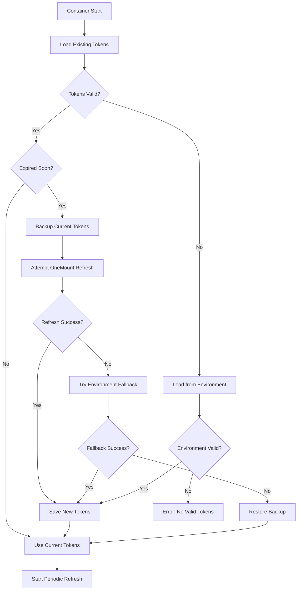

# OneMount Token Refresh System

## Overview

The OneMount Docker runners now include a comprehensive token refresh system that automatically manages OneDrive authentication tokens, ensuring continuous operation without manual intervention.

## Key Features

### 🔄 Automatic Token Refresh
- **Built-in OneMount Integration**: Uses OneMount's native token refresh capabilities
- **Proactive Refresh**: Refreshes tokens 5 minutes before expiration
- **Fallback Mechanism**: Falls back to environment variables if refresh fails
- **Persistent Storage**: Tokens stored in Docker volumes across container restarts

### 🛡️ Robust Error Handling
- **Validation**: Comprehensive token validation before use
- **Backup & Restore**: Automatic backup of working tokens before refresh attempts
- **Graceful Degradation**: Continues with existing tokens if refresh fails
- **Detailed Logging**: Complete audit trail of refresh attempts

### ⚙️ Configurable Operation
- **Refresh Interval**: Configurable periodic refresh (default: 1 hour)
- **Auto-Refresh Toggle**: Can disable automatic refresh if needed
- **Manual Controls**: Manual refresh commands available

## Architecture

### Components

1. **Token Manager (`token-manager.sh`)**
   - Core token management logic
   - Handles refresh, validation, and fallback
   - Integrates with OneMount binary

2. **Runner Entrypoint Integration**
   - Automatic token setup on container start
   - Periodic refresh daemon
   - Environment variable handling

3. **Persistent Storage**
   - Docker volumes for token persistence
   - Separate volumes per runner instance
   - Backup and restore capabilities

### Token Refresh Flow



## Configuration

### Environment Variables

| Variable | Default | Description |
|----------|---------|-------------|
| `AUTH_TOKENS_B64` | - | Base64-encoded OneDrive auth tokens |
| `ONEMOUNT_AUTO_REFRESH_TOKENS` | `true` | Enable/disable automatic token refresh |
| `ONEMOUNT_TOKEN_REFRESH_INTERVAL` | `3600` | Refresh interval in seconds (1 hour) |

### Docker Volumes

| Volume | Purpose |
|--------|---------|
| `runner-1-tokens` | Runner 1 authentication tokens |
| `runner-2-tokens` | Runner 2 authentication tokens |
| `onemount-runner-tokens` | Remote runner authentication tokens |

## Usage

### Automatic Operation
Tokens are managed automatically when containers start:

```bash
# Start runners - tokens managed automatically
docker-compose -f docker/compose/docker-compose.runners.yml up -d
```

### Manual Token Management

#### Check Token Status
```bash
docker exec onemount-runner-1 runner-entrypoint.sh token-status
```

#### Force Token Refresh
```bash
docker exec onemount-runner-1 runner-entrypoint.sh refresh-tokens
```

#### Using Workspace Management Script
```bash
# Interactive token management
./scripts/manage-workspace.sh tokens runner-1
```

### Initial Token Setup

#### Method 1: Environment Variable
```bash
export AUTH_TOKENS_B64=$(base64 -w 0 ~/.cache/onemount/auth_tokens.json)
docker-compose -f docker/compose/docker-compose.runners.yml up -d
```

#### Method 2: Volume Mount (Development)
```bash
# Mount existing tokens directly
docker run -v ~/.cache/onemount/auth_tokens.json:/opt/onemount-ci/auth_tokens.json:ro \
  onemount-github-runner:latest token-status
```

## Monitoring and Troubleshooting

### Log Files
- **Refresh Log**: `/opt/onemount-ci/token_refresh.log`
- **Container Logs**: `docker logs <container-name>`

### Common Issues

#### Token Refresh Fails
1. Check network connectivity
2. Verify OneMount binary is available
3. Check token file permissions
4. Review refresh logs

#### Environment Fallback Fails
1. Verify `AUTH_TOKENS_B64` is set correctly
2. Check base64 encoding
3. Validate original token file

#### Persistent Storage Issues
1. Check Docker volume permissions
2. Verify volume mounts in compose files
3. Inspect volume contents

### Debugging Commands

```bash
# Check token manager directly
docker exec onemount-runner-1 /usr/local/bin/token-manager.sh status

# View refresh logs
docker exec onemount-runner-1 cat /opt/onemount-ci/token_refresh.log

# Test OneMount binary
docker exec onemount-runner-1 /workspace/build/binaries/onemount --version

# Inspect token volume
docker volume inspect runner-1-tokens
```

## Security Considerations

### Token Storage
- Tokens stored in Docker volumes with restricted permissions (600)
- Separate volumes per runner instance
- No tokens in container images or logs

### Environment Variables
- `AUTH_TOKENS_B64` should be provided securely
- Consider using Docker secrets for production
- Rotate tokens regularly

### Network Security
- Token refresh requires internet access to Microsoft Graph API
- Consider firewall rules for production deployments
- Monitor for unusual token refresh patterns

## Best Practices

### Development
- Use bind mounts for development containers
- Keep backup of working tokens
- Test token refresh in isolated environment

### Production
- Use Docker volumes for token persistence
- Monitor token refresh success rates
- Set up alerting for refresh failures
- Regular token rotation schedule

### CI/CD Integration
- Automate token provisioning in pipelines
- Use secure secret management
- Test token refresh as part of deployment validation

## Future Enhancements

### Planned Features
- Token rotation scheduling
- Multi-account support
- Centralized token management
- Metrics and alerting integration
- Token health monitoring dashboard

### Integration Opportunities
- GitHub Actions secret management
- HashiCorp Vault integration
- Kubernetes secret management
- Azure Key Vault integration
