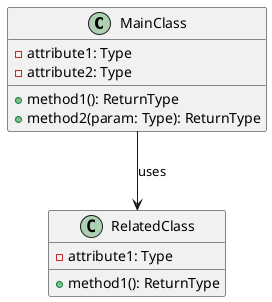
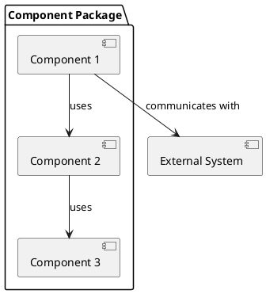
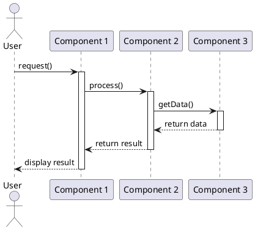
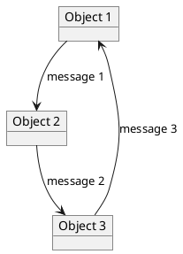
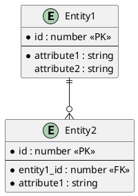

# Design Specification Template

## 1. Introduction

### 1.1 Purpose
[Describe the purpose of this design specification document]

### 1.2 Scope
[Define the scope of this design specification, including which components, features, or modules it covers]

### 1.3 Definitions, Acronyms, and Abbreviations
[List any terms, acronyms, or abbreviations used in this document]

## 2. Class & Component Diagrams

### 2.1 Class Diagram
[Include a class diagram that shows the classes, their attributes, methods, and relationships]



### 2.2 Component Diagram
[Include a component diagram that shows the major components and their interactions]



## 3. Sequence & Collaboration Diagrams

### 3.1 Sequence Diagram
[Include sequence diagrams for key operations or workflows]



### 3.2 Collaboration Diagram
[Include collaboration diagrams to show object interactions]



## 4. API Specifications

### 4.1 API Overview
[Provide an overview of the APIs being designed]

### 4.2 API Endpoints/Methods
[List and describe each API endpoint or method]

#### 4.2.1 [Endpoint/Method Name]
- **Description**: [Brief description of what this endpoint/method does]
- **URL/Method Signature**: [URL pattern or method signature]
- **Parameters**:
  - `param1` (type): Description
  - `param2` (type): Description
- **Returns**:
  - Return type: Description
- **Exceptions/Errors**:
  - Error code: Description
- **Example**:
  ```
  [Example request/call and response/return]
  ```

### 4.3 Authentication and Authorization
[Describe authentication and authorization mechanisms if applicable]

### 4.4 Rate Limiting and Quotas
[Describe any rate limiting or quotas if applicable]

## 5. Data Model Definitions

### 5.1 Data Model Overview
[Provide an overview of the data model]

### 5.2 Entity Definitions
[Define each entity in the data model]

#### 5.2.1 [Entity Name]
- **Description**: [Brief description of this entity]
- **Attributes**:
  - `attribute1` (type): Description
  - `attribute2` (type): Description
- **Relationships**:
  - Relationship to [Other Entity]: Description

### 5.3 Database Schema
[Include database schema if applicable]



### 5.4 Data Validation Rules
[Describe data validation rules for each entity]

## 6. Implementation Considerations

### 6.1 Dependencies
[List external dependencies and libraries]

### 6.2 Performance Considerations
[Describe performance considerations and optimizations]

### 6.3 Security Considerations
[Describe security considerations and measures]

### 6.4 Error Handling
[Describe error handling strategies]

## 7. Appendices

### 7.1 References
[List any references or related documents]

### 7.2 Revision History
[Track document revisions]

| Version | Date | Description | Author |
|---------|------|-------------|--------|
| 0.1 | [Date] | Initial draft | [Author] |