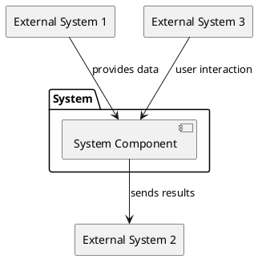
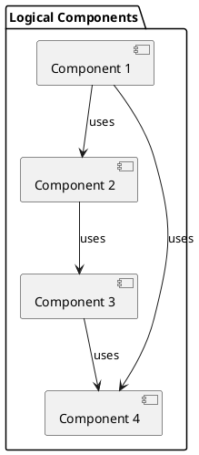
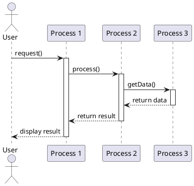
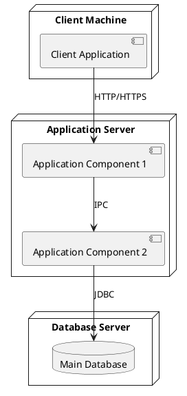

# Software Architecture Specification Template

## 1. Introduction & Context

### 1.1 Purpose
[Describe the purpose of this Software Architecture Specification]

### 1.2 Scope
[Define the scope of this architecture document, including which systems, components, or modules it covers]

### 1.3 System Overview
[Provide a high-level overview of the system, its purpose, and its main functions]

### 1.4 Document Overview
[Describe the structure of this document and how it should be used]

### 1.5 References
[List any reference documents, standards, or external resources]

### 1.6 Definitions, Acronyms, and Abbreviations
[List any terms, acronyms, or abbreviations used in this document]

## 2. Stakeholder Viewpoints & Concerns

### 2.1 Stakeholder Summary
[Identify the key stakeholders and their relationship to the system]

| Stakeholder | Description | Primary Concerns |
|-------------|-------------|------------------|
| [Stakeholder 1] | [Description] | [List of concerns] |
| [Stakeholder 2] | [Description] | [List of concerns] |

### 2.2 Architectural Viewpoints
[Describe the architectural viewpoints used in this document and which stakeholder concerns they address]

| Viewpoint | Stakeholders | Concerns Addressed |
|-----------|--------------|-------------------|
| Context View | [Stakeholders] | [Concerns] |
| Logical View | [Stakeholders] | [Concerns] |
| Development View | [Stakeholders] | [Concerns] |
| Process View | [Stakeholders] | [Concerns] |
| Deployment View | [Stakeholders] | [Concerns] |

## 3. Architectural Views

### 3.1 Context View
[Describe the relationships, dependencies, and interactions between the system and its environment]

#### 3.1.1 System Context Diagram
[Include a system context diagram showing the system and its external entities]

#### 3.1.2 External Entities
[Describe each external entity and its relationship with the system]

#### 3.1.3 System Interfaces
[Describe the interfaces between the system and external entities]

### 3.2 Logical View
[Describe the key functional elements of the system and their responsibilities]

#### 3.2.1 Logical Components
[Describe the major logical components of the system]

#### 3.2.2 Component Diagram
[Include a component diagram showing the logical components and their relationships]

#### 3.2.3 Key Abstractions
[Describe the key abstractions (classes, interfaces) in the system]

### 3.3 Development View
[Describe the architecture that supports the software development process]

#### 3.3.1 Module Organization
[Describe how the software is organized into modules, packages, or layers]

#### 3.3.2 Code Structure
[Describe the code structure, including directory organization, build system, etc.]

#### 3.3.3 Development Environment
[Describe the development environment, tools, and processes]

### 3.4 Process View
[Describe the system's dynamic aspects, including processes, threads, and their interactions]

#### 3.4.1 Runtime Processes
[Describe the major runtime processes and their responsibilities]

#### 3.4.2 Process Communication
[Describe how processes communicate with each other]

#### 3.4.3 Sequence Diagrams
[Include sequence diagrams for key operations or workflows]

### 3.5 Deployment View
[Describe the physical environment where the system will be deployed]

#### 3.5.1 Deployment Diagram
[Include a deployment diagram showing the physical nodes and their connections]

#### 3.5.2 Physical Nodes
[Describe each physical node and its hardware/software configuration]

#### 3.5.3 Network Requirements
[Describe network requirements, including bandwidth, latency, etc.]

## 4. Crosscutting Concerns

### 4.1 Security

#### 4.1.1 Security Requirements
[Describe the security requirements for the system]

#### 4.1.2 Authentication and Authorization
[Describe the authentication and authorization mechanisms]

#### 4.1.3 Data Protection
[Describe how data is protected at rest and in transit]

#### 4.1.4 Security Patterns
[Describe any security patterns or frameworks used]

### 4.2 Performance

#### 4.2.1 Performance Requirements
[Describe the performance requirements for the system]

#### 4.2.2 Scalability
[Describe how the system scales to handle increased load]

#### 4.2.3 Caching Strategy
[Describe any caching strategies used to improve performance]

#### 4.2.4 Performance Monitoring
[Describe how performance is monitored and measured]

### 4.3 Other Crosscutting Concerns
[Describe any other crosscutting concerns such as availability, reliability, maintainability, etc.]

## 5. Architectural Decisions

### 5.1 Key Architectural Decisions
[Document key architectural decisions and their rationale]

| Decision | Alternatives Considered | Rationale |
|----------|-------------------------|-----------|
| [Decision 1] | [Alternatives] | [Rationale] |
| [Decision 2] | [Alternatives] | [Rationale] |

### 5.2 Architectural Constraints
[Describe any constraints that influenced the architecture]

### 5.3 Quality Attribute Scenarios
[Describe scenarios that illustrate how the architecture addresses quality attributes]

## 6. Appendices

### 6.1 Glossary
[Define terms used in this document]

### 6.2 Revision History
[Track document revisions]

| Version | Date | Description | Author |
|---------|------|-------------|--------|
| 0.1 | [Date] | Initial draft | [Author] |