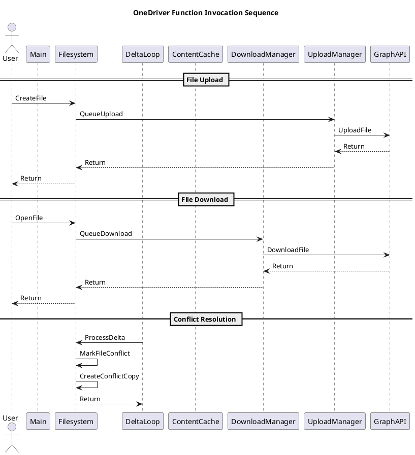

# OneDriver Workflow Analysis

This directory contains tools for analyzing the primary workflows in OneDriver (file upload, download, conflict resolution) and generating sequence diagrams that illustrate these flows.

## Workflow Analyzer

The `workflow_analyzer.go` script executes the primary workflows in OneDriver and logs the sequence of invoked functions. It then analyzes the logs to generate a PlantUML sequence diagram.

### Prerequisites

- Go 1.16 or later
- OneDriver installed and configured
- A mounted OneDrive filesystem

### Usage

1. Build the workflow analyzer:

```bash
cd docs/implementation
go build workflow_analyzer.go
```

2. Run the workflow analyzer with the path to your OneDrive mount point:

```bash
./workflow_analyzer /path/to/your/onedrive/mount
```

For example:

```bash
./workflow_analyzer ~/OneDrive
```

3. The script will:
   - Configure OneDriver to log at DEBUG level to a temporary log file
   - Restart the OneDriver service to apply the new logging configuration
   - Execute the primary workflows (file upload, download, conflict resolution)
   - Analyze the logs to extract the sequence of function calls
   - Generate a PlantUML sequence diagram
   - Save the diagram to a file in the system's temporary directory

4. The location of the generated PlantUML file will be displayed in the output.

### How It Works

The workflow analyzer performs the following steps:

1. **Setup Logging**: Configures OneDriver to log at DEBUG level to a temporary file.
2. **Restart OneDriver**: Restarts the OneDriver service to apply the new logging configuration.
3. **Execute Workflows**:
   - **File Upload**: Creates a test file and modifies it to trigger uploads.
   - **File Download**: Removes the local file and accesses it to trigger a download.
   - **Conflict Resolution**: Creates a file, modifies it, and forces a sync to simulate a conflict.
4. **Analyze Logs**: Parses the log file to extract method calls and their relationships.
5. **Generate Diagram**: Creates a PlantUML sequence diagram showing the function calls for each workflow.

### Generated Sequence Diagram

The generated sequence diagram shows the function calls for each of the primary workflows:

- **File Upload**: Shows the sequence of function calls when a file is created or modified.
- **File Download**: Shows the sequence of function calls when a file is accessed and downloaded.
- **Conflict Resolution**: Shows the sequence of function calls when a conflict is detected and resolved.

The diagram includes the following participants:

- **User**: The user who initiates the workflows.
- **Main**: The main application.
- **FS**: The filesystem implementation.
- **Delta**: The delta synchronization component.
- **Cache**: The content cache.
- **DM**: The download manager.
- **UM**: The upload manager.
- **Graph**: The Microsoft Graph API integration.

## Example Sequence Diagram



## Customization

You can customize the workflow analyzer by modifying the following aspects:

- **Logging Level**: Change the log level in the `SetupLogging` method.
- **Workflows**: Modify the `executeUploadWorkflow`, `executeDownloadWorkflow`, and `executeConflictWorkflow` methods to test different scenarios.
- **Diagram Generation**: Customize the `GeneratePlantUML` and `generateWorkflowUML` methods to change the appearance of the sequence diagram.