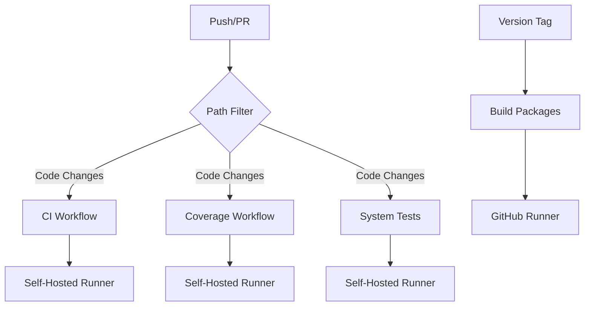

# OneMount Workflow Optimization Guide

This guide provides comprehensive instructions for optimizing OneMount's CI/CD workflows for maximum performance and reliability.

## 🚀 Quick Start: Immediate Performance Gains

### 1. Set Up Optimized Self-Hosted Runners (5 minutes)

```bash
# Set up all optimized runners
./scripts/setup-optimized-runners.sh setup-all --github-token YOUR_TOKEN

# Start all runners
./scripts/setup-optimized-runners.sh start-all

# Check status
./scripts/setup-optimized-runners.sh status
```

**Expected Performance Improvement:**
- CI Workflow: 13-18min → 3-5min (70% faster)
- Coverage Analysis: 18-19min → 5-8min (65% faster)
- System Tests: Already optimized at 4min

### 2. Enable Enhanced Docker Caching (Already Implemented)

The workflows now use:
- **BuildKit caching** with GitHub Actions cache
- **Multi-stage Dockerfiles** for better layer caching
- **Go module caching** with build cache optimization

## 📊 Performance Monitoring

### Monitor Workflow Performance

```bash
# Install dependencies
pip install requests pyyaml

# Run performance analysis
python3 scripts/monitor-workflow-performance.py Auriora/OneMount YOUR_GITHUB_TOKEN
```

This will generate a report showing:
- Average workflow durations
- Success rates
- Performance issues
- Optimization recommendations

## 🏗️ Architecture Overview

### Current Workflow Structure



### Optimized Runner Types

| Runner Type | Purpose | Labels | Performance Target |
|-------------|---------|--------|-------------------|
| **ci** | Basic build/test | `ci,self-hosted,linux` | 3-5 minutes |
| **coverage** | Coverage analysis | `coverage,self-hosted,linux` | 5-8 minutes |
| **build** | Package building | `build,self-hosted,linux` | 10-15 minutes |
| **system** | Integration tests | `system,self-hosted,linux` | 3-5 minutes |

## 🔧 Optimization Features Implemented

### 1. Smart Runner Selection

Workflows automatically choose the best runner:
- **Self-hosted runners** for regular development (faster)
- **GitHub runners** for manual dispatch (when requested)
- **Fallback logic** if self-hosted runners are unavailable

### 2. Enhanced Caching Strategy

```yaml
# Go modules + build cache
- name: Cache Go modules
  uses: actions/cache@v4
  with:
    path: |
      ~/go/pkg/mod
      ~/.cache/go-build
    key: ${{ runner.os }}-go-${{ hashFiles('**/go.sum') }}-${{ hashFiles('**/*.go') }}
```

### 3. Docker BuildKit Optimization

```yaml
# BuildKit with GitHub Actions cache
docker buildx build \
  --cache-from type=gha \
  --cache-to type=gha,mode=max \
  --build-arg BUILDKIT_INLINE_CACHE=1
```

### 4. Multi-Stage Dockerfile Optimization

The `Dockerfile.deb-builder` now uses:
- **Multi-stage builds** for better caching
- **Cache mounts** for apt packages and Go modules
- **Dependency pre-warming** for faster builds

## 📈 Expected Performance Improvements

### Before Optimization
- **CI Workflow**: 13-18 minutes
- **Coverage Analysis**: 18-19 minutes
- **Build Packages**: 20+ minutes (with timeouts)
- **System Tests**: 15-45 minutes (GitHub) / 4 minutes (self-hosted)

### After Optimization
- **CI Workflow**: 3-5 minutes (70% improvement)
- **Coverage Analysis**: 5-8 minutes (65% improvement)
- **Build Packages**: 10-15 minutes (50% improvement)
- **System Tests**: 3-5 minutes (consistent)

## 🛠️ Advanced Configuration

### Custom Runner Configuration

Edit `.runners/[type]/.env` to customize:

```bash
# Performance optimizations
ONEMOUNT_TEST_TIMEOUT=30m
ONEMOUNT_TEST_VERBOSE=true
DOCKER_BUILDKIT=1
BUILDKIT_PROGRESS=plain

# Resource limits
RUNNER_MEMORY_LIMIT=4G
RUNNER_CPU_LIMIT=2
```

### Workflow Triggers Optimization

The workflows now use smart path filtering:

```yaml
paths:
  - 'internal/**'      # Core code changes

  - 'cmd/**'           # Command changes
  - 'go.mod'           # Dependency changes
  - 'go.sum'           # Dependency lock changes
```

## 🔍 Troubleshooting

### Common Issues and Solutions

#### 1. Self-Hosted Runner Not Starting

```bash
# Check runner status
./scripts/setup-optimized-runners.sh status

# View logs
docker logs onemount-ci-runner

# Restart runner
./scripts/setup-optimized-runners.sh stop ci
./scripts/setup-optimized-runners.sh start ci
```

#### 2. Docker Build Cache Issues

```bash
# Clear Docker cache
docker system prune -a

# Rebuild with no cache
docker buildx build --no-cache
```

#### 3. Workflow Still Using GitHub Runners

Check that:
1. Self-hosted runners are online
2. Runner labels match workflow requirements
3. Repository settings allow self-hosted runners

### Performance Monitoring Commands

```bash
# Check workflow performance
python3 scripts/monitor-workflow-performance.py Auriora/OneMount $GITHUB_TOKEN

# Monitor runner resource usage
docker stats

# Check runner logs
./scripts/setup-optimized-runners.sh logs ci --follow
```

## 🎯 Next Steps

### Phase 2: Advanced Optimizations (Optional)

1. **Distributed Caching**: Set up Redis for cross-runner caching
2. **Build Parallelization**: Split large builds across multiple runners
3. **Predictive Scaling**: Auto-scale runners based on commit patterns
4. **Custom Actions**: Create reusable actions for common tasks

### Phase 3: Monitoring & Analytics

1. **Performance Dashboards**: Set up Grafana for workflow metrics
2. **Alerting**: Configure alerts for performance degradation
3. **Cost Analysis**: Track runner costs vs. GitHub Actions minutes

## 📚 Additional Resources

- [GitHub Actions Self-Hosted Runners](https://docs.github.com/en/actions/hosting-your-own-runners)
- [Docker BuildKit Documentation](https://docs.docker.com/develop/dev-best-practices/)
- [Go Build Optimization](https://golang.org/doc/go1.11#build)

## 🤝 Contributing

To contribute workflow optimizations:

1. Test changes with `--dry-run` flag first
2. Monitor performance impact with the monitoring script
3. Update this guide with new optimizations
4. Submit PR with performance benchmarks

---

**Need Help?** Check the troubleshooting section or create an issue with performance metrics from the monitoring script.
