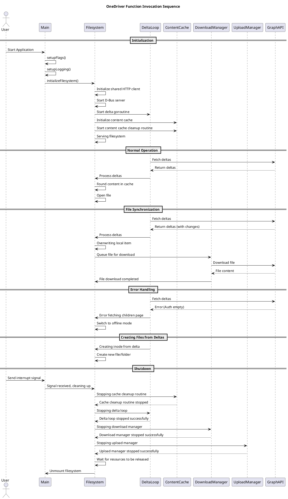

# OneDriver Function Invocation Sequence Diagram

Based on the analysis of the onedriver.log file, I've created a sequence diagram that illustrates the main function invocation flows in the OneDriver application.

## Key Components

The diagram shows interactions between these main components:

1. **Main** - The application entry point
2. **Filesystem** - Core filesystem implementation
3. **DeltaLoop** - Handles synchronization with OneDrive
4. **ContentCache** - Manages local file caching
5. **DownloadManager** - Handles file downloads
6. **UploadManager** - Handles file uploads
7. **GraphAPI** - Microsoft Graph API interface

## Main Flows

The sequence diagram captures these key operational flows:

### Initialization
- Application startup and configuration
- Filesystem initialization
- Starting background services (D-Bus, delta sync, cache cleanup)

### Normal Operation
- Delta synchronization with OneDrive
- File access from cache

### File Synchronization
- Detecting changes from OneDrive
- Downloading modified files
- Updating local cache

### Error Handling
- Authentication errors
- Switching to offline mode

### File Creation
- Creating new inodes from delta information

### Shutdown
- Signal handling
- Graceful shutdown of all components
- Resource cleanup

## Implementation Details

The code analysis reveals that OneDriver uses:

1. A delta-based synchronization mechanism to efficiently track changes
2. A local content cache to minimize network requests
3. Separate managers for uploads and downloads
4. Background goroutines for continuous synchronization
5. Graceful error handling with offline mode support

This sequence diagram provides a high-level overview of how the different components interact during the application lifecycle, from startup to shutdown.