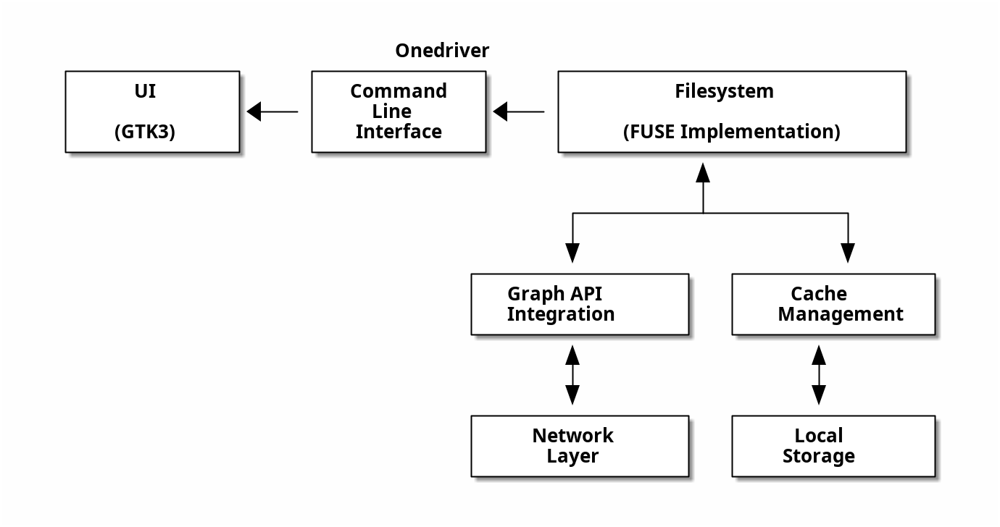
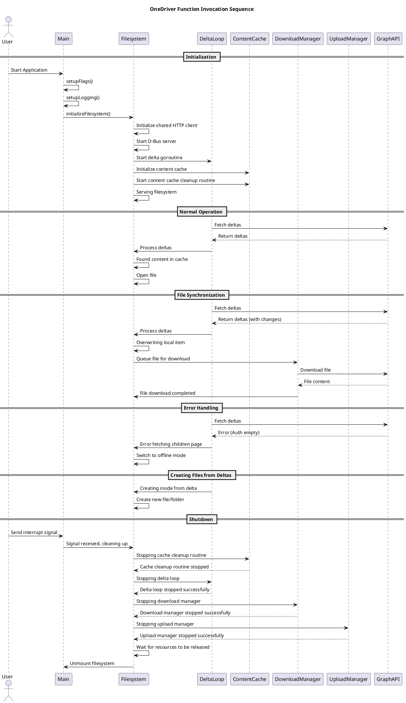

# Software Architecture Document for onedriver

## 1. Introduction

### 1.1 Purpose

This document provides a comprehensive architectural overview of the onedriver system using the "Views and Beyond" approach. It presents the architecture
through multiple views to address different stakeholder concerns.

### 1.2 Scope

This document covers the architecture of onedriver, a native Linux filesystem for Microsoft OneDrive that performs on-demand file downloads rather than syncing
the entire OneDrive content.

### 1.3 Definitions, Acronyms, and Abbreviations

- **FUSE**: Filesystem in Userspace - allows implementing a filesystem in user space
- **API**: Application Programming Interface
- **OAuth2**: Open Authorization 2.0 - an authorization protocol
- **UI**: User Interface
- **CLI**: Command Line Interface
- **GTK**: GIMP Toolkit - a multi-platform toolkit for creating graphical user interfaces

## 2. Architectural Representation

The architecture of onedriver is presented through five primary views following the "Views and Beyond" approach:

- **Context View**: Shows how onedriver fits into its environment and interacts with external entities
- **Logical View**: Describes the functional decomposition of the system into components and their relationships
- **Development View**: Describes the architecture that supports the software development process
- **Process View**: Describes the system's dynamic behavior and runtime concurrency aspects
- **Deployment View**: Illustrates how the software is deployed onto the underlying hardware

## 3. Context View

### 3.1 System Context

onedriver operates within the Linux operating system environment, interacting with Microsoft's OneDrive cloud storage service through the Microsoft Graph API.
It integrates with the Linux filesystem through FUSE and provides both command-line and graphical interfaces for user interaction.

### 3.2 External Entities and Interfaces

#### 3.2.1 Microsoft OneDrive / Graph API

- **Description**: Cloud storage service that hosts user files and folders
- **Interface**: RESTful HTTP API with OAuth2 authentication
- **Interaction**: onedriver authenticates with Microsoft, then performs CRUD operations on files and folders

#### 3.2.2 Linux Filesystem

- **Description**: The host operating system's filesystem
- **Interface**: FUSE (Filesystem in Userspace)
- **Interaction**: onedriver mounts a virtual filesystem that appears as a normal directory to the user and applications

#### 3.2.3 User Applications

- **Description**: Any application that needs to access OneDrive files
- **Interface**: Standard filesystem operations (open, read, write, etc.)
- **Interaction**: Applications interact with onedriver through normal filesystem operations

#### 3.2.4 Desktop Environment

- **Description**: The Linux desktop environment (GNOME, KDE, etc.)
- **Interface**: GTK3 for UI integration, D-Bus for system integration
- **Interaction**: Provides status information and basic controls through system tray icon

### 3.3 Stakeholders and Concerns

| Stakeholder                          | Role                 | Primary Concern                                                       |
|--------------------------------------|----------------------|-----------------------------------------------------------------------|
| Linux Users                          | End Users            | Access OneDrive files on Linux without syncing entire account         |
| Windows/Mac Users Migrating to Linux | End Users            | Easily transition files from Windows/Mac to Linux via OneDrive        |
| Mobile Device Users                  | End Users            | Access photos and files uploaded from mobile devices on Linux         |
| Users with Limited Storage           | End Users            | Access large OneDrive accounts without using equivalent local storage |
| Users with Poor Internet             | End Users            | Work with OneDrive files even with unreliable internet connection     |
| Developers                           | Contributors         | Extend and improve the onedriver codebase                             |
| File Manager Developers              | Integration Partners | Integrate file managers with onedriver for better user experience     |
| Package Maintainers                  | Distributors         | Package onedriver for different Linux distributions                   |
| Microsoft                            | Service Provider     | Enable cross-platform access to OneDrive service                      |
| System Administrators                | IT Support           | Deploy onedriver in organizational environments                       |

## 4. Logical View

### 4.1 Component Overview

onedriver is structured into several logical components:



### 4.2 Component Descriptions

#### 4.2.1 Filesystem (fs package)

The core of onedriver is the Filesystem implementation, which provides a FUSE-compatible interface to OneDrive. Key components include:

- **Inode**: Represents files and directories in the filesystem
- **Filesystem**: The main FUSE implementation that handles file operations
- **Cache**: Manages local caching of file content and metadata
- **Upload/Download Managers**: Handle file transfers to and from OneDrive

#### 4.2.2 Graph API Integration (fs/graph package)

This component handles communication with Microsoft's Graph API:

- **Auth**: Manages OAuth2 authentication with Microsoft
- **DriveItem**: Represents files and folders in OneDrive
- **API Client**: Handles HTTP requests to the Graph API endpoints

#### 4.2.3 Cache Management

onedriver uses a sophisticated caching system to minimize network requests:

- **Metadata Cache**: Stores file and directory metadata in memory and in a BBolt database
- **Content Cache**: Stores file contents on the local filesystem
- **Delta Synchronization**: Uses the Graph API's delta query to efficiently sync changes

#### 4.2.4 Command Line Interface (cmd package)

Provides the user interface for mounting, unmounting, and configuring onedriver:

- **Argument Parsing**: Handles command-line flags and arguments
- **Configuration**: Manages user configuration settings
- **Signal Handling**: Manages graceful shutdown on system signals

#### 4.2.5 UI (ui package)

Provides a graphical interface for onedriver:

- **GTK3 Interface**: Shows status and allows basic operations
- **Systemd Integration**: Manages the onedriver service

### 4.3 Module Structure

| Module                 | Description                      | File Count | Key Dependencies        |
|------------------------|----------------------------------|:----------:|-------------------------|
| fs                     | Core filesystem implementation   |     34     | go-fuse, bbolt, zerolog |
| fs/graph               | Microsoft Graph API integration  |     20     | net/http, json, zerolog |
| fs/graph/quickxorhash  | Hash implementation for OneDrive |     2      | hash, encoding/base64   |
| fs/offline             | Offline mode functionality       |     2      | fs, fs/graph            |
| cmd/onedriver          | Main filesystem application      |     1      | fs, fs/graph, pflag     |
| cmd/onedriver-launcher | GUI launcher application         |     1      | ui, ui/systemd, gtk     |
| cmd/common             | Shared code between applications |     5      | fs, yaml, zerolog       |
| ui                     | GUI implementation               |     4      | gtk, fs/graph           |
| ui/systemd             | Systemd integration for the UI   |     3      | dbus, go-systemd        |
| testutil               | Testing utilities                |     5      | testing, fs, fs/graph   |

### 4.4 Class Structure

The core engine of onedriver consists of the following key classes:

- **Filesystem**: The main class that manages the filesystem operations
- **Inode**: Represents files and directories in the filesystem
- **DriveItem**: Represents items in OneDrive
- **UploadManager**: Manages file uploads to OneDrive
- **DownloadManager**: Manages file downloads from OneDrive
- **Auth**: Manages authentication with Microsoft Graph API
- **LoopbackCache**: Handles caching of file content
- **ThumbnailCache**: Handles caching of thumbnails
- **FileStatus**: Tracks the status of files

### 4.5 Key Interactions

#### 4.5.1 Filesystem Operations

1. When a file is accessed:
    - The filesystem checks if the file is in the local cache
    - If not, it requests the file from OneDrive via the Graph API
    - The file is cached locally for future access

2. When a file is modified:
    - Changes are made to the local cache
    - On flush/close, changes are uploaded to OneDrive
    - If offline, changes are tracked and synchronized when online

#### 4.5.2 Authentication Flow

1. User initiates authentication
2. OAuth2 flow opens a browser window for Microsoft login
3. After successful login, an access token is obtained
4. The token is refreshed automatically when needed

#### 4.5.3 Delta Synchronization

1. Periodically, onedriver requests changes from OneDrive using a delta link
2. Changes are applied to the local cache
3. Conflicts are resolved based on modification times and other heuristics

## 5. Development View

### 5.1 Module Organization

onedriver follows a modular code organization that separates concerns and promotes maintainability:

| Module                 | Description                                | File Count | Key Dependencies                  |
|------------------------|--------------------------------------------|:----------:|-----------------------------------|
| fs                     | Core filesystem implementation             |     34     | go-fuse, bbolt, zerolog           |
| fs/graph               | Microsoft Graph API integration            |     20     | net/http, json, zerolog           |
| fs/graph/quickxorhash  | Hash implementation for OneDrive           |      2     | hash, encoding/base64             |
| fs/offline             | Offline mode functionality                 |      2     | fs, fs/graph                      |
| cmd/onedriver          | Main filesystem application                |      1     | fs, fs/graph, pflag               |
| cmd/onedriver-launcher | GUI launcher application                   |      1     | ui, ui/systemd, gtk               |
| cmd/common             | Shared code between applications           |      5     | fs, yaml, zerolog                 |
| ui                     | GUI implementation                         |      4     | gtk, fs/graph                     |
| ui/systemd             | Systemd integration for the UI             |      3     | dbus, go-systemd                  |
| testutil               | Testing utilities                          |      5     | testing, fs, fs/graph             |

### 5.2 Source Code Structure

The source code is organized according to Go's standard project layout:

```
onedriver/
├── cmd/                  # Command-line applications
│   ├── common/           # Shared code between applications
│   ├── onedriver/        # Main filesystem application
│   └── onedriver-launcher/ # GUI launcher application
├── fs/                   # Filesystem implementation
│   ├── graph/            # Microsoft Graph API integration
│   │   └── quickxorhash/ # Hash implementation for OneDrive
│   └── offline/          # Offline mode functionality
├── ui/                   # GUI implementation
│   └── systemd/          # Systemd integration for the UI
├── testutil/             # Testing utilities
│   └── common/           # Common test utilities
└── pkg/                  # Resources and packaging files
    ├── debian/           # Debian packaging
    └── resources/        # Application resources
```

### 5.3 Build System

onedriver uses a Makefile-based build system that supports various targets:

- **build**: Compiles the main binaries
- **install**: Installs the application system-wide
- **rpm**: Creates RPM packages for Fedora, CentOS, RHEL
- **deb**: Creates DEB packages for Debian, Ubuntu
- **test**: Runs all tests
- **test-init**: Sets up the test environment

The build process handles CGO dependencies for GTK integration and creates appropriate systemd service files.

### 5.4 Testing Approach

onedriver employs a comprehensive testing strategy:

1. **Unit Tests**: Test individual components in isolation
2. **Integration Tests**: Test interactions between components
3. **Filesystem Tests**: Test FUSE filesystem operations
4. **Offline Tests**: Test behavior when network connectivity is lost
5. **UI Tests**: Test the graphical user interface

Tests are organized in the same directory structure as the code they test, following Go conventions. The project uses the testify framework for assertions and mocking.

### 5.5 Development Tools

The development process is supported by several tools:

- **GoLand**: JetBrains IDE with predefined run configurations
- **cgo-helper.sh**: Script to help with CGO compilation
- **curl-graph.sh**: Utility for interacting with Microsoft Graph API
- **run_tests_with_mock_auth.sh**: Script to run tests with mock authentication

### 5.6 Coding Standards

The codebase follows Go's standard coding conventions and best practices:

- **Error Handling**: Return errors to callers instead of handling them internally
- **Logging**: Use structured logging with zerolog
- **Documentation**: Document public APIs with godoc-compatible comments
- **Testing**: Write both unit and integration tests
- **Concurrency**: Use goroutines and channels for concurrent operations

## 6. Process View

### 6.1 Runtime Processes

onedriver runs as a single process with multiple goroutines for concurrent operations:

1. **Main Process**: Handles filesystem mounting and signal handling
2. **Delta Synchronization**: Background goroutine that periodically fetches changes from OneDrive
3. **Upload Workers**: Multiple goroutines that handle file uploads to OneDrive
4. **Download Workers**: Multiple goroutines that handle file downloads from OneDrive
5. **Cache Cleanup**: Background goroutine that periodically cleans up the cache

### 6.2 Communication Patterns

Components communicate through various mechanisms:

1. **Function Calls**: Direct method invocation for synchronous operations
2. **Channels**: Go channels for asynchronous communication between goroutines
3. **Callbacks**: Function callbacks for event notification
4. **D-Bus**: For communication with the desktop environment
5. **HTTP**: For communication with the Microsoft Graph API

### 6.3 Concurrency Model

onedriver uses Go's concurrency primitives to handle multiple operations simultaneously:

1. **Goroutines**: Lightweight threads for concurrent operations
2. **Channels**: For communication and synchronization between goroutines
3. **Mutexes**: For protecting shared resources
4. **WaitGroups**: For waiting for multiple goroutines to complete
5. **Context**: For cancellation and timeout handling

### 6.4 Sequence Diagrams

The following sequence diagram illustrates the main operational flows in onedriver:



### 6.5 State Management

onedriver manages several important states:

1. **Authentication State**: Tracks whether the user is authenticated with Microsoft
2. **Network State**: Tracks whether the system is online or offline
3. **File States**: Tracks the status of files (cloud, local, modified, syncing, etc.)
4. **Upload/Download States**: Tracks the progress of file transfers

State transitions are handled by dedicated components and communicated to other parts of the system as needed.

### 6.6 Error Handling and Recovery

onedriver implements robust error handling and recovery mechanisms:

1. **Automatic Retry**: Failed operations are automatically retried with exponential backoff
2. **Offline Mode**: When network connectivity is lost, the system switches to offline mode
3. **Conflict Resolution**: File conflicts are detected and resolved based on configurable policies
4. **Graceful Degradation**: The system continues to function with reduced capabilities when external services are unavailable
5. **Crash Recovery**: The system can recover from crashes by restoring state from persistent storage

## 7. Deployment View

### 7.1 Runtime Environment

onedriver is designed to run on Linux systems with the following components:

- **Operating System**: Linux (various distributions)
- **Required Libraries**: FUSE, GTK3
- **Runtime Dependencies**:
    - go-fuse/v2: For filesystem implementation
    - gotk3: For GUI components
    - bbolt: For embedded database
    - zerolog: For logging

### 7.2 Installation and Deployment

onedriver can be installed and deployed in several ways:

#### 7.2.1 Package Installation

- RPM packages for Fedora, CentOS, RHEL
- DEB packages for Debian, Ubuntu
- AUR packages for Arch Linux

#### 7.2.2 Manual Installation

```bash
# Build the main binaries
make

# Install the application system-wide
sudo make install
```

#### 7.2.3 Service Configuration

onedriver is typically deployed as a systemd user service:

```
[Unit]
Description=onedriver - Microsoft OneDrive client
Documentation=https://github.com/jstaf/onedriver

[Service]
ExecStart=/usr/bin/onedriver %h/OneDrive
Restart=on-failure
RestartSec=3
RestartPreventExitStatus=0

[Install]
WantedBy=default.target
```

### 7.3 File Structure

When deployed, onedriver creates the following directory structure:

```
$HOME/
├── .config/onedriver/
│   ├── config.yml       # User configuration
│   ├── auth_tokens.json # Authentication tokens
│   └── onedriver.log    # Log file
├── .cache/onedriver/
│   ├── content/         # Cached file content
│   ├── thumbnails/      # Cached thumbnails
│   └── onedriver.db     # Metadata cache database
└── OneDrive/            # Mount point (configurable)
```

### 7.4 Network Configuration

onedriver requires outbound HTTPS access to the following endpoints:

- `https://login.microsoftonline.com` - Authentication
- `https://graph.microsoft.com` - Microsoft Graph API

No inbound network access is required.

## 8. Quality Attributes

### 8.1 Performance

- **On-demand downloading**: Files are only downloaded when accessed, saving bandwidth and storage
- **Caching**: Frequently accessed files remain in the cache to improve performance
- **Concurrent operations**: Upload and download operations run concurrently for better throughput

### 8.2 Security

- **Authentication**: Uses OAuth2 for secure authentication with Microsoft
- **Token storage**: Access tokens are stored securely on the local filesystem
- **Permissions**: File permissions are mapped between OneDrive and the local filesystem

### 8.3 Availability

- **Offline mode**: Continues to function when network connectivity is lost
- **Automatic reconnection**: Reconnects and synchronizes when connectivity is restored
- **Crash recovery**: Can recover from crashes and continue operation

### 8.4 Modifiability

- **Modular design**: Components are loosely coupled for easier maintenance and extension
- **Interface-based**: Key components implement interfaces that can be replaced or mocked for testing
- **Configuration options**: Many behaviors can be customized through configuration

## 9. Architectural Decisions

### 9.1 Use of FUSE

FUSE was chosen to implement the filesystem interface because it allows implementing a filesystem in user space rather than kernel space, which simplifies
development and deployment.

### 9.2 On-demand File Download

Unlike traditional sync clients, onedriver downloads files only when they are accessed. This design decision was made to save bandwidth and local storage,
especially for users with large OneDrive accounts.

### 9.3 Local Caching

onedriver caches file metadata and content locally to improve performance and enable offline access. This decision balances the need for performance with the
goal of minimizing local storage usage.

### 9.4 Delta Synchronization

The system uses the Microsoft Graph API's delta query feature to efficiently synchronize changes. This minimizes bandwidth usage and improves synchronization
performance.

## 10. References

1. Microsoft Graph API Documentation: https://docs.microsoft.com/en-us/graph/
2. FUSE Documentation: https://github.com/libfuse/libfuse
3. BBolt Documentation: https://github.com/etcd-io/bbolt
4. GTK3 Documentation: https://docs.gtk.org/gtk3/
