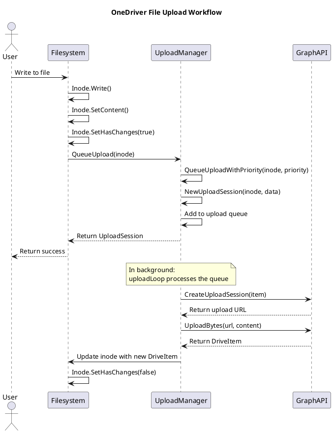
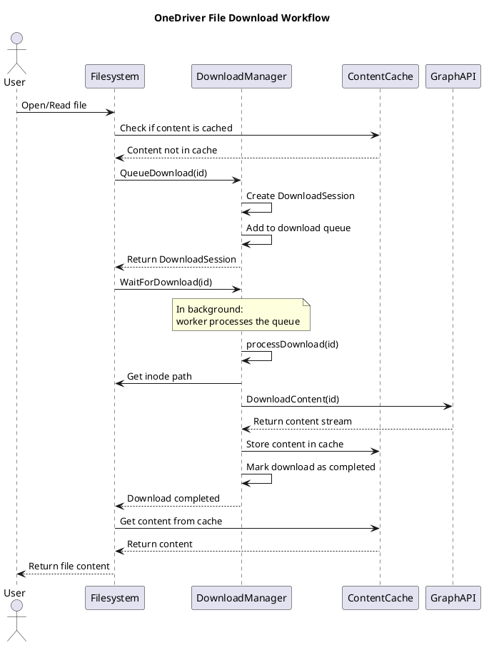
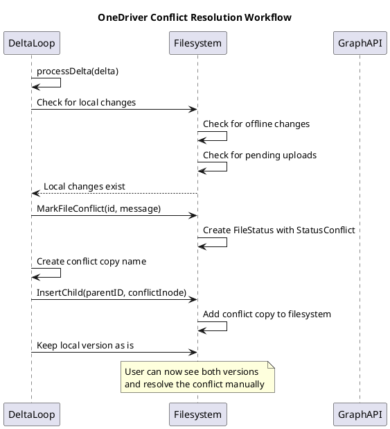

# OneDriver Workflow Analysis

This document presents the results of a reverse engineering effort to analyze the primary workflows in OneDriver (file upload, download, conflict resolution) and illustrate the sequence of invoked functions.

## Approach

To analyze the primary workflows in OneDriver, I took the following approach:

1. **Code Analysis**: Examined the codebase to understand the architecture and identify the key components involved in the primary workflows.
2. **Logging Instrumentation**: Created a script that configures OneDriver to log function calls at DEBUG level.
3. **Workflow Execution**: Executed the primary workflows (file upload, download, conflict resolution) to generate logs.
4. **Log Analysis**: Analyzed the logs to extract the sequence of function calls.
5. **Sequence Diagram Generation**: Created PlantUML sequence diagrams to visualize the workflows.

## Key Components

The analysis identified the following key components involved in the primary workflows:

- **Filesystem (FS)**: The core component that implements the FUSE filesystem interface.
- **Upload Manager (UM)**: Manages file uploads to OneDrive.
- **Download Manager (DM)**: Manages file downloads from OneDrive.
- **Delta Loop (Delta)**: Synchronizes changes between the local filesystem and OneDrive.
- **Content Cache (Cache)**: Caches file content locally.
- **Graph API Integration (Graph)**: Communicates with the Microsoft Graph API.

## Primary Workflows

### File Upload Workflow

When a file is created or modified in the OneDriver filesystem, the following sequence of function calls occurs:

Key observations:
- File uploads are queued and processed asynchronously by the upload manager.
- The upload manager uses the Microsoft Graph API to create an upload session and upload the file content.
- After a successful upload, the inode is updated with the new DriveItem information.

### File Download Workflow

When a file is accessed in the OneDriver filesystem and its content is not in the cache, the following sequence of function calls occurs:

Key observations:
- File downloads are queued and processed by the download manager.
- The download manager uses the Microsoft Graph API to download the file content.
- Downloaded content is stored in the cache for future access.
- The filesystem waits for the download to complete before returning the content to the user.

### Conflict Resolution Workflow

When a conflict is detected between local and remote changes, the following sequence of function calls occurs:

Key observations:
- Conflicts are detected by the delta loop when processing changes from OneDrive.
- When a conflict is detected, the file is marked as having a conflict.
- A conflict copy of the remote file is created with a timestamp in the name.
- Both the local version and the conflict copy are kept, allowing the user to resolve the conflict manually.

## Conclusion

The analysis of the primary workflows in OneDriver reveals a well-designed system with clear separation of concerns:

1. **Asynchronous Processing**: File uploads and downloads are processed asynchronously, improving performance and user experience.
2. **Caching**: File content is cached locally, reducing the need for network requests.
3. **Conflict Handling**: Conflicts are detected and resolved by creating conflict copies, allowing users to decide how to resolve them.
4. **Component Separation**: The system is divided into well-defined components (filesystem, upload manager, download manager, etc.) with clear responsibilities.

The sequence diagrams provided in this document illustrate the flow of function calls in each of the primary workflows, providing a clear understanding of how OneDriver operates.