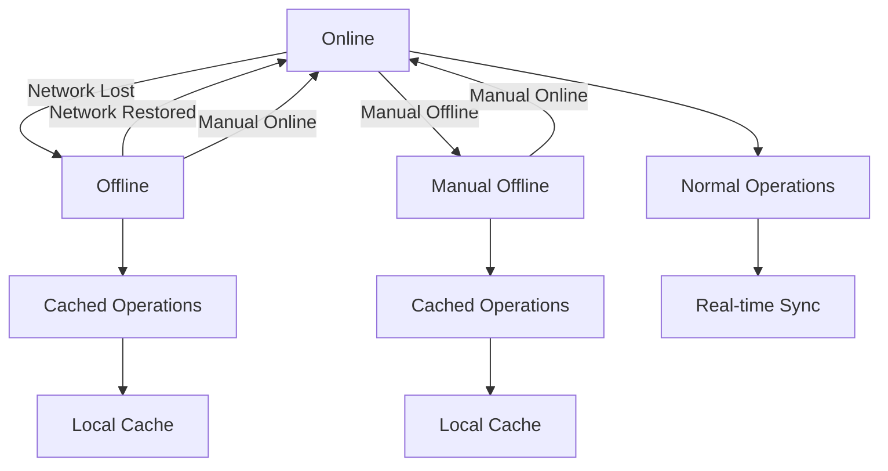
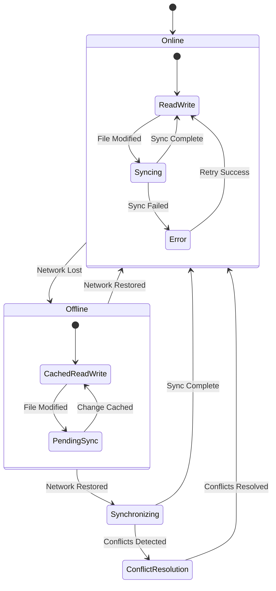
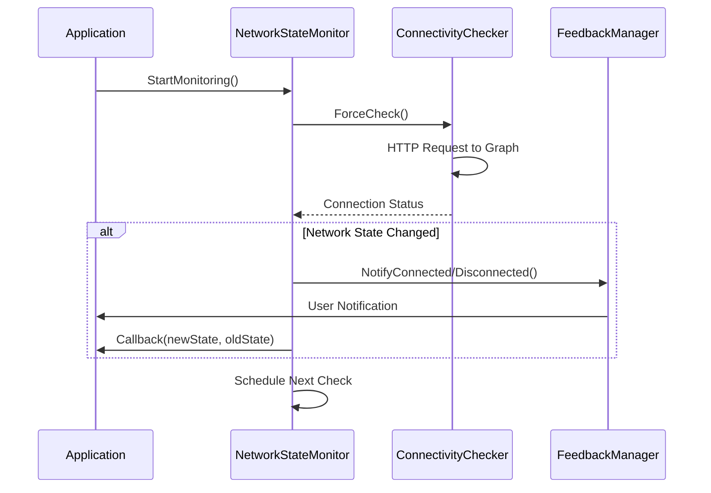
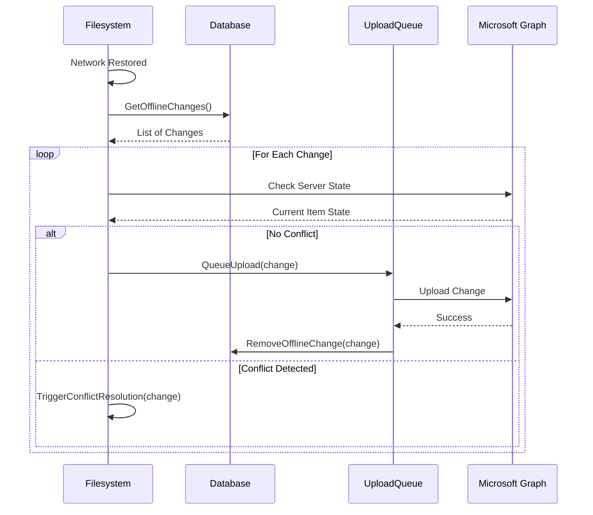
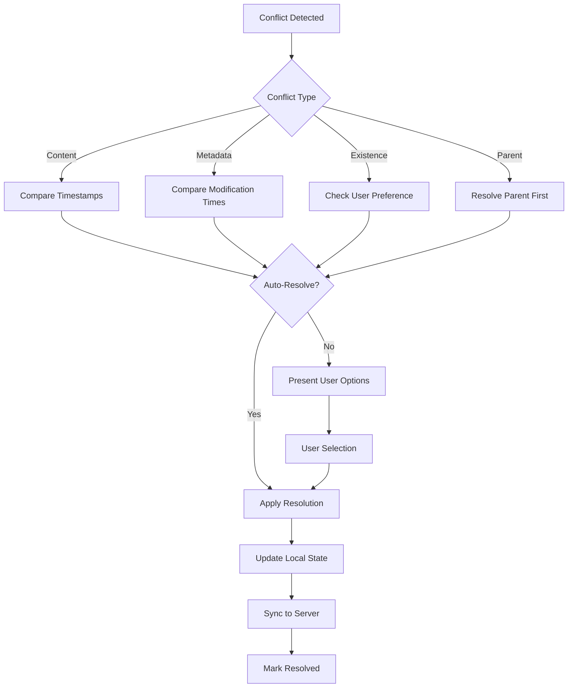

# Offline Functionality Documentation

## Overview

OneMount provides robust offline functionality that allows users to continue working with their files even when network connectivity is unavailable. This document describes the offline functionality behavior, state transitions, synchronization process, and conflict resolution mechanisms.

## State Transition Diagrams

### Network Connectivity States



### Filesystem Operation States



## Offline Mode Behavior

### File Operations in Offline Mode

When the filesystem is in offline mode, the following behaviors apply:

1. **Read Operations**: Files are served from the local cache if available
2. **Write Operations**: Changes are cached locally and marked for synchronization
3. **Create Operations**: New files/directories are created locally and marked for upload
4. **Delete Operations**: Items are marked for deletion and hidden from view
5. **Move/Rename Operations**: Changes are cached and will be applied during sync

### Cache Management

- **Content Cache**: File contents are stored in the local cache directory
- **Metadata Cache**: File and directory metadata is stored in the database
- **Change Tracking**: All modifications are tracked in the offline changes bucket
- **Conflict Detection**: Checksums and timestamps are used to detect conflicts

## Network Connectivity Detection

### Detection Mechanisms

1. **Passive Detection**: Monitors API call failures for network error patterns
2. **Active Detection**: Periodic connectivity checks to Microsoft Graph endpoints
3. **Error Pattern Analysis**: Enhanced error pattern matching for offline conditions

### Detection Process



### Network Error Patterns

The system recognizes the following patterns as offline conditions:

- `no such host`
- `network is unreachable`
- `connection refused`
- `connection timed out`
- `dial tcp`
- `context deadline exceeded`
- `no route to host`
- `network is down`
- `temporary failure in name resolution`
- `operation timed out`

## Synchronization Process

### Offline to Online Transition

When network connectivity is restored, the synchronization process follows these steps:

1. **Change Detection**: Identify all pending offline changes
2. **Conflict Analysis**: Check for server-side changes that conflict with local changes
3. **Upload Queue**: Queue local changes for upload to the server
4. **Batch Processing**: Process changes in batches to avoid overwhelming the server
5. **Verification**: Verify that all changes were successfully synchronized
6. **Cleanup**: Remove successfully synchronized changes from the pending queue

### Synchronization Sequence



## Conflict Resolution

### Conflict Types

1. **Content Conflicts**: Local and server versions of a file have different content
2. **Metadata Conflicts**: File properties (name, location) differ between local and server
3. **Existence Conflicts**: File exists locally but was deleted on server, or vice versa
4. **Parent Conflicts**: Parent directory was moved or deleted on server

### Resolution Strategies

1. **Last Writer Wins**: Most recent modification takes precedence
2. **User Choice**: Present options to user for manual resolution
3. **Merge**: Attempt automatic merging for compatible changes
4. **Rename**: Create separate versions with conflict indicators

### Conflict Resolution Process



## User Feedback Mechanisms

### Feedback Levels

1. **None**: No user notifications
2. **Basic**: Simple connectivity status messages
3. **Detailed**: Comprehensive network and sync information

### Feedback Channels

1. **Logging**: All network state changes are logged
2. **Callbacks**: Application can register for network state callbacks
3. **Status Updates**: Periodic status information for monitoring tools

### Notification Types

- **Network Connected**: Connectivity restored notification
- **Network Disconnected**: Connectivity lost notification  
- **Sync Started**: Synchronization process initiated
- **Sync Completed**: All changes successfully synchronized
- **Conflicts Detected**: Manual intervention required
- **Sync Failed**: Synchronization errors occurred

## Configuration Options

### Network Monitoring

- `checkInterval`: How often to check network connectivity (default: 15 seconds)
- `connectivityTimeout`: Timeout for connectivity checks (default: 10 seconds)
- `feedbackLevel`: Level of user feedback (default: Basic)

### Offline Behavior

- `offlineMode`: Current offline mode setting
- `cacheRetention`: How long to keep cached content
- `maxPendingChanges`: Maximum number of pending changes to track
- `conflictResolution`: Default conflict resolution strategy

## API Reference

### Network State Monitoring

```go
// Create and start network monitoring
monitor := graph.NewNetworkStateMonitor()
monitor.AddCallback(func(connected bool, previousState bool) {
    if connected {
        log.Println("Network restored")
    } else {
        log.Println("Network lost")
    }
})
monitor.StartMonitoring()

// Check current state
isConnected := monitor.GetCurrentState()
```

### Feedback Management

```go
// Add custom feedback handler
feedbackManager := graph.GetGlobalFeedbackManager()
feedbackManager.AddHandler(&MyCustomHandler{})

// Create logging handler with detailed feedback
handler := graph.NewLoggingFeedbackHandler(graph.FeedbackLevelDetailed)
feedbackManager.AddHandler(handler)
```

### Offline Operations

```go
// Set filesystem to offline mode
filesystem.SetOfflineMode(fs.OfflineModeReadWrite)

// Check if filesystem is offline
isOffline := filesystem.IsOffline()

// Process pending offline changes
filesystem.ProcessOfflineChanges()

// Get file status
status := filesystem.GetFileStatus(fileID)
```
