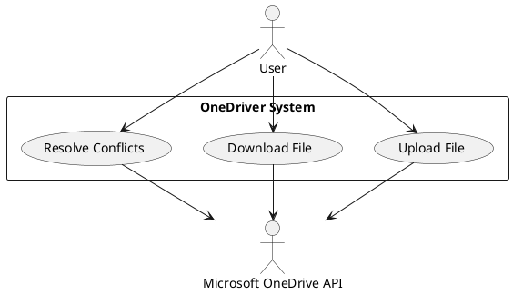

# OneDriver Use Cases with UML Diagrams

## UML Use Case Diagram

This PlantUML diagram represents the same use case diagram that was previously shown in Mermaid format. It shows:

1. Two actors: User and Microsoft OneDrive API
2. Three use cases within the OneDriver System: Upload File, Download File, and Resolve Conflicts
3. The relationships between actors and use cases, showing which actor interacts with which use case

The diagram maintains the same structure and relationships as the original Mermaid diagram while using PlantUML's specific syntax for use case diagrams.

## Use Case 1: Upload File

| Field | Description |
|-------|-------------|
| **Use Case ID** | UC-01 |
| **Name** | Upload File to OneDrive |
| **Actors** | User, Microsoft OneDrive API |
| **Preconditions** | 1. User is authenticated with Microsoft account 2. OneDriver is mounted and running 3. User has write permissions for the target location 4. Network connection is available |
| **Postconditions** | 1. File is successfully uploaded to OneDrive 2. Local file system reflects the upload status 3. File metadata is updated in the local cache |
| **Main Flow** | 1. User creates or modifies a file in the OneDriver mounted directory 2. System detects the file change event 3. System queues the file for upload 4. System uploads the file to OneDrive using Microsoft Graph API 5. System updates the local cache with new file metadata 6. System notifies the user of successful upload |
| **Alternative Flows** | **A1: Network Unavailable** 1. System detects network is unavailable 2. System marks file for deferred upload 3. System stores file changes in local cache 4. System periodically attempts to reconnect 5. When connection is restored, system resumes upload  **A2: Upload Quota Exceeded** 1. OneDrive API returns quota exceeded error 2. System notifies user of quota limitation 3. System marks file for retry when space is available  **A3: Authentication Failure** 1. System detects authentication token is expired 2. System attempts to refresh authentication 3. If refresh fails, system prompts user to re-authenticate 4. Upload process resumes after successful authentication |

## Use Case 2: Download File

| Field | Description |
|-------|-------------|
| **Use Case ID** | UC-02 |
| **Name** | Download File from OneDrive |
| **Actors** | User, Microsoft OneDrive API |
| **Preconditions** | 1. User is authenticated with Microsoft account 2. OneDriver is mounted and running 3. File exists in OneDrive 4. Network connection is available |
| **Postconditions** | 1. File is successfully downloaded to local filesystem 2. File metadata is updated in local cache 3. File is accessible to the user |
| **Main Flow** | 1. User attempts to access a file in the OneDriver mounted directory 2. System checks if file content is available locally 3. If not available, system requests file content from OneDrive API 4. System downloads the file content 5. System stores the file in local cache 6. System presents the file to the user 7. System updates access metadata |
| **Alternative Flows** | **A1: Network Unavailable** 1. System detects network is unavailable 2. System checks if file is available in offline cache 3. If available in cache, system serves cached version 4. If not in cache, system notifies user that file is unavailable offline  **A2: File No Longer Exists Remotely** 1. OneDrive API returns file not found error 2. System removes file reference from local directory 3. System notifies user that file no longer exists  **A3: Insufficient Local Storage** 1. System detects insufficient storage for download 2. System notifies user of storage limitation 3. System suggests clearing cache or freeing disk space 4. Download is paused until sufficient space is available |

## Use Case 3: Resolve File Conflicts

| Field | Description |
|-------|-------------|
| **Use Case ID** | UC-03 |
| **Name** | Resolve File Conflicts |
| **Actors** | User, Microsoft OneDrive API |
| **Preconditions** | 1. User is authenticated with Microsoft account 2. OneDriver is mounted and running 3. Same file has been modified both locally and remotely 4. Network connection is available |
| **Postconditions** | 1. Conflict is resolved according to user's decision or automatic policy 2. File system reflects the resolved state 3. OneDrive is synchronized with the resolution |
| **Main Flow** | 1. System detects conflicting versions of the same file 2. System compares local and remote file metadata (modification times, sizes) 3. System applies automatic conflict resolution policy if configured 4. If manual resolution is required, system notifies user of conflict 5. User selects preferred version or requests to keep both 6. System implements the resolution decision 7. System synchronizes the resolved state with OneDrive 8. System updates local cache with resolution metadata |
| **Alternative Flows** | **A1: Keep Both Versions** 1. User chooses to keep both versions 2. System renames the conflicting file with suffix indicating local/remote origin 3. System uploads/retains both versions 4. System updates metadata for both files  **A2: Automatic Resolution Based on Policy** 1. System applies pre-configured conflict resolution policy 2. System resolves conflict without user intervention 3. System logs the automatic resolution action 4. System synchronizes the resolved state  **A3: Merge Changes** 1. For supported file types, system offers to merge changes 2. User reviews and confirms merge 3. System creates merged version 4. System uploads merged version to OneDrive 5. System updates local cache with merged file |

These use cases provide a comprehensive overview of the core functionality in OneDriver, focusing on file operations and conflict management. The structured format follows industry standards for use case documentation, making it easy to understand the system's behavior from a user perspective.